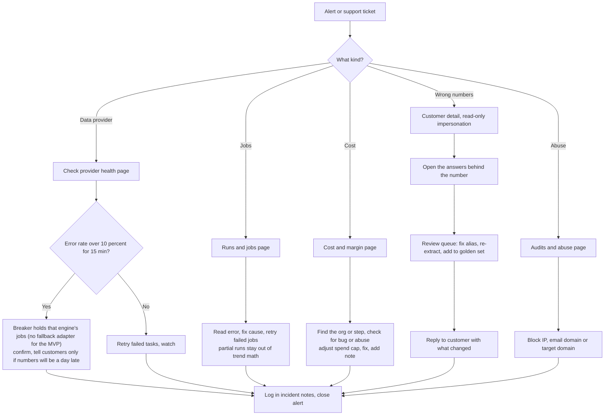

# AEO Corner — Admin Flow, Tasks & Operations

| | |
|---|---|
| **Document** | Internal admin and operations specification, v0.1 (draft for founder review) |
| **Date** | 2026-09-28 |
| **Companion to** | [MVP.md](MVP.md) (F12, §7.8, §7.11, §10) and [CUSTOMER_JOURNEY.md](CUSTOMER_JOURNEY.md) |
| **Who this is for** | The AEO Corner team: at MVP, the founder plus 2 engineers |

---

## 0. Summary

"Admin" means two different things in AEO Corner:

| | **Platform admin (internal)** | **Customer admin** |
|---|---|---|
| Who | The AEO Corner team | A customer's `owner` / `admin` role |
| Where | Internal admin console at `admin.aeocorner.com` | Settings pages inside the app |
| What | Keep the product healthy, accurate, profitable and safe | Manage their own team, billing, projects and connections |
| Covered in | §1–§8 | §9 |

**The internal admin console has one job:** let a 3-person team run hundreds of customers without surprises. It answers four questions every day:
1. **Is it working?** Runs, job queues, data providers.
2. **Is it right?** Extraction accuracy, and customer reports of wrong readings.
3. **Is it profitable?** Cost per run, margin per customer, spend caps.
4. **Is it safe?** Audit abuse, access, security events.

The team's routine: **about 15 minutes a day, 2–3 hours a week, half a day a month** ([§5](#5-recurring-tasks-runbook)). Everything else is driven by alerts.

---

## 1. Access and security

| Rule | Detail |
|---|---|
| **Separate entry point** | `admin.aeocorner.com`: a separate Express router in the same app. It's put behind **Cloudflare Access** (Zero Trust login in front of the site), so it can't be reached from the public internet |
| **Staff accounts only** | Staff sign in through a **separate Clerk application**, so staff and customer accounts never mix. The first staff member is created from the command line (`npm run staff:invite`); later ones by a super admin. Sign-up is invite-only. **Two-factor login is mandatory** (authenticator app or passkey): the admin app refuses a staff session without it. Sessions time out after 30 minutes idle |
| **Least privilege** | Staff roles ([§2](#2-staff-roles)). At MVP the same people hold several roles, but the permissions stay separate |
| **Everything is logged** | Every admin write action goes to `admin_audit_log`: who, what, which customer, reason, before/after, time. The log can't be edited |
| **Impersonation** | Requires a **reason** (and a ticket link if there is one). Opens **read-only** by default; any write needs a second confirmation. A banner is always visible. The session ends after 30 minutes. The customer's account activity log shows "AEO Corner support viewed your account on <date>" |
| **Customer secrets are never visible** | Staff can never see WordPress passwords, Google tokens or API keys, only their status (connected / broken / last used) |
| **Destructive actions** | Deleting data, refunds and plan changes need typed confirmation. Deletion also has a 24-hour undo window |

---

## 2. Staff roles

| Role | Typical person (MVP) | Can do | Can't do |
|---|---|---|---|
| **Super admin** | Founder, tech lead | Everything: feature flags, provider routing, refunds, staff management | — |
| **Ops / on-call** | Engineers | Job queues, retries, provider health, circuit breakers, pausing tracking | Billing actions, staff management |
| **Support** | Founder (later: a support hire) | Customer lookup, read-only impersonation, resend emails, "run now", extend trials, add notes | Provider routing, refunds above a set limit, deletion |
| **Reviewer** | Founder, contract labelers | Extraction review queue, golden-set labeling | Customer account details beyond the answer being reviewed |
| **Finance** | Founder | Cost and margin reports, refunds, credits, coupons | Job queues, impersonation |

---

## 3. Admin console: modules

| # | Module | What it shows | Main actions |
|---|---|---|---|
| 1 | **Ops home** | Today at a glance: runs (scheduled / done / partial / failed), queue backlogs, data-provider error rates, spend today vs. budget, audits, signups, trials, open alerts | Jump to any problem |
| 2 | **Customers** (orgs and projects) | Search by email, domain or org. Per org: plan, Stripe status, usage vs. limits, **cost and margin (30 days)**, projects, run history, integration status, members, staff notes | Impersonate, extend trial, grant credits or extra questions, pause/resume tracking, "run now", resend emails, export data, delete (GDPR) |
| 3 | **Runs & jobs** | Every BullMQ queue (waiting, active, failed, delayed) via the embedded **Bull Board** dashboard. Partial and failed runs, with a breakdown by engine and provider | Retry, discard, re-run for one project, drain a stuck queue |
| 4 | **Data providers** | Per provider: success rate, response time, error rate (15 min / 24 h), **circuit-breaker state**, the routing per engine (primary only for the MVP), spend vs. monthly budget, API-key age | Read-only today: the breaker state and the health history |
| 5 | **Cost & margin** | From `usage_ledger` + Stripe: cost per question-run by engine, provider and AI model; margin per org and per plan; top-cost orgs; spend-cap events; anomalies (a run costing more than 2× expected) | Adjust an org's spend cap, flag an org for review |
| 6 | **Extraction review queue** | Cases where the rule-based check and Claude disagree, customers' "That's not us" reports, low-confidence readings. Each shows the answer text with highlights, the extraction result and the tracked names | Mark correct/incorrect, fix an alias, **re-extract** affected rows, **add to golden set** |
| 7 | **Recommendation quality** | Per rule: how often it fires, dismiss rate, verified rate, proven-win rate. Content quality-check failures. Publishing errors | Disable a noisy rule (feature flag), adjust a rule's confidence |
| 8 | **Audits & abuse** | Audits per day, completion rate, time, cost per audit. Abuse signals: IP and email velocity, disposable email domains, repeated domains | Block an IP, email domain or target domain; tighten limits |
| 9 | **Billing** | Trials ending soon, failed payments, customers in the grace period, refunds, design-partner coupons. Actions happen in Stripe; the console shows status and links | Refund (within the money-back window, D9), apply a coupon, extend a grace period |
| 10 | **Flags & config** | PostHog feature flags (per engine, integration, feature); per-org overrides (e.g., beta features for design partners); current versions of the extraction model, readiness rubric and prompt templates | Toggle flags, set per-org overrides. Model and prompt changes go through the repo, not the console |
| 11 | **Announcements** | In-app banners and status messages | Post an incident banner ("Gemini data delayed this week"), with a start/end time and audience |
| 12 | **Audit log** | All staff actions | Search and export |

---

## 4. Key admin flows

### 4.1 Alert triage (how every problem enters the admin flow)

### 4.2 Flow catalog

| # | Flow | Trigger | Steps | Done when |
|---|---|---|---|---|
| A1 | **Morning ops check** | Daily | Ops home → failed jobs → provider health → spend vs. budget → new trials → support inbox | No red items, or each red item has an owner |
| A2 | **Failed or partial run** | Alert or ops home | Runs & jobs → read the error → fix the cause (provider, bad data, bug) → retry → confirm the run completes. If it can't be fixed within 24 h, the customer sees "couldn't check" for the missing cells | Run is complete, or partial with the customer informed |
| A3 | **Data-provider outage** | Circuit breaker trips (automatic) | Confirm the breaker holds the engine's jobs (they wait, up to 4 hours) → tell customers only if numbers will be a day late → see [RUNBOOK_INCIDENTS §4](RUNBOOK_INCIDENTS.md) | Breaker closed; the run complete, or `partial` and explained |
| A4 | **"The numbers look wrong"** (support) | Customer ticket or "That's not us" | Customer detail → read-only impersonation → click the number → inspect the actual answers → review queue → fix the alias or rule → re-extract affected rows → reply with the correction | Customer confirms. The case is added to the golden set |
| A5 | **Cost anomaly or spend cap hit** | Alert | Cost & margin → which org, engine or step? → bug (e.g., retry loop), abuse, or legitimate growth? → fix, raise the cap or contact the customer | Cost per run back within the expected range |
| A6 | **Weekly extraction review** | Weekly | Clear the review queue → check the disagreement rate trend → add 10–20 hard cases to the golden set | Queue empty; disagreement rate ≤ target |
| A7 | **Audit abuse** | Velocity alert | Audits & abuse → identify the pattern → block → tighten limits if needed | Audit cost per day back to normal |
| A8 | **Refund, trial extension or credit** | Customer request | Customer detail → check eligibility (money-back window, D9) → act in Stripe via the console → add a note | Customer notified; logged |
| A9 | **Data export or deletion request** (GDPR/CCPA) | Customer request or self-serve | Verify the requester is an owner → export (CSV + JSON) or delete (24-h undo, then purge within 30 days) → confirm by email | Request closed within 30 days |
| A10 | **Release a new extraction version, rubric or prompt template** | Planned change | The eval must pass in CI → enable for internal and design-partner orgs via flag → compare for 1 week → roll out to everyone → re-extract history only if metrics change materially (each metric records its version) | New version live for all; no unexplained metric jumps |
| A11 | **Incident communication** | Customer-visible impact over 2 hours | Banner → email affected customers if data is delayed more than a day → short post-incident note in the repo | Customers informed; follow-up tasks created |
| A12 | **Design-partner onboarding** | New partner | Create org → apply partner coupon → enable beta flags → run the audit together on a call → set up the weekly feedback slot | Partner's first run completed |

---

## 5. Recurring tasks (runbook)

| Frequency | Task | Owner | Time |
|---|---|---|---|
| **Daily** | Morning ops check (A1): failed jobs, provider health, spend vs. budget | On-call engineer | 10 min |
| | Support inbox and "That's not us" reports | Support | 15–30 min |
| | New trials: design partners and notable accounts get a personal note | Founder | 5 min |
| **Weekly** | Extraction review queue (A6) + golden-set additions | Reviewer | 1–2 h |
| | Rule quality: dismiss rates, verified and proven-win rates per rule | Founder | 30 min |
| | Cost per question-run trend vs. target (≤ $0.12) | Tech lead | 15 min |
| | Trials ending in the next 7 days: check each is activated (baseline done, 1+ fix verified); personal outreach if not | Founder | 30 min |
| | Churn and cancellation survey answers | Founder | 15 min |
| | Digest and email delivery rates (bounces, spam complaints) | On-call | 10 min |
| **Monthly** | Margin by plan vs. the 70% target (MVP §12) | Finance | 1 h |
| | Reconcile provider invoices against `usage_ledger` (difference should be under 5%) | Finance | 1 h |
| | **Database restore drill** ([RUNBOOK_RESTORE_DRILL.md](RUNBOOK_RESTORE_DRILL.md): restore to a new cluster, `npm run restore:check`, destroy it) | Tech lead | 1 h |
| | Dependency and security updates; review Sentry's top errors | Engineers | 2 h |
| | Clean up feature flags (remove flags fully rolled out for 30+ days) | Tech lead | 30 min |
| | Staff access review (who has which role; remove leavers) | Super admin | 15 min |
| **Quarterly** | Update the AI crawler user-agent list (MVP Appendix A) | Tech lead | 1 h |
| | Refresh the golden set (new engines, new answer formats) | Reviewer | half day |
| | Readiness rubric calibration, once there's enough data (~200 projects; MVP §6.6) | Founder + tech lead | 1 day |
| | Rotate provider API keys and the encryption master key (yearly) | Tech lead | 1 h |
| **Every 6 months** | Legal review of data-provider terms (MVP §11.3) | Founder + counsel | — |

---

## 6. Background tasks (what the system does on its own)

These are the BullMQ queues and scheduled jobs the admin console monitors ([§3](#3-admin-console-modules), module 3).

| Queue / job | Trigger | What it does | On failure |
|---|---|---|---|
| `scheduler.tick` | Every hour | Finds projects whose weekly slot is due and enqueues runs (job ID = project + slot, so no duplicates) | Next tick catches up |
| `audit.run` | Free audit submitted | Full audit pipeline (MVP F1) | Retried; customer sees "couldn't check" per engine |
| `crawl.readiness` | Before each weekly run; on demand | Re-crawls key pages and re-runs readiness checks (`crawl` queue; job ID `scan-<scan id>`). Obeys robots.txt; writes one `usage_ledger` row (requests made, cost 0) | Retried up to 5 times; then the scan is marked `failed` and the job stays in the failed set; last good result kept |
| `collect.answer` | Each run (question × engine × sample) | Sends to the data provider, then stores the raw answer in Spaces and a snapshot row. For a provider that queues the question (DataForSEO standard), the same job comes back every minute to ask whether it is ready; waiting uses up no retry ([ADR-0006](adr/0006-engine-adapters.md)) | Up to 5 retries → marked "couldn't check". Bad credentials or an unreadable answer: "couldn't check" at once. A queued task not ready after 75 min (20 for priority): "couldn't check" |
| `extract.batch` / `extract.poll` | After collection | Submits the Claude Batch API job; polls and stores mentions and citations | Retry; falls back to synchronous extraction for stuck batches |
| `metrics.rollup` | After extraction; nightly full pass | Builds `metric_daily`, runs significance tests, creates change events | Retry; dashboards keep the last good rollup |
| `recs.refresh` | After rollup | Runs the rule engine; adds or updates recommendations | Retry |
| `alerts.evaluate` | After rollup | Significant drops, competitor surges, negative claims and "a decline has lasted" (a recovery case) → emails | Retry; never sends duplicates |
| `recovery.evaluate` | After a finished run | Opens a recovery case for a decline that has lasted (once per decline), closes cases that recovered, diagnoses the ones waiting (Milestone 14) | Retry; a repeat opens and closes nothing twice |
| `autopilot.tick` | After a recommendations refresh, only for a project that has Autopilot on and not paused (Milestone 15) | Prepares the next fixes and drafts for a person to approve: works out the exact change for a fix, or starts a draft that stops at the quality check. Never writes to a site and never publishes. Skips when the `autopilot` flag, the plan, the spend cap, the pause or the draft allowance say so | Retry; a repeat prepares nothing twice |
| `recovery.recheck` | When a case opens | A fresh site scan and a look at each earlier fix, then the first diagnosis; free of provider cost | Retry; a repeat is skipped once the re-check is saved |
| `verify.fix` | Fix marked done or content published; retried at +1 h and +24 h for caches and CDNs | Re-fetches the page as an AI crawler and confirms the change | Marked "unverified" with the reason |
| `outcome.check` | Delayed +2 and +4 weeks after verification | Before/after comparison → `action_outcomes` | Retry; appears in the next digest |
| `content.generate` | Customer request | Research → brief → draft → quality check → schema markup | Retry per step; progress is saved |
| `publish.wordpress` | Customer approval | Pushes content or a fix through the WordPress plugin or REST API; pings IndexNow | Retry; customer told after the first failure |
| `sync.google` | Daily per connection | Pulls GA4 and Search Console metrics | Retry; "reconnect" email if access was revoked |
| `digest.weekly` | Hourly tick, sends to timezones where it's Monday 8:00 | Weekly digest per user | Retry; skipped if already sent |
| `email.send` | Any email | Sends through the Resend API | Retry with backoff |
| `billing.reconcile` | Daily (Stripe webhooks handle real time) | Matches plans and limits with Stripe | Alert on mismatch |
| `guard.provider_health` | Every 5 min | Computes error rates; trips or resets circuit breakers | Alert |
| `guard.spend` | Every 15 min | Checks each org's daily spend against its cap; pauses collection if exceeded | Alert |
| `maintenance.retention` | Nightly | Deletes expired data: raw answers > 13 months (plus the Spaces lifecycle rule), unconverted leads > 12 months, deleted orgs > 30 days | Alert |

---

## 7. Alerts to the team

| Alert | Condition | Channel | First response |
|---|---|---|---|
| Provider breaker tripped | Error rate > 10% for 15 min | Slack + email | A3 |
| Run failure rate high | > 5% of runs failed or partial today | Slack | A2 |
| Queue backlog | Any queue waiting > 30 min beyond normal | Slack | Check workers; add a worker if needed |
| Cost anomaly | Run cost > 2× expected, or daily spend > 150% of budget | Slack + email | A5 |
| Audit abuse | Audits/hour > 3× normal, or a single IP/domain burst | Slack | A7 |
| Extraction drift | Disagreement rate above target for 2 days | Email | Review queue; check provider format changes |
| Infrastructure | Droplet CPU/RAM/disk > 85%; database or Redis unreachable (DigitalOcean monitoring) | Email + SMS | Scale or restart; A11 if customers are affected |
| App errors | Sentry error spike, or a new error type in payments or publishing | Slack | Fix or roll back |
| Stripe webhook failures | Any failed delivery | Email | Replay from Stripe; run `billing.reconcile` |

---

## 8. Data additions for admin (proposed)

These are **not yet in MVP §8.2**. They are now fully defined in [DATABASE_SCHEMA.md](DATABASE_SCHEMA.md) §2 (mostly §2.2 and §2.15), together with `staff_roles`, `impersonation_sessions` and `data_requests`. Staff sign-in and 2FA are handled by Clerk ([DATABASE_SCHEMA.md §10.1](DATABASE_SCHEMA.md#101-auth-clerk-identity-only)):

| Table | Purpose |
|---|---|
| `staff_users` | Staff accounts and roles, separate from customer users, linked to the staff Clerk app by `clerk_user_id` |
| `admin_audit_log` | Append-only log of every staff action: staff ID, action, org ID, reason, before/after, time |
| `org_notes` | Staff notes per customer (context for support) |
| `review_items` | The extraction review queue: source (disagreement / customer report / low confidence), snapshot, status, reviewer, resolution |
| `provider_health` | Time series per provider: success rate, response time, errors, breaker state |
| `announcements` | In-app banners: message, audience, start/end time |
| `action_outcomes` | Before/after results per verified fix (also proposed in [CUSTOMER_JOURNEY.md §7](CUSTOMER_JOURNEY.md#7-proposed-changes-to-the-mvp-spec)) |

---

## 9. Customer admin (owner / admin roles)

What a customer's owner or admin can do in the app's **Settings**:

| Area | Tasks | Role |
|---|---|---|
| **Team** | Invite by email, set roles (owner/admin/editor/viewer), remove members, transfer ownership | Owner, admin (admins can't remove owners) |
| **Projects** | Add a project (runs an audit first), pause/resume tracking, set the locale, delete a project | Owner, admin |
| **Connections** | Connect or disconnect WordPress and Google (Analytics + Search Console); see the status and last sync | Owner, admin |
| **Billing** | Change plan, update the card, see invoices, cancel (all in the Stripe Customer Portal) | Owner |
| **Notifications** | Digest recipients, timezone, alert types | Each user for themselves; admins set defaults |
| **Data** | Export all data (CSV/JSON); delete the account | Owner |
| **Activity log** | Who changed what, including any AEO Corner support access | Owner, admin |

---

## 10. When to build it

The console grows with the MVP timeline ([MVP §13.2](MVP.md#132-12-week-timeline)). Nothing is built before it's needed:

| MVP week | Admin pieces |
|---|---|
| **1–2** | Staff login (separate Clerk app, 2FA required), Cloudflare Access, `admin_audit_log`, customer lookup (read-only), Bull Board |
| **4** (free audit live) | Audits & abuse page, blocking, audit cost tracking |
| **5–6** | Runs & jobs page, provider health + circuit breakers, spend guard |
| **7–8** (design-partner beta) | Impersonation (read-only), org notes, feature-flag overrides, extraction review queue |
| **9–10** | Recommendation quality page, publishing-error view |
| **11** | Billing page, cost & margin page, refunds and credits |
| **12** (launch) | Announcements, the alert set in §7, a runbook check against §5 |

**Built in Milestone 8 (2026-10-04):** cost and margin (module 5), provider health (module 4, read-only: a breaker cannot be reset from the console yet), failed jobs with retry (module 3, beside the Bull Board), the extraction review queue (module 6), feature flags with per-customer overrides (module 10) and the audit log (module 12), behind one wall with every change recorded first ([ADR-0012](adr/0012-billing-traffic-notifications-and-the-console.md)). Not built: the customer lookup, impersonation, announcements and the billing page (module 9). **Milestone 15 (2026-10-05)** adds a read-only Autopilot module (ops) listing where it is on, what is waiting for a person and when it last ran, by customer and project, with names and counts only; the kill switch is the `autopilot` feature flag (every change audited first) ([ADR-0016](adr/0016-autopilot-prepares-and-a-person-approves.md)).
