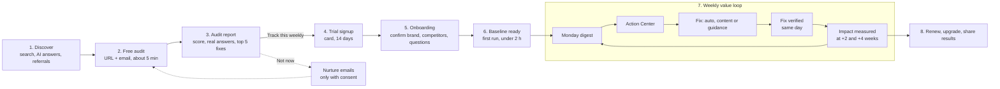
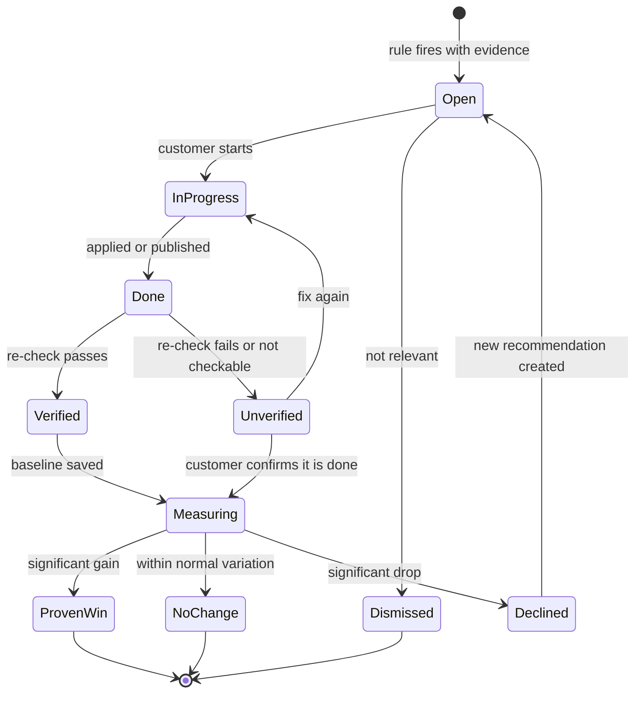
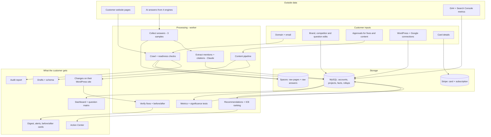

# AEO Corner — Customer Journey & Data Flow

| | |
|---|---|
| **Document** | Customer experience and data flow specification, v0.1 (draft for founder review) |
| **Date** | 2026-09-28 |
| **Companion to** | [MVP.md](MVP.md). Feature IDs (F1–F12), tables (§8.2) and metrics (§6.5) refer to that spec |
| **Personas** | **Maya**: in-house marketing manager at a small business (primary). **Omar**: agency owner (secondary) |

---

## 0. Summary

**The customer's journey has four "moments of truth".** Every design choice below exists to get the customer to the next one faster:

| # | Moment | What the customer feels | Target time |
|---|---|---|---|
| 1 | **"AI doesn't know us"**: the audit shows real ChatGPT answers naming competitors, not them | Urgency | ≤ 10 min after entering their URL |
| 2 | **"Now I can see it"**: the baseline dashboard shows where they stand across 4 engines | Clarity | ≤ 2 h after signup |
| 3 | **"I fixed something"**: a fix is applied and we confirm it's live on their site | Progress | ≤ 7 days after signup |
| 4 | **"It worked"**: a before/after card shows a significant gain in AI answers | Proof → retention | 2–4 weeks after the fix; ≥ 40% of projects within 60 days |

**Experience principles**
1. **Value before signup.** The free audit gives a real, useful answer with no account.
2. **Zero typing.** Everything is pre-filled from the audit and the website; the customer only confirms and corrects.
3. **Plain language first, statistics on demand.** "ChatGPT recommended you in 3 of 9 answers" comes first; confidence ranges sit behind a "How sure are we?" link.
4. **Every number opens the evidence.** Any score or rate can be clicked through to the actual AI answers behind it.
5. **Nothing changes on the customer's site without their approval.** They always see the change (a diff or a preview) first.
6. **Honest states.** A failed collection is shown as "couldn't check", never as "not mentioned". Normal ups and downs are labeled "within normal variation".
7. **Two levels of proof.** A fix is **verified** the same day (it's live on the site) and **proven** weeks later (AI answers changed). This separation keeps customers confident while AI answers catch up.

**Key finding from this analysis:** the 14-day trial (decision D3) ends **before** the first before/after check, which comes 2–4 weeks after a fix. The trial therefore can't sell on proof. It has to sell on moments 1–3. See [§7](#7-proposed-changes-to-the-mvp-spec) and the new decision **D9** in the MVP spec.

**Terminology:** The UI says **"buyer questions"**. The spec and code say **prompts**. Customers don't think in "prompts".

---

## 1. Journey at a glance

### Maya's first 30 days (the target experience)

| When | What Maya does | What she sees | Moment |
|---|---|---|---|
| **Day 0, 9:00** | Enters `maya-dental.com` in the free audit, then her work email and the 6-digit code | A live progress page. Real answer excerpts appear as each engine responds | |
| **Day 0, 9:06** | Reads the report | "Your AEO Score: 38/100. ChatGPT named 3 dentists for 'best family dentist in Austin'. You weren't one of them." Plus the top 5 fixes | **1** |
| **Day 0, 9:10** | Clicks "Track this weekly" and starts the trial (card, $0 today) | Onboarding, already filled in from the audit | |
| **Day 0, 9:14** | Confirms her brand, removes one wrong competitor, keeps 38 suggested buyer questions, skips WordPress for now | "We're asking 4 AI engines your 38 questions, 3 times each. Your baseline will be ready in about an hour. Meanwhile, here are 4 fixes you can make today." | |
| **Day 0, 10:20** | Opens the "Your baseline is ready" email | The dashboard: score, engine breakdown, competitors, and which sites AI cites | **2** |
| **Day 1** | Connects WordPress and approves the first auto-fix (Organization schema) | A preview of the exact code, then "Fix verified ✓ — live on your homepage" | **3** |
| **Day 3** | Generates an answer page for a question she's losing, edits it, approves it | Pushed to WordPress; "Page verified ✓ — live and indexable". Before/after check scheduled | **3** |
| **Day 7** | Reads the first Monday digest | What changed (mostly "within normal variation"), 3 next actions, "first before/after check: Oct 19" | |
| **Day 10** | Reads the "trial ends in 4 days" email | A summary: baseline, 5 fixes verified, next check date, what she keeps by staying | |
| **Day 14** | Trial converts to Starter | Receipt | |
| **Day 17** | Opens the before/after email | "Since you published 'Family dentist in Austin: what to look for' on Oct 3, ChatGPT mentions on the 3 targeted questions went from 1 of 9 to 5 of 9 answers (significant)" | **4** |
| **Day 30** | Shares the before/after card with her boss | A shareable card or link | |

---

## 2. Stage-by-stage specification

Each stage lists: the customer's goal, the screens, what the system does, the data written (tables from MVP §8.2), messages sent, the success metric, and edge cases.

### Stage 1 — Discover

| | |
|---|---|
| **Customer goal** | "Is AI sending my customers to competitors?" |
| **Entry points** | Search and AI answers (our own content), the public methodology page, social and community posts, agency referrals, design-partner case studies |
| **Screens** | Marketing site (server-rendered EJS, fast, readable by AI crawlers), with the audit form above the fold on every page |
| **Data** | PostHog anonymous events (page views, UTM source). Nothing personal |
| **Metric** | Visitor → audit start rate |

### Stage 2 — Free audit (F1)

| | |
|---|---|
| **Customer goal** | A fast, credible answer to "Does ChatGPT know about us?" |
| **Screens** | 1) URL form (+ optional competitor URL) → 2) work email → 3) 6-digit code → 4) live progress page → 5) report |
| **Progress page** | Streams real steps over server-sent events: "Reading your site (14 pages)" → "Checking whether AI crawlers can access it" → "Asking ChatGPT 5 buyer questions" → … Each answer excerpt appears as it arrives, so the wait feels productive |
| **System** | Turnstile check → SSRF-safe fetch → robots/sitemap → select ≤ 20 pages → readiness checks → lite Brand Kit → 5 prompts → 4 engines × 5 prompts × 1 sample (live mode) → synchronous extraction → scores → top 5 fixes |
| **Data written** | `leads` (email, domain, consent), `audits` + `audit_checks`, answer snapshots (`runs.trigger = audit`), raw pages and answers in Spaces, `usage_ledger` (≈ $0.60) |
| **Messages** | Verification code email; "Your AEO report is ready" email with the permanent report link |
| **Metric** | Audit completion rate; p90 ≤ 10 min; cost ≤ $0.75 |
| **Edge cases** | **Site blocks our crawler:** reported as a finding ("AI crawlers may be blocked too"), not an error. **Site unreachable or behind a login:** clear message, no charge to our limits. **Same domain within 24 h:** cached report. **Quota hit** (3 per email/day, 10 per IP/day): friendly limit message. **An engine fails:** "We couldn't check Gemini right now", never counted as 0. **Non-English site:** audit runs in the site's language if supported, otherwise says so |

### Stage 3 — Audit report (the first "aha")

The report is laid out in this order, most persuasive first:

1. **Headline sentence:** *"ChatGPT mentioned you in 1 of 5 buyer questions. RivalCo was mentioned in 4."*
2. **AEO Score (0–100)** with its two parts shown separately: **Readiness** (things on your site) and **Visibility** (what AI answers say).
3. **Engine cards:** ChatGPT, Perplexity, Gemini, AI Overviews. Each shows mentioned / not mentioned, and the competitors that were.
4. **Real answer excerpts** with the customer's brand and competitors highlighted. This is the most persuasive element.
5. **Top 5 fixes**, each with a "why", the evidence, and "we can do this for you" where auto-fixable.
6. **Call to action:** "Track this weekly and fix it — start 14-day trial." A secondary CTA offers to email the report to a colleague.

| | |
|---|---|
| **Honesty rules** | A note that this is a 1-sample snapshot ("AI answers vary; tracking samples each question 3 times"). A link to the methodology page |
| **Data** | The report is read-only and reached by an unguessable link. It stays available for 12 months (the lead retention period) |
| **Metric** | Report → trial click-through; audit → trial ≥ 5% |
| **Nurture (only with marketing consent)** | Day 2: "The #1 fix from your report, step by step". Day 5: a relevant case study. Day 9: "Re-run your audit to see if anything changed" |

### Stage 4 — Trial signup (F12)

| | |
|---|---|
| **Customer goal** | Start tracking with minimal friction |
| **Screens** | Sign up with Clerk (email + password, or Google) → organization name (pre-filled from the domain) → plan (Starter pre-selected; Growth and Agency visible) → Stripe Checkout (card, $0 today, 14-day trial) → back to onboarding |
| **System** | Creates the user, org and owner membership. Creates the project **from the audit**: domain, lite Brand Kit, competitors and the 5 audit questions are copied in. Stripe webhook sets the subscription to `trialing` |
| **Data written** | Auth tables, `organizations` (plan, `stripe_customer_id`), memberships, `projects`. **Card details go only to Stripe**; we store the customer ID |
| **Messages** | "Welcome: here's what happens next" (3 steps and the time to baseline) |
| **Edge cases** | **Signup email differs from the audit email:** the audit is claimed through the report link's token. **Card declined:** stay on Checkout with Stripe's message. **Existing customer:** "Add project" instead of a new org. **Agency:** picks Agency and is guided to "Add your first client" |

### Stage 5 — Onboarding (F2, F3, F9, F10): ≤ 5 minutes to the first run

| Step | Screen | Pre-filled from | Customer action |
|---|---|---|---|
| 1 | **Confirm your brand**: name, one-line description, category, where you operate, products/services | Full Brand Kit extraction (≤ 30 pages, < 2 min) | Correct anything wrong |
| 2 | **Your competitors** (3–10) | Audit answers + LLM suggestions | Remove or add |
| 3 | **Buyer questions** (25–50), grouped by topic, with a plan meter ("38 of 50") | Generated across intents + the 5 audit questions | Toggle off, edit or add |
| 4 | **Connect** (optional): WordPress; Google Analytics + Search Console | — | Connect now or "later" |
| 5 | **Start tracking** | — | One click |

- **The first run starts immediately.** It doesn't wait for the project's weekly slot (`runs.trigger = onboarding`), and it uses synchronous extraction instead of the Batch API so the baseline arrives in about an hour ([§7](#7-proposed-changes-to-the-mvp-spec), change 1).
- **While waiting,** the customer sees the full-site readiness checklist and can start on fixes immediately. There's never an empty screen.
- **Data written:** `brand_profiles` v1, `competitors`, `prompts` (`source = generated | audit`), `integrations` (secrets envelope-encrypted), `runs`, and the project's weekly slot.
- **Metric:** signup → first run started ≤ 5 min; activation = first run completed ≤ 24 h (target ≥ 70%).

### Stage 6 — Baseline ready (F4, F5, F6)

| | |
|---|---|
| **Trigger** | The first run completes: collection, extraction, metrics and recommendations are all done |
| **Messages** | Email and in-app: "Your AI visibility baseline is ready", with the headline number and a link |
| **First dashboard visit** | A 3-step guided tour: 1) the **score and engine breakdown**, 2) the **question matrix** (click a cell → see the real answers), 3) the **Action Center**. Copy frames it as a starting point: *"This is your baseline. We'll measure every change from here."* |
| **Data read** | `metric_daily`, `mentions`, `citations`, `recommendations` |
| **Edge cases** | **Partial run** (an engine failed): banner "Gemini data is incomplete this week; retrying", and the missing cells show "couldn't check". **Score of 0:** supportive framing ("Most brands start here") plus the 3 highest-impact fixes. **Brand name is a common word** (e.g., "Apex"): ask the customer to confirm aliases before trusting the numbers. **AI Overviews didn't appear** for a search: shown as "no AI Overview for this search", not as a miss |

### Stage 7 — The weekly value loop (F5–F11)

**1. Monday digest (F11).** Sent Monday morning in the customer's timezone. It covers:
- The score change, plus **only significant** wins and losses
- Newly appearing competitors
- The top 3 actions
- Upcoming before/after dates

Runs are spread across the week (MVP §7.8), so the dashboard updates whenever a run finishes. The digest summarizes the latest completed run.

**2. Action Center (F7).** Recommendations are ranked by ICE score. Each card shows the why, the evidence, the questions it affects, the effort, and one of three fix paths:

| Fix path | Customer experience | How we verify it (same day) |
|---|---|---|
| **Auto-fix** (WordPress plugin): schema, meta, robots.txt | Preview the exact change → **Approve** → pushed server-side | Re-fetch the page **as an AI crawler would** (raw HTML, bot user agent) and confirm the change is present |
| **Content** (Content Studio, F8) | Brief → draft → QC score → edit → **Approve** → push to WordPress as a draft or published page (or copy-paste export) | Confirm the URL is live, returns 200, is indexable, and carries valid JSON-LD. Ping IndexNow |
| **Guidance** (e.g., allow-list AI bots in Cloudflare) | Step-by-step instructions → the customer does it → **Mark done** | Re-run the matching readiness check. If it can't be checked automatically, the fix is marked "done (not verifiable)" |

**3. Impact measurement.** When a fix is verified, we save a baseline for the questions it targets. At **+2 and +4 weeks** we compare before and after with the significance test from MVP §6.3.

**Recommendation lifecycle (proposed; extends MVP F7):**

### Stage 8 — Proof (the fourth moment of truth)

| Outcome | What the customer sees |
|---|---|
| **Proven win** (significant gain) | A before/after card: *"Since you published 'X' on Oct 3, ChatGPT mentions on the 3 targeted questions went from 1 of 9 to 5 of 9 answers."* A marker on the trend chart, and a **share** button (image card or link) for their boss or client. It counts toward the north-star "Proven wins" |
| **No significant change** | *"Within normal variation so far. AI answers often take 2–6 weeks to change."* We check again at +4 weeks, then suggest the next step (e.g., get cited on the review sites AI uses for this question) |
| **Significant drop** | An alert with the likely cause (a competitor surge, a new source being cited), plus a new recommendation |

### Stage 9 — Trial end, billing and plan limits (F12)

| Event | Experience |
|---|---|
| **Day 10: trial ending soon** | Email: *"Here's what we found in 10 days"*: baseline, fixes verified, the date of the first before/after check, and what stops if they cancel |
| **Day 14: conversion** | Stripe charges the card. Receipt email. No interruption |
| **Payment fails** | Stripe's automatic retry emails with a card-update link; 7-day grace period; then tracking pauses (the data is kept) |
| **Plan limit reached** | Shown at the moment of saving ("50 of 50 buyer questions"), with an upgrade option. Nothing is silently dropped |
| **Downgrade** | The customer chooses which questions or projects to pause. **Paused, never deleted** |
| **Cancel** | Self-serve in the Stripe Customer Portal. One-question exit survey. Tracking stops at the end of the billing period. Data export (CSV) available. Data kept 90 days for reactivation, then deleted *(proposed; needs a policy decision)* |
| **Account deletion** | Everything purged within 30 days (MVP §8.3) |

### Stage 10 — Agency variant (Omar)

The same journey, with these differences:
- **Add a client:** runs an audit for the client's domain, then converts it into a project with one click. The audit becomes a sales tool for the agency.
- **Client switcher** across projects, and a portfolio view: all clients' scores, drops and pending actions on one screen.
- **Per-client digests,** with viewer seats for clients (read-only).
- **Share links and PDF reports** *(Should, MVP)*. White-label *(v1.1)*.

---

## 3. System data flow

### 3.1 From customer input to customer value

### 3.2 Handoffs between stages

| From → to | What moves | Rule |
|---|---|---|
| Audit → project | Domain, lite Brand Kit, competitors, 5 questions, readiness results | Copied into the new project at signup. **Audit answers are not the baseline.** They were taken with 1 sample in live mode, so they aren't comparable with 3-sample weekly runs. They're kept as a "day 0 snapshot" for reference |
| Onboarding → first run | Confirmed Brand Kit, competitors, active questions | The run uses the Brand Kit version current at run start (`brand_profiles.version`) |
| Run → dashboard | Snapshots → mentions and citations → `metric_daily` | Dashboards read only from rollups. Partial runs are excluded from significance tests |
| Run → Action Center | Checks + metrics + citations → rule engine | Upsert on `stable_key`, so the same issue never appears twice |
| Fix → proof | The verified fix + its targeted questions → baseline | The baseline is the last 2 completed runs before verification. Checks at +2 and +4 weeks |
| Customer correction → data | "That's not us" / "this answer was misread" on any answer | Goes to the extraction review queue. An alias fix re-applies to future runs; past rows are re-extracted from raw |

### 3.3 Data inventory: what we hold, where, and for how long

| Data | Source | Stored in | Who can see it | Retention | Sensitivity |
|---|---|---|---|---|---|
| Lead email + domain | Audit form | MySQL `leads` | Internal. Marketing only with consent | 12 months if not converted | Personal data |
| User account | Signup | Clerk (sign-in data); MySQL `users` keeps a copy of email and name | Org members | Account life + 30 days | Personal data |
| **Card details** | Stripe Checkout | **Stripe only** (we keep the customer ID) | — | Stripe | Payment data, never in our systems |
| Crawled pages | Our crawler | Spaces (raw) + MySQL (check results) | Org | 13 months | Public web content |
| Brand Kit, competitors, questions | Generated + edits | MySQL (versioned Brand Kit) | Org | Account life | **Confidential** (reveals the customer's strategy) |
| Raw AI answers | Data providers | Spaces (raw) + MySQL (excerpts) | Org | Raw 13 months | Public-ish |
| Mentions, citations | Claude extraction | MySQL | Org | 13 months. Daily rollups for the account's life | Derived |
| Content drafts | Claude + edits | MySQL `content_items` | Org | Account life | Confidential until published |
| WordPress password, Google token | Customer | MySQL `integrations`, **envelope-encrypted** | Never shown again. Only the worker decrypts | Until disconnect or deletion | **Secret** |
| GA4 / Search Console metrics | Google APIs (read-only) | MySQL `traffic_daily` | Org | Account life | Confidential |
| Cost and usage | System | MySQL `usage_ledger` | Internal only | Kept for finance | Internal |

**Roles** (MVP F12):

| Action | Owner | Admin | Editor | Viewer |
|---|---|---|---|---|
| View dashboards, answers, reports | ✅ | ✅ | ✅ | ✅ |
| Edit Brand Kit, competitors, questions | ✅ | ✅ | ✅ | — |
| Create content, mark fixes done | ✅ | ✅ | ✅ | — |
| **Approve changes to the live site** (auto-fix, publish) | ✅ | ✅ | ✅ | — |
| Connect or disconnect WordPress / Google | ✅ | ✅ | — | — |
| Members, billing, plan, delete project | ✅ | Members only | — | — |

---

## 4. Messages catalog

| Message | Channel | Trigger / timing | Opt-out? |
|---|---|---|---|
| Verification code | Email | Audit (sent by us; expires in 10 min) or signup (sent by Clerk) | No (transactional) |
| Audit report ready | Email | Audit completes | No |
| Audit nurture (3 emails) | Email | Days 2, 5, 9 after the audit, **only with marketing consent** | Yes |
| Welcome: what happens next | Email | Signup | No |
| Baseline ready | Email + in-app | First run completes | No |
| Weekly digest | Email | Monday morning, customer's timezone | Yes (per user) |
| Significant drop / competitor surge | Email (Slack in v1.1) | After a run that detects it | Yes |
| Negative or inaccurate claim about the brand | Email | After a run that detects it | Yes |
| Fix verified | In-app (and in the digest) | Re-check passes | — |
| Before/after ready | Email + in-app | +2 and +4 weeks after a verified fix | Yes |
| Trial ending | Email | Day 10 of the trial | No |
| Payment failed | Email (Stripe) | Failed charge, then Stripe's retry schedule | No |
| Integration broken (WordPress disconnected, Google access revoked) | Email + banner | Detected on the next sync or publish | No |
| Tracking incomplete | In-app banner | A run finishes partial | — |
| Plan limit reached | In-app | At the moment of saving | — |

**Rule:** at most **one proactive email per day** per user, except transactional ones. Non-urgent items wait for the digest.

---

## 5. Cross-cutting states and edge cases

| Situation | Experience |
|---|---|
| **A run is in progress** | "Updating: 60% of answers collected". Existing data stays visible |
| **An engine or provider is down** | That engine shows "couldn't check this week". Its trend line shows a gap, not a drop to zero |
| **The customer's WordPress site is unreachable** | The publish or fix is queued and retried. The customer is told after the first failure, not silently |
| **A wrong reading** (e.g., a different company with the same name) | A "That's not us" button on every answer. It removes the reading after review and suggests an alias rule |
| **Many locales** | Locale filter on every view. Questions are tracked per locale |
| **Spend cap reached** (internal circuit breaker) | "This week's update is delayed; our team has been notified." The team is alerted, because this usually means a bug or abuse |
| **Stale data** (no run in 14+ days, e.g., payment paused) | A banner with the date of the last update and the reason |
| **Empty states** | Every empty screen explains why and gives the next action (e.g., "Connect Google Analytics to see AI traffic — 2 minutes") |

---

## 6. Experience metrics

These roll up to MVP §14. Each stage has one metric the product team watches:

| Stage | Metric | Target |
|---|---|---|
| Discover → audit | Visitor → audit started | Baseline in first month, then improve |
| Audit | Completion rate; p90 time | ≥ 85%; ≤ 10 min |
| Report → trial | Audit → trial | ≥ 5% |
| Onboarding | Signup → first run started | ≤ 5 min median |
| Activation | First run completed ≤ 24 h | ≥ 70% |
| First fix | Trial projects with ≥ 1 verified fix in 7 days | ≥ 50% (new) |
| Conversion | Trial → paid | ≥ 15% |
| Proof | Projects with ≥ 1 proven win in 60 days | ≥ 40% |
| Retention | Paid logo retention at month 3 | ≥ 85% |

---

## 7. Proposed changes to the MVP spec

This analysis surfaced six changes. They're **not yet applied** to [MVP.md](MVP.md)'s feature sections, apart from recording D9 as an open decision. Changes 1, 2, 3, 5 and 6 are already modeled in the database schema ([DATABASE_SCHEMA.md](DATABASE_SCHEMA.md): `runs.extraction_mode`, the extended `recommendations` lifecycle, `fix_verifications`, `action_outcomes`, `review_items`, `organizations.retain_until`).

| # | Change | Why | Cost / effort |
|---|---|---|---|
| 1 | **The first run starts immediately at onboarding and uses synchronous extraction** (weekly runs keep the Batch API) | Brings the baseline (moment 2) from up to 24 h down to about 1 h | Roughly +$3–4 one-time per new project (50 questions). Small |
| 2 | **Add a "Fix verified" step** with a same-day automated re-check. Extend the recommendation statuses: `done → verified / unverified → measuring → proven_win / no_change / declined` | Gives the trial a real success moment (moment 3), since impact proof takes 2–4 weeks | New fields `recommendations.verified_at` + `verification` (JSON). Re-uses the crawler |
| 3 | **Add an `action_outcomes` table:** recommendation, check (+2w / +4w), targeted questions, before k/n, after k/n, p-value, change, verdict | Makes before/after results queryable, and makes the "Proven wins" metric easy to calculate | One table + one scheduled job |
| 4 | **Decision D9: trial length vs. proof timing.** Recommendation: keep the 14-day trial, sell on moments 1–3, and add a **30-day money-back guarantee** on the first paid month | The first before/after check (day ~17+) lands after the trial ends | A policy decision. Minimal build |
| 5 | **"That's not us" / "misread" feedback** on every answer | Customers see and correct wrong readings. This builds trust and feeds the extraction review queue | Small UI + review queue (already planned) |
| 6 | **Retention policy for cancelled accounts** (proposed: 90 days read-only for reactivation, then delete) | Not defined in the MVP spec | A privacy-policy decision |
