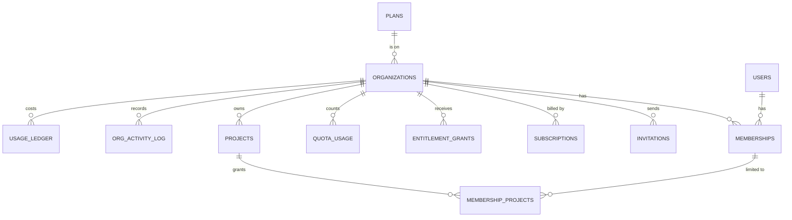
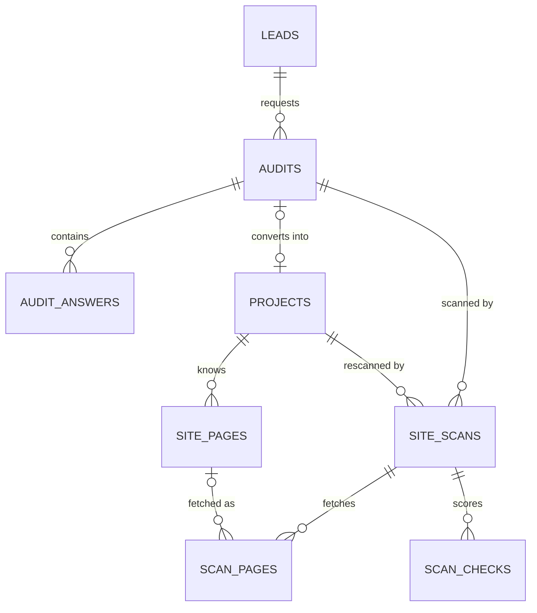
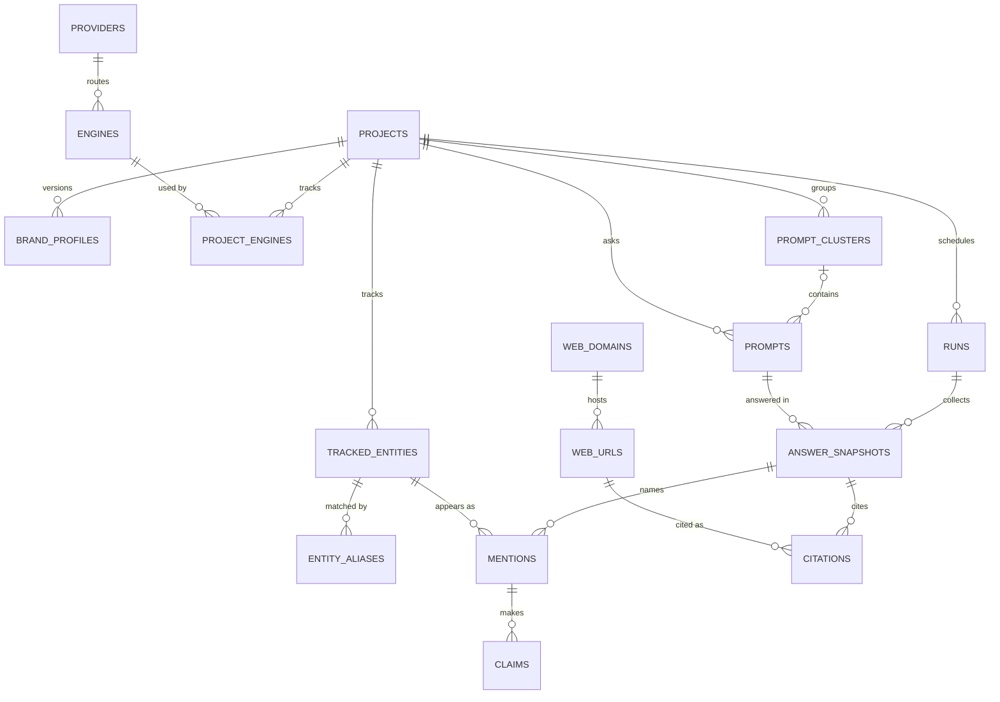
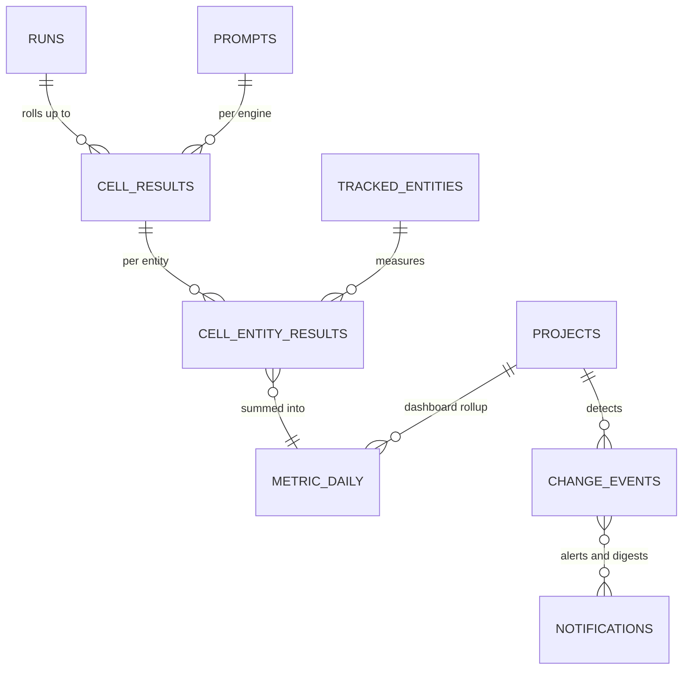
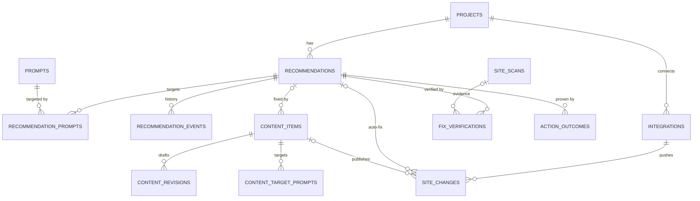
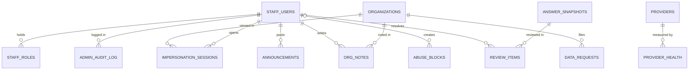

# AEO Corner — Database Schema v1

| | |
|---|---|
| **Document** | Database design, v1 (draft for founder and engineering review) |
| **Date** | 2026-09-28 |
| **Files** | [db/schema.sql](db/schema.sql) (DDL; becomes Prisma migration `0001_init`) · [db/seed_reference.sql](db/seed_reference.sql) (plans, engines, providers, seed domains) · [db/checks.sql](db/checks.sql) (CI guard-rail checks) |
| **Target** | MySQL 8.0.19+ on DigitalOcean Managed MySQL |
| **Auth / ORM** | **Clerk** for sign-in (identity only) · **Prisma 7** with SQL-first migrations. Decided 2026-09-28 ([§10](#10-auth-clerk-orm-prisma-and-migrations)) |
| **Tested** | Loaded on MySQL 8.4.11 with `sql_require_primary_key=ON` (DigitalOcean's requirement). All 7 guard-rail checks pass. 38 constraint tests pass. Monthly partitioning of all fact tables works. All 10 query patterns in §5 use an index. Prisma 7.10 introspects all 64 tables with no drift, applies the schema as its first migration, and passes the runtime tests in [§10.2](#102-orm-prisma-7-with-sql-first-migrations) |
| **Companion to** | [MVP.md](MVP.md) §8 (data model), [CUSTOMER_JOURNEY.md](CUSTOMER_JOURNEY.md) §3 and §7, [ADMIN_OPERATIONS.md](ADMIN_OPERATIONS.md) §8 |

---

## 0. Summary

**64 tables in 16 areas, with 101 foreign keys and 18 CHECK constraints.** The schema covers everything in the MVP spec. It also models the proposals from the customer-journey and admin docs: fix verification, before/after outcomes, "That's not us" reports and the admin tables.

The ten decisions that shape it:

1. **One tenant rule.** Every customer-owned row carries `org_id`. Every project-owned row also carries `project_id`, with a composite foreign key to `projects (id, org_id)`, so the two can never disagree. A CI check fails the build if a new table has no `org_id` and isn't on a reviewed list of global tables.
2. **The brand, competitors and discovered brands live in one table** (`tracked_entities`). Mentions, share of voice and win/loss all point to one ID space.
3. **Fact tables are partition-ready from day one.** `answer_snapshots`, `mentions`, `citations`, `claims` and the two cell rollups have no foreign keys, and every primary and unique key includes `run_date`. Monthly partitioning can be switched on later without changing any keys (tested).
4. **Rollups store sums, never rates.** Mention rate, share of voice and the AI Visibility Score are computed at read time from `n`, `k` and weighted sums, so any date range or filter aggregates correctly.
5. **A failed collection is never an absence.** Snapshot status is `ok`, `no_answer` (for example, no AI Overview shown) or `failed`. Only `ok` answers count in `n`.
6. **The database enforces idempotency.** Unique keys stop duplicates from a double-fired scheduler, a retried collection job, a re-sent webhook, a repeated cost row or a repeated alert.
7. **The recommendation lifecycle has proof built in.** The extended statuses are backed by `fix_verifications` (same-day "fix verified") and `action_outcomes` (+2 and +4 weeks, the north-star "proven wins").
8. **Every change to a customer's site is a row** in `site_changes`. It holds the exact payload the customer previewed, who approved it, and the previous value for rollback. A CHECK constraint makes "applied without approval" impossible.
9. **Anonymous audit data is kept apart from tenant data.** Audits have their own small tables until they are claimed at signup, because leads have a different retention rule (12 months).
10. **Raw data lives in Spaces, MySQL keeps what screens need.** Full answer text, raw HTML and PDFs go to Spaces. MySQL holds a 500-character excerpt and the structured facts. Citation URLs are stored once in a global dictionary (`web_urls`), which keeps the largest fact table small.

**Clerk handles identity only.** Sign-in, sessions and MFA are Clerk's. Organizations, roles, invitations and project access stay in MySQL, and `users` is a local copy keyed by `clerk_user_id` ([§10.1](#101-auth-clerk-identity-only)).

---

## 1. Conventions

| Topic | Rule |
|---|---|
| Engine, charset | InnoDB, `utf8mb4`, collation `utf8mb4_0900_ai_ci` on every table (CI check 6) |
| Primary keys | `BIGINT UNSIGNED AUTO_INCREMENT`. Every table has a primary key (DigitalOcean requirement; CI check 1) |
| Public IDs | `public_id CHAR(26)` (a ULID) on rows whose ID appears in URLs: organizations, projects, audits, content items, reports. Nested resources use internal IDs under a tenant-scoped route. Share links and audit claims use a separate random token, stored only as a SHA-256 hash |
| Tenancy columns | `org_id` on every tenant row. `project_id` plus a composite foreign key to `projects (id, org_id)` on project rows. See [§6](#6-tenant-isolation) |
| Time | `DATETIME(3)` in UTC (the connection sets `time_zone = '+00:00'`). No `TIMESTAMP` (it has a 2038 limit and converts time zones). Calendar facts use `DATE` |
| Money and rates | `DECIMAL` only. Provider costs are `DECIMAL(12,6)`, since single calls cost fractions of a cent. There are no FLOAT/DOUBLE columns (CI check 7) |
| Enumerations | `ENUM` for closed state machines (statuses, roles, intents). Values start with a letter, because Prisma can't name `2w`. Appending a value at the end is a metadata-only change. `VARCHAR(32)` codes for open catalogs that are configuration: `engine_code`, `provider_code`, `rule_code`, `check_code` |
| JSON | For evidence, Brand Kit versions, configs and payloads. A JSON field is never filtered in hot queries. If one needs to be, it gets a generated column plus an index |
| Long text and URLs | URLs are `VARCHAR(2048)` plus a `BINARY(32)` SHA-256 hash for uniqueness and lookups (utf8mb4 index keys max out at 768 characters) |
| Soft delete | `deleted_at` + `purge_after` on organizations and projects only. Everything else is removed by the purge job ([§8](#8-retention-and-deletion)) |
| Foreign keys | Default `RESTRICT`, so an accidental delete fails loudly. `CASCADE` only for pure child rows (aliases, join tables, revisions). No foreign keys on fact tables (CI checks 4–5) |
| Names | Plural `snake_case` tables. Indexes are named `uq_…`, `ix_…`, `fk_…` and `ck_…` so migrations are stable. MySQL reserved words are avoided: `trigger_type` (not `trigger`), `list_rank` (not `rank`), `horizon` (not `checkpoint`), `memberships` (not `member`) |
| Immutability | `brand_profiles`, `content_revisions`, `org_activity_log` and `admin_audit_log` are append-only. **A prompt's text is immutable once tracked:** editing it archives the prompt and creates a new one (`replaces_prompt_id`), so trend lines never mix two different questions |

---

## 2. Table catalog

"Used from" is the MVP week ([MVP §13.2](MVP.md#132-12-week-timeline)) when the feature that writes the table is built. All tables are created in weeks 1–2 as schema v1.

### 2.1 Reference data (global, seeded)

| Table | Purpose | Used from |
|---|---|---|
| `plans` | Plan catalog and limits (Starter/Growth/Agency, pricing hypothesis from MVP §12.3). A NULL limit means not defined yet | 1–2 |
| `providers` | Data and LLM providers, monthly budgets, API-key age | 1–2 |
| `engines` | Measured engines and their primary/fallback routing, so routing is configuration rather than code. v1.1 engines are seeded as `disabled` | 1–2 |

### 2.2 Staff (internal admin)

| Table | Purpose | Used from |
|---|---|---|
| `staff_users` | Staff accounts, separate from customer users. Sign-in and MFA come from a separate Clerk application behind Cloudflare Access; `clerk_user_id` is bound on first sign-in. No passwords or second factors are stored here | 1–2 |
| `staff_roles` | super_admin / ops / support / reviewer / finance. One person can hold several roles | 1–2 |

### 2.3 Web dictionary (global)

| Table | Purpose | Used from |
|---|---|---|
| `web_domains` | Every domain cited by an AI answer, classified as review site / UGC / media / reference / directory / etc. "Own" and "competitor" are decided per project, not here | 5–6 |
| `web_urls` | Every cited URL, stored once. Citations point here by ID | 5–6 |

These hold public URLs only, never who cited them, so sharing them across tenants reveals nothing.

### 2.4 Identity and tenancy

| Table | Purpose | Used from |
|---|---|---|
| `users` | Local copy of each Clerk user, keyed by `clerk_user_id`: email, name, time zone, last org opened. Kept current by Clerk webhooks. Sessions, passwords and sign-in methods stay in Clerk | 1–2 |
| `organizations` | The tenant root. Holds the plan, a mirror of billing status, the Stripe customer ID, the daily spend cap and the retention dates | 1–2 |
| `memberships` | Role per org (owner/admin/editor/viewer), `project_access = all/selected`, and notification preferences | 1–2 |
| `membership_projects` | Which projects a `selected` member can see. This is what makes agency client seats work: a client sees only their own project | 11 |
| `invitations` | Team invites (ours, not Clerk's). The emailed link carries a random token, because serial IDs are guessable. Acceptance also needs a verified Clerk email that matches | 1–2 |
| `org_activity_log` | The customer-visible activity log, including "AEO Corner support viewed your account" | 7–8 |

### 2.5 Billing and entitlements

| Table | Purpose | Used from |
|---|---|---|
| `subscriptions` | Mirror of Stripe subscriptions: trial end, grace period, `money_back_until` (D9) | 11 |
| `entitlement_grants` | Add-ons, credits, coupons and staff grants on top of plan limits. Effective limit = plan + active grants | 11 |
| `quota_usage` | Monthly counters (drafts, "run now", audits), checked when a customer saves something | 10–11 |

### 2.6 Free-audit funnel (anonymous until claimed)

| Table | Purpose | Used from |
|---|---|---|
| `leads` | Audit emails, marketing consent, conversion, `delete_after` (12 months if not converted). **OTP codes live in Redis** | 4 |
| `audits` | One free audit: the 5 questions (JSON), scores, lite Brand Kit, top fixes, cost, a claim token for signup, and the 24-hour cache link | 4 |
| `audit_answers` | 5 questions × 4 engines, 1 sample in live mode. **Never used as the tracking baseline** (CUSTOMER_JOURNEY §3.2) | 4 |
| `abuse_blocks` | Blocked IPs, email domains and target domains. Velocity counters live in Redis | 4 |

### 2.7 Projects and tracking configuration

| Table | Purpose | Used from |
|---|---|---|
| `projects` | One brand or site: locale, cadence, `weekly_slot_hour` (0–167, spreads provider load), status and pause reason, active Brand Kit version | 5–6 |
| `project_engines` | Engines per project, engine weight `w_e`, and a samples override (e.g., 2 samples on Agency, MVP §12.3 lever c) | 5–6 |
| `brand_profiles` | Immutable Brand Kit versions (JSON v1). Runs record which version they used | 5–6 |
| `tracked_entities` | The brand (exactly one per project, enforced), competitors, and discovered brands with a 30-day mention count | 5–6 |
| `entity_aliases` | Names, domains and **exclusions** ("Apex Legends is not us") used by the deterministic pre-pass, each with where it came from | 5–6 |
| `prompt_clusters` | Topic groups | 5–6 |
| `prompts` | Buyer questions: text plus a SHA-256 of the normalized text (duplicates blocked per locale), keyword form for AI Overviews, intent, priority 1–3, locale, source, daily add-on flag | 5–6 |
| `site_pages` | The customer's known pages, for own-page performance, "should be cited" gaps and internal-link targets. *Phase 4:* every scan refreshes the key pages it chose (`INSERT … ON DUPLICATE KEY UPDATE` on `uq_site_pages_url`); `source` is the best way we met the page (`nav` over `sitemap` over `crawl`) | 4–6 |

### 2.8 Readiness scans

| Table | Purpose | Used from |
|---|---|---|
| `site_scans` | One crawl and readiness evaluation. **Shared by audits, weekly re-checks and fix verification**, so there's one readiness engine and one table set. A row belongs to an audit or to a project (CHECK constraint). *Phase 4 (project-owned scans; audit-owned arrive with Phase 7):* `queued` → `running` → `complete` / `partial` / `failed`. `readiness_score` is **NULL, never 0,** when the site could not be read or less than half the rubric could be evaluated. `category_scores` JSON is `{categories: {A…F: {name, earned, possible, score, evaluated, checks}}, coverage, counts, notes[], platform, origin}`; `sitemap_urls` lists the sitemaps found, each with its Spaces key; `robots_txt_uri` is the Spaces key of the robots.txt that was read | 1–2 |
| `scan_pages` | Each fetched page: status, redirects, raw vs rendered text length, JSON-LD types, Spaces keys for the HTML. `raw_uri` / `rendered_uri` are the **full** keys including the environment folder (`aeo-corner/prod/crawl/2026/10/<sha256>.html`: the app's own directory in the shared bucket, then the environment), content-addressed so a retried scan writes the same key. `error` holds why a page has no content: `disallowed_by_robots`, `blocked_by_firewall`, `scan_time_limit`, a fetch error code | 1–2 |
| `scan_checks` | One row per rubric check (A1…F4): pass/partial/fail, points, evidence. `status` `error` means **we could not look** (not a fail) and `not_applicable` means the check does not apply; both are left out of the score. `evidence` JSON always starts with a plain-English `summary`, and names the stored file behind a finding where there is one (`robotsKey`, a sitemap `key`) | 1–2 |

### 2.9 Tracking runs and facts

| Table | Purpose | Used from |
|---|---|---|
| `runs` | One tracking run. `slot_key` (e.g. `2026-W40`) is unique per project, so a double-fired scheduler can't create a duplicate run. Holds task counts, cost and Claude batch IDs | 1–2 (spikes), 5–6 |
| `answer_snapshots` | **Fact.** One collected answer: engine, provider, method, sample, status, model version, locale, Spaces key, excerpt, answer type, pre-pass result, extraction status and version, cost | 5–6 |
| `mentions` | **Fact.** One tracked or discovered brand in one answer: rank, order, prominence, stance, sentiment, excerpt, how it was detected, `is_excluded` after review | 5–6 |
| `citations` | **Fact.** One source cited by an answer: position, `url_id`, `domain_id`, owning entity, `is_own` | 5–6 |
| `claims` | **Fact.** A claim about a tracked brand. Written from the MVP (it feeds negative-claim alerts); accuracy checking arrives in v1.1 | 5–6 |

### 2.10 Rollups and change detection

| Table | Purpose | Used from |
|---|---|---|
| `cell_results` | Question × engine × run: samples planned/ok/no-answer/failed, cell status, the brand's cell score `s(p,e)`, citation counts. **This is the prompt matrix** | 5–6 |
| `cell_entity_results` | The same cell per tracked entity: k mentioned/recommended/cited, rank sum, best rank, sentiment sum. Rows exist only when the entity appears | 5–6 |
| `metric_daily` | Project × date × engine × tracked entity sums. **The dashboard overview reads only this table** | 5–6 |
| `change_events` | Significant changes (z-test result, windows, before/after), each keyed by a dedupe key. Feeds alerts and the digest; an alert can't fire twice | 5–6 |

Filtering by cluster, intent or locale reads the cell tables joined to `prompts`. This means a question's current cluster always applies, and `metric_daily` doesn't multiply into every filter combination.

### 2.11 Action Center and proof

| Table | Purpose | Used from |
|---|---|---|
| `recommendations` | Action Center items with the extended lifecycle (open → in_progress → done → verified/unverified → measuring → proven_win/no_change/declined; dismissed). `open_key` makes the rule engine's upsert safe: one open item per issue, and a closed issue can come back as a new item | 9 |
| `recommendation_prompts` | The questions a recommendation targets, which define the before/after scope | 9 |
| `recommendation_events` | Status history. Feeds rule quality (dismiss, verified and proven-win rates per rule; ADMIN module 7) | 9 |
| `fix_verifications` | Same-day re-checks (immediately, then +1 h and +24 h): re-fetch the page as a bot, re-run a readiness check, or confirm the URL is live | 9 |
| `action_outcomes` | Before/after at +2 and +4 weeks, overall and per engine: k/n before and after, change in percentage points, p-value, verdict. **Proven wins are counted from this table** | 9 |

### 2.12 Integrations, Content Studio and site changes

| Table | Purpose | Used from |
|---|---|---|
| `integrations` | WordPress and Google (one OAuth grant covers GA4 and Search Console). Secrets are envelope-encrypted: ciphertext, wrapped data key, key version | 10–11 |
| `content_items` | Content Studio items: brief, research sources, QC, JSON-LD, status, publishing references. **A CHECK constraint blocks `approved/publishing/published` without an approved revision** | 10 |
| `content_revisions` | Draft history. Approval pins one exact revision, so an edit after approval doesn't silently go live | 10 |
| `content_target_prompts` | The questions a piece of content targets | 10 |
| `site_changes` | Every change pushed to a customer site (JSON-LD, meta, robots.txt, llms.txt, posts, IndexNow): payload, approval, remote reference, previous value for rollback | 10 |

### 2.13 AI traffic analytics

| Table | Purpose | Used from |
|---|---|---|
| `traffic_daily` | GA4 sessions, engaged sessions, key events and revenue by channel (each AI referrer, plus organic and all) and landing page | 11 |
| `search_console_daily` | Clicks, impressions and position for branded queries and target pages | 11 |

### 2.14 Reports and messaging

| Table | Purpose | Used from |
|---|---|---|
| `reports` | PDF exports and share links (the token is stored hashed, with expiry and revocation) | 12 (Should) |
| `notifications` | Every email and in-app message, with a unique `dedupe_key` (sending is idempotent). Also enforces "at most one proactive email per user per day" | 4 |
| `email_suppressions` | Bounced, complained and globally unsubscribed addresses | 4 |
| `announcements` | In-app banners, including incident notices, targeted by plan, org or engine | 7–8 |

### 2.15 Internal admin and operations

| Table | Purpose | Used from |
|---|---|---|
| `admin_audit_log` | Every staff write action, with reason and before/after. **The app's database user can only INSERT and SELECT here** ([§9](#9-database-users-and-grants)) | 1–2 |
| `impersonation_sessions` | Support impersonation. CHECK constraints require a reason of at least 10 characters, and write mode requires the second confirmation | 7–8 |
| `org_notes` | Staff notes per customer | 7–8 |
| `review_items` | The extraction review queue: disagreements, low confidence, and customer "That's not us" / "misread" reports, with resolution and golden-set export | 7–8 |
| `provider_health` | 5-minute buckets per provider and engine: requests, failures, latency, cost, breaker state. The live breaker state is in Redis | 5–6 |
| `data_requests` | GDPR/CCPA export and deletion requests, with the 24-hour undo window | 12 |

### 2.16 Cost ledger and webhook inbox

| Table | Purpose | Used from |
|---|---|---|
| `usage_ledger` | Every paid call with its USD cost and token counts. `idempotency_key` is derived from the job, so a retry never double-counts. Powers COGS, margin per org and the spend guard | 1–2 |
| `webhook_events` | Inbound webhooks (Stripe, Clerk, providers, WordPress, Resend), unique per source and event ID (for Clerk, the `svix-id` header), so replays are harmless | 1–2 |

### 2.17 What is deliberately *not* in MySQL

| Data | Where | Why |
|---|---|---|
| Full answer text, raw provider payloads | Spaces: `raw/answers/{org_id}/{project_id}/{run_date}/{snapshot_id}.json.gz` | Size. Re-extraction reads from here |
| Raw and rendered HTML | Spaces: `raw/pages/{scan_id}/{url_hash}.{raw\|rendered}.html.gz` | Size |
| PDFs, data exports | Spaces: `reports/{org_id}/…` and `exports/{org_id}/…` (exports expire after 7 days) | Downloads via presigned URLs |
| Job queues, retries, schedules | Redis (BullMQ) | Queue semantics. Redis must use `noeviction` |
| OTP codes, rate-limit counters, locks, live circuit-breaker state | Redis | Short-lived and high-churn |
| Feature flags and per-org overrides | PostHog | Already the flag system (ADMIN module 10) |
| Golden set, prompts and rubric versions | The repo (`evals/`, `src/llm/`) | Versioned with the code. `review_items.golden_set_exported_at` links the two |

All raw objects live under one `raw/` prefix, so a **single Spaces lifecycle rule** expires them after 13 months.

---

## 3. Entity-relationship diagrams

The diagrams are split by area for readability. Column-level detail is in [db/schema.sql](db/schema.sql).

### 3.1 Accounts, access and billing



### 3.2 Free audit and readiness scans



### 3.3 Project setup and tracking facts



### 3.4 Rollups and change detection



### 3.5 Action Center, content, site changes and proof



### 3.6 Internal admin and operations



---

## 4. How the data moves through a run

This is the database view of [MVP §7.6](MVP.md#76-key-flows) and [CUSTOMER_JOURNEY §3](CUSTOMER_JOURNEY.md#3-system-data-flow).

| Step (job) | Reads | Writes | Idempotency guard |
|---|---|---|---|
| `scheduler.tick` | `projects` (by `status`, `weekly_slot_hour`) | `runs` | `uq_runs_slot (project_id, slot_key)` + BullMQ job ID |
| `crawl.readiness` | `site_pages` | `site_scans`, `scan_pages`, `scan_checks`; raw HTML → Spaces | New scan row per run |
| `collect.answer` | `prompts`, `project_engines`, `engines` | `answer_snapshots` (status, Spaces key, excerpt), `usage_ledger` | `uq_answer_snapshots_task` + `uq_usage_ledger_idem` |
| Pre-pass | `entity_aliases` | `answer_snapshots.prepass` | Pure function of stored text |
| `extract.batch` / `extract.poll` | Snapshot text (Spaces) | `mentions`, `citations`, `claims`, `web_urls`, `web_domains`; `review_items` when the pre-pass and LLM disagree | Re-extraction deletes and re-inserts per snapshot; `uq_mentions_entity`, `uq_citations_position` |
| `metrics.rollup` | Facts, `prompts.priority`, `project_engines.weight` | `cell_results`, `cell_entity_results`, `metric_daily`, `change_events` | Upserts on the unique cell keys; `uq_change_events_dedupe` |
| `recs.refresh` | Checks, cells, citations | `recommendations`, `recommendation_prompts`, `recommendation_events` | Upsert on `uq_recommendations_open (project_id, open_key)` |
| `publish.wordpress` | `site_changes` (approved) | `site_changes.status`, `content_items` | CHECK: nothing applies without approval |
| `verify.fix` | `site_changes`, `content_items` | `fix_verifications`, `recommendations.verified_at` / `verification`, `site_scans` | `uq_fix_verifications_attempt` |
| `outcome.check` | `recommendation_prompts`, `cell_entity_results`, `cell_results` | `action_outcomes`, `recommendations.status` | `uq_action_outcomes_check` |
| `alerts.evaluate` / `digest.weekly` | `change_events`, `action_outcomes` | `notifications` | `uq_notifications_dedupe` |
| `guard.spend` | `usage_ledger` (today, per org) | `organizations.collection_paused_until` | — |

---

## 5. Query patterns (and the index that serves each)

All ten were run through `EXPLAIN` on the test database. Each one resolves through an index, and none scans a whole table. The index names are the planned access path. On the tiny test data the optimizer sometimes chose a different index from the same table, so re-check with `EXPLAIN` on beta-sized data.

| # | Screen / job | Query shape | Index |
|---|---|---|---|
| Q1 | Dashboard: score and mention-rate trend | `SUM(k_mentioned)/SUM(n_answers)` and `100*SUM(vis_weighted_sum)/SUM(vis_weight_total)` from `metric_daily` for (project, brand entity, date range), grouped by date and engine | `ix_metric_daily_entity`, `uq_metric_daily_cell` |
| Q2 | Share of voice | `SUM(k_mentioned) / SUM(SUM(k_mentioned)) OVER ()` from `metric_daily` for (project, period), grouped by entity | `ix_metric_daily_entity`, `uq_metric_daily_cell` |
| Q3 | Prompt matrix (latest run) | `cell_results` for the run, LEFT JOIN `cell_entity_results` for the brand | `uq_cell_results_cell`, `uq_cell_entity_results_cell` |
| Q4 | "Show me the answers behind this number" | `answer_snapshots` by (project, prompt, engine, date range); full text from Spaces | `ix_answer_snapshots_cell` |
| Q5 | Citation gap | Non-own `citations` in answers where a competitor is mentioned and the brand isn't (`EXISTS` / `NOT EXISTS` on `mentions`), grouped by domain | `ix_citations_domain` or `ix_citations_url`, then `uq_mentions_entity` |
| Q6 | Spend guard | `SUM(cost_usd)` from `usage_ledger` for (org, today) | `ix_usage_ledger_spend` |
| Q7 | Scheduler tick | `projects` where `status='active' AND weekly_slot_hour=?` | `ix_projects_schedule` |
| Q8 | North star: proven wins | `COUNT(*)` from `action_outcomes` where `verdict='proven_win' AND engine_scope='all'` in a period | `ix_action_outcomes_global` |
| Q9 | Due fix verifications | `fix_verifications` where `status='pending' AND scheduled_for <= now` | `ix_fix_verifications_due` |
| Q10 | One proactive email per day | `COUNT(*)` from `notifications` for (user, proactive, email, today) | `ix_notifications_daily_cap` |

**Performance target check (MVP F5: p95 < 1.5 s for 500 questions × 12 months).** A year of the overview for one project is about 4 engines × 52 dates × ~11 entities ≈ 2,300 `metric_daily` rows. A year of one question's history is 208 `cell_results` rows. Both are small index-range reads.

---

## 6. Tenant isolation

MySQL has no row-level security, so isolation has four layers:

1. **Repository layer (runtime).** Every query goes through a tenant-scoped repository that injects `org_id` (MVP §11.1): `createDb().forOrg(orgId)` binds the organization once, and no function takes an `org_id` from its arguments. Prisma and raw SQL outside `src/db/` are blocked by an ESLint rule (`eslint.config.js`), and `src/db/boundary.test.js` proves the rule fires.
2. **Composite foreign keys (database).** Project rows reference `projects (id, org_id)`, so a row with project 10 and the wrong org is rejected (tested: `ERROR 1452`).
3. **Schema guard rails (CI, [db/checks.sql](db/checks.sql)).**
   - Every table without `org_id` must be on a reviewed global list.
   - `org_id` may be NULL only on a reviewed "mixed" list: `audits`, `site_scans`, `scan_pages`, `scan_checks`, `notifications`, `usage_ledger`, `admin_audit_log`. Those rows either belong to an anonymous audit or lead, or are internal.
4. **Cross-tenant leak tests (CI).** Seed two orgs with near-identical data, call every repository method and every route as org A, and assert that no org B ID appears. **Live since Phase 2** in `tests/tenancy/` (repositories and routes). Both suites fail if a function or route is added without a leak test, so they grow with every phase.

**Global tables (no `org_id`):** `plans`, `providers`, `engines`, `web_domains`, `web_urls`, `staff_users`, `staff_roles`, `users`, `organizations` (the tenant root), `leads`, `audit_answers` (reached through its audit), `abuse_blocks`, `email_suppressions`, `announcements`, `provider_health`, `webhook_events`, and Prisma's `_prisma_migrations`.

`users` is global on purpose: one person can belong to several orgs (an agency and a client, for example). Access always goes through `memberships`, plus `membership_projects` for client seats.

---

## 7. Volume, sizing and partitioning

### 7.1 Estimate at MVP scale

Assumptions: 100 projects × 100 questions, weekly runs (4.33 per month), 10 answers per question-run, about 5 mentions and 6 citations per answer. **These are estimates. Measure real row sizes during the design-partner beta.**

| Table | New rows / month | Notes |
|---|---|---|
| `answer_snapshots` | ≈ 430K | ~1 KB/row with indexes (500-character excerpt) |
| `mentions` | ≈ 2.2M | Excerpts for tracked brands only |
| `citations` | ≈ 2.6M | Small rows (IDs only) thanks to `web_urls` |
| `claims` | ≈ 0.4M | |
| `cell_results` / `cell_entity_results` | ≈ 170K / ≈ 0.7M | Kept for the account's lifetime |
| `usage_ledger` | ≈ 0.45M | LLM batch costs are one row per batch |
| `metric_daily` | ≈ 15K | |

**Storage: roughly 2–3 GB per month including indexes, so about 30–40 GB by month 13** with the 13-month fact retention from MVP §8.3.

⚠️ **This affects cost.** The MVP §7.11 estimate (~$15/month for Managed MySQL) assumed the smallest plan, and its disk will fill within the first months of paid usage. Budget for a larger plan or added storage from the beta. Alternatively, reduce MySQL fact retention (see [§11](#11-open-decisions), O3).

### 7.2 When and how to partition

- **Trigger:** any fact table passes ~50M rows (MVP §8.3), or retention deletes become slow.
- **How:**

  ```sql
  ALTER TABLE mentions PARTITION BY RANGE COLUMNS(run_date)
    (PARTITION p2026_10 VALUES LESS THAN ('2026-11-01'), …, PARTITION pmax VALUES LESS THAN (MAXVALUE));
  ```

  This was tested on copies of all six fact tables. Every primary and unique key already includes `run_date`, and there are no foreign keys to drop.
- **Afterwards:** retention becomes `ALTER TABLE … DROP PARTITION` (instant) instead of batched deletes. A monthly job adds next month's partition.
- **Past partitioning:** the ClickHouse trigger is unchanged: more than ~200M fact rows, or dashboard p95 above 1.5 s. MySQL stays the system of record.

---

## 8. Retention and deletion

| Data | Tables / location | Kept | Mechanism (`maintenance.retention`, nightly) |
|---|---|---|---|
| Raw answers and pages | Spaces `raw/` | 13 months | Spaces lifecycle rule |
| Answer facts | `answer_snapshots`, `mentions`, `citations`, `claims` | 13 months | Batched `DELETE … WHERE run_date < ?` (later `DROP PARTITION`) |
| Rollups and proof | `cell_results`, `cell_entity_results`, `metric_daily`, `change_events`, `action_outcomes` | Account lifetime | Purged with the org |
| Unconverted audit leads | `leads`, `audits`, `audit_answers`, audit `site_scans`, lead `notifications` | 12 months after the last audit | `leads.delete_after` |
| Cited-URL dictionary | `web_urls` | While referenced | Orphans (not cited in 13 months) removed monthly |
| Webhook payloads | `webhook_events.payload` | 30 days (row kept 90 days) | Nightly |
| Provider health | `provider_health` | 90 days | Nightly |
| Cost ledger | `usage_ledger` | 25 months in MySQL, then exported to Spaces as CSV | Monthly |
| Staff audit log | `admin_audit_log` | 24 months *(proposed)* | Monthly |
| Customer activity log | `org_activity_log` | Account lifetime (max 24 months) | Monthly |
| Cancelled accounts | Everything for the org | 90 days read-only *(proposed, CUSTOMER_JOURNEY §7 change 6)*, then purged | `organizations.retain_until` |
| Deleted accounts | Everything for the org | 24-hour undo, then purged within 30 days | `data_requests` + `organizations.purge_after` |

**Org purge order** (safe with the foreign keys):
1. Facts and cell rollups by `org_id`, in batches (no foreign keys).
2. `action_outcomes`, `fix_verifications`, then `site_changes`.
3. Content tables, then recommendation tables.
4. `integrations`, `reports`, `review_items`, `change_events`, `metric_daily`, `runs`, project `site_scans`.
5. Project configuration: entities (aliases cascade), `prompts`, clusters, `brand_profiles`, `site_pages`, `project_engines`, `membership_projects`.
6. `projects`.
7. Billing rows, invitations, memberships, notes and notifications.
8. `organizations`, plus Spaces prefixes for the org.
9. Users with no remaining memberships, and their Clerk accounts (deleted through Clerk's Backend API).

`data_requests` and `admin_audit_log` keep the numeric `org_id` as proof the purge happened. They hold no customer content.

---

## 9. Database users and grants

| User | Used by | Privileges |
|---|---|---|
| `aeo_migrator` | Deploy step only (`prisma migrate deploy`) | DDL + DML on `aeo_corner.*` |
| `aeo_app` | Web and worker processes | SELECT, INSERT, UPDATE, DELETE, **granted per table**. On `admin_audit_log` and `org_activity_log`: **SELECT and INSERT only**, which makes them append-only for the application |
| `aeo_readonly` | Ad-hoc analysis, BI later | SELECT on every table **except** `integrations` (the only table holding secrets, now that sign-in data lives in Clerk) |

- MySQL can't subtract one table's privileges from a database-wide grant, so a script generates the per-table `GRANT` statements from `information_schema`. It runs in CI against a scratch database.
- Encrypted secrets are useless without the master key. That key lives in the Droplet's `.env`, never in the database (MVP §11.2).
- Verify in week 0 that DigitalOcean's `doadmin` user can create these users and table-level grants on the managed cluster.

---

## 10. Auth (Clerk), ORM (Prisma) and migrations

Decided on 2026-09-28: **Clerk** for sign-in and **Prisma** for data access.

### 10.1 Auth: Clerk, identity only

Clerk handles sign-in (email + password or Google, as in [CUSTOMER_JOURNEY](CUSTOMER_JOURNEY.md) stage 4), sessions and MFA. **Organizations, roles, invitations and project access stay in MySQL.** Clerk Organizations is not used, because:
- Clerk's included organizations offer only Admin and Member roles, up to 20 members per org and 100 active orgs per app. Our four roles (owner/admin/editor/viewer) would need its B2B add-on: $100/month, plus $1 per active org beyond 100.
- Project-level access (`membership_projects`) and plan seat limits would stay here anyway, so Clerk would only add a second copy of membership data to keep in sync.
- This way, permissions never depend on webhook timing, and changing auth provider later only touches `users`.

**How a customer request is authenticated:**
1. `clerkMiddleware()` from `@clerk/express` checks the Clerk session, and `getAuth(req).userId` gives the Clerk user ID. (`requireAuth()` is deprecated.)
2. The app finds the `users` row by `clerk_user_id` (unique index; cacheable in Redis for a few minutes).
3. If the row doesn't exist yet, it fetches the user from Clerk's Backend API and inserts it. The `user.created` webhook can arrive after the first page view, and it does the same insert, so either path can win. A unique-key error (Prisma `P2002`) means "already created": read the row.
4. The org comes from the URL (`/app/o/:org`, its `public_id`). `organizations.findForUser()` returns it only if the user has a membership; a non-member gets the same 404 as an ID that doesn't exist. `memberships` and `membership_projects` decide access, as before. `users.last_org_id` chooses the org to open after sign-in.
5. State-changing requests carry a CSRF token: an HMAC of the Clerk session ID under `APP_SECRET`. Nothing is stored server-side.

**Sign-in screens are Clerk's hosted pages** (decided 2026-10-02, [ADR-0004](adr/0004-clerk-hosted-sign-in.md)): Clerk's embedded components need `style-src 'unsafe-inline'`, which would undo the strict CSP. The app sends visitors to Clerk with a return address, and `clerkMiddleware()` runs only under `/app`, `/invite`, `/sign-out` and on the staff host.

**Webhooks** (`user.created`, `user.updated`, `user.deleted`):
- Verify the Svix signature, then insert into `webhook_events` with `external_id` = the `svix-id` header. Clerk can deliver an event twice or out of order. The unique key drops repeats.
- Apply an update only if its `updated_at` is newer than `users.clerk_updated_at`.
- `users.email` is indexed but not unique. Clerk enforces uniqueness, and out-of-order events could briefly give two rows the same address.
- `user.deleted`: clear the email and name, set `deleted_at` and remove memberships. The row stays so history keeps its IDs. A late `user.updated` never revives a deleted user. If the person was the only owner of an organization, the organization is left without an owner: the handler logs a warning, and nothing else happens automatically yet (the account-deletion and ownership-transfer flow belongs with billing, Phase 13).
- Only the customer Clerk app sends webhooks (`webhook_events.source = 'clerk'`). The stored payload contains email addresses and is meant to be kept 30 days; **the purge job that deletes older payloads does not exist yet** (Phase 3, with the other background jobs).

**Invitations are ours.** An owner invites by email, and we send the email with a random token (its hash is `invitations.token_hash`). The invitee signs in or signs up with Clerk. Acceptance needs the token **and** a verified Clerk email that matches the invitation. It then creates the membership and any project restrictions.

**Staff sign in through a separate Clerk application**, so staff and customer accounts never share a user pool or a session:
- Sign-up is invite-only. A super_admin creates the `staff_users` row, and `clerk_user_id` is bound on first sign-in by matching the verified email.
- The admin middleware rejects any staff session whose Clerk user has no second factor (the `fva` claim in the session token; see [ADR-0004](adr/0004-clerk-hosted-sign-in.md)). The staff app's session settings enforce the 30-minute idle timeout: **set it in the staff Clerk dashboard, it isn't code.** Cloudflare Access stays in front of `admin.aeocorner.com`, and the app verifies Cloudflare's signed token itself (`src/web/staff/cloudflare-access.js`), so going around Cloudflare to the server's own address gets nothing. The staff app runs on its own host (`STAFF_HOST`) and never serves customer pages, or the other way round.
- The first staff member is created from the command line: `npm run staff:invite -- you@aeocorner.com "Your Name" super_admin`. They then sign in with that email, verified, and a second factor.
- Support impersonation stays ours (`impersonation_sessions`: org-scoped, read-only by default, reason required). Clerk's own impersonation signs in as a specific user and is capped at 5 a month without a $100/month add-on.

**Cost** (Clerk's pricing page, checked 2026-09-28):
- **Free plan:** 50,000 monthly retained users per app, password and Google sign-in, invite-only mode.
- **Pro plan, $25/month ($20 billed annually):** adds MFA and passkeys. One Pro plan covers every application.
- **Staff MFA makes Pro necessary from launch.** Customers get optional MFA with it.

**Setup notes:**
- Clerk's production instance needs DNS records on aeocorner.com. Add Clerk's domains to the CSP.
- Development instances include Pro features free.
- Add Clerk to the public subprocessor list (MVP §11).

### 10.2 ORM: Prisma 7 with SQL-first migrations

Tested with Prisma 7.10.0 (the current stable release; Prisma 8 is a release candidate) and its `@prisma/adapter-mariadb` driver against MySQL 8.4:

| Test | Result |
|---|---|
| `prisma db pull` | All 64 tables introspected, and `prisma validate` passes. One fix was needed: enum values can't start with a digit, so `action_outcomes.horizon` is now `week_2` / `week_4` (was `2w` / `4w`) |
| Drift | Database vs. introspected schema: no differences. Migrations vs. schema: no differences. Adding one field in `schema.prisma` drafts exactly one `ALTER TABLE … ADD COLUMN` and leaves generated columns and CHECKs alone |
| `prisma migrate deploy` | Applies `schema.sql` and `seed_reference.sql` as migrations `0001_init` and `0002_reference_data` on an empty database |
| Partitioned fact table | Introspection unchanged, no drift, queries work |
| CHECK constraints | Prisma doesn't model them, but MySQL still enforces them: error `P2039` wrapping MySQL error 3819 |
| Generated columns | Introspected as ordinary nullable fields. Reads work. MySQL rejects writes (`P2039` wrapping error 3105) |
| Tenant composite foreign key | A row whose `org_id` doesn't match its project is rejected (`P2003`) |
| Plain JavaScript | The generated client is TypeScript, but it runs from a plain `.js` file on Node 24 with no build step (generator options `moduleFormat = "esm"`, `importFileExtension = "ts"`) |

**Where Prisma falls short, and the rule for each:**
1. **`schema.prisma` can't rebuild the database.** Built from `schema.prisma` alone, the database would lose the 18 CHECKs, `ON UPDATE CURRENT_TIMESTAMP`, and the 3 generated columns (they'd become plain columns). So the SQL files in `prisma/migrations/` are the source of truth. **Never run `prisma db push`** against a shared database. Build test and CI databases with `prisma migrate deploy`.
2. **Everyday change:**
   1. Edit `schema.prisma`.
   2. Run `prisma migrate dev --create-only`.
   3. Review the SQL. Add by hand anything Prisma can't express (a CHECK, a generated column, a partition clause).
   4. Run `prisma migrate dev`.

   To change a CHECK or a generated column, write the SQL by hand, then run `prisma db pull`.
3. **IDs are JavaScript `BigInt`.** `JSON.stringify` throws on them, and `1n === 1` is false. IDs rarely leave the server (URLs use `public_id`), and JSON responses go through one serializer that turns BigInt into strings.
4. **`upsert` isn't atomic on MySQL.** Prisma runs a SELECT and then an INSERT. In the test, 3 of 4 concurrent upserts on one key failed with `P2002`. Where writes race (Clerk webhook vs. first request, job retries), catch `P2002` and re-read, or use `$executeRaw` with `INSERT … ON DUPLICATE KEY UPDATE`.
5. **Never use `createMany({ skipDuplicates: true })`.** It becomes `INSERT IGNORE`, and in MySQL that also silently truncates text that is too long, stores an invalid enum as an empty string, and skips rows that break a CHECK (all three verified). For idempotent bulk inserts such as fact rows, use `INSERT … ON DUPLICATE KEY UPDATE id = id` through `$executeRaw`: duplicates become no-ops, and bad data still errors.
6. **Prisma's `_prisma_migrations` table** uses `utf8mb4_unicode_ci`. It is exempt from CI check 6 and on the global list in check 2.
7. **Tenant scoping stays in the repository layer** (§6). A Prisma client extension can add the `org_id` filter, but the lint rule remains: `prisma.*` and `$queryRaw` are allowed only inside `src/db/`.
8. **Connections:** use TLS with DigitalOcean's CA certificate. Set the adapter's `connectionLimit` so the web and worker processes together stay under the cluster's connection cap.
9. **Transactions retry deadlocks.** InnoDB resolves two transactions that wait on each other by abandoning one ("Deadlock found… try restarting transaction", Prisma `P2034`, or `P2010` for a raw query). That is routine under concurrency, not a bug, and the remedy is to run the whole transaction again. Repositories call `transaction(prisma, async (tx) => …)` from `src/db/transaction.js` (up to 4 attempts with a short random wait), and a lint rule forbids calling `prisma.$transaction` directly there. Added 2026-10-02 after organization creation failed under load.

`docs/db/schema.sql` becomes `prisma/migrations/0001_init/migration.sql`, and `seed_reference.sql` becomes `0002_reference_data`. The copy in `docs/db/` is regenerated each release (`mysqldump --no-data`) as a readable snapshot.

### 10.3 Migration rules

1. **Expand → migrate → contract.**
   - Add new columns or tables in one release.
   - Backfill in a job.
   - Remove old ones in a later release.
   - Never rename in one step.
2. **Prefer online DDL** (`ALGORITHM=INSTANT` or `INPLACE`). Append ENUM values at the end (metadata-only), starting with a letter. Reordering or removing values rebuilds the table.
3. **Rehearse** any DDL on a large fact table against a restored copy first (the monthly restore drill in ADMIN §5 provides one).
4. **Every migration runs `checks.sql` in CI.** A new table without `org_id`, or a foreign key on a fact table, fails the build.
5. **CI also fails on Prisma drift.** It runs `prisma migrate diff --from-migrations prisma/migrations --to-schema prisma/schema.prisma` and expects an empty migration.

---

## 11. Open decisions

| # | Decision | Recommendation |
|---|---|---|
| O1 | ORM | ✅ **Decided: Prisma 7**, SQL-first migrations ([§10.2](#102-orm-prisma-7-with-sql-first-migrations)) |
| O2 | Auth | ✅ **Decided: Clerk**, identity only, with a separate Clerk app for staff ([§10.1](#101-auth-clerk-identity-only)) |
| O3 | Fact retention in MySQL | Keep **13 months** (MVP §8.3) if the database budget allows. Otherwise **6 months hot**: rollups keep all trends, and older answers can be re-extracted from the 13-month raw copies in Spaces. That roughly halves database size |
| O4 | Cancelled-account retention | **90 days read-only, then delete** (CUSTOMER_JOURNEY §7 change 6) |
| O5 | Staff audit log retention | **24 months** |
| O6 | Managed MySQL plan | Size for ~30–40 GB by month 13 ([§7.1](#71-estimate-at-mvp-scale)). Update the MVP §7.11 cost estimate |
| O7 | Undefined plan limits (seats, "run now" per month) | Set before launch. They are NULL in [seed_reference.sql](db/seed_reference.sql) |

---

## 12. Changes from MVP §8.2

| MVP §8.2 | Schema v1 | Why |
|---|---|---|
| `competitors` | `tracked_entities` + `entity_aliases` | One ID space for brand, competitors and discovered brands. Aliases and exclusions are rows with a source, so review fixes are traceable |
| `audits` / `audit_checks` | `audits` + `audit_answers` + `site_scans` / `scan_pages` / `scan_checks` | One readiness engine for audits, weekly re-checks and fix verification |
| `leads.audit_id` | `audits.lead_id` | A lead can run several audits |
| Monthly-partitioned facts | Partition-*ready* facts (no FKs; `run_date` in every key) | Partitioning is switched on at ~50M rows with no key changes (tested) |
| `citations.url`, `domain`, `domain_class` | `url_id` → `web_urls`, `domain_id` → `web_domains` | URLs repeat across answers; this keeps the largest fact table small. Classification is global |
| `metric_daily` with cluster/intent/locale and stored rates | `cell_results` + `cell_entity_results` + `metric_daily` storing sums | Filters come from cells joined to prompts. Rates are derived at read time, so periods aggregate correctly |
| `recommendations` with `open → in_progress → done/dismissed` | Extended lifecycle, `verified_at`, `verification`, `open_key`, plus `recommendation_prompts`, `recommendation_events`, `fix_verifications`, `action_outcomes` | CUSTOMER_JOURNEY §7 changes 2 and 3 |
| `content_items` with `target_prompt_ids[]` | `content_items` + `content_revisions` + `content_target_prompts` | Approval pins an exact revision |
| — | `site_changes` | An auditable record of every change pushed to a customer's site, with approval and rollback |
| `integrations.secret_ciphertext` | Plus `secret_wrapped_dek` and `secret_key_version` | Envelope encryption and key rotation |
| `usage_ledger` | Plus token counts and `idempotency_key` | Retries never double-count cost |
| `users` | Plus `clerk_user_id`; no session, account or token tables | Clerk holds sessions, passwords and sign-in methods ([§10.1](#101-auth-clerk-identity-only)) |
| ADMIN_OPERATIONS §8 proposals | `staff_users`, `staff_roles`, `admin_audit_log`, `impersonation_sessions`, `org_notes`, `review_items`, `provider_health`, `announcements`, `data_requests` | Admin console modules 1–12 |
| — | `runs.slot_key`, `change_events`, `notifications`, `subscriptions`, `entitlement_grants`, `quota_usage`, `webhook_events`, `abuse_blocks`, `reports`, `membership_projects`, `prompt_clusters`, `site_pages`, `org_activity_log`, `email_suppressions`, `search_console_daily` | Needed by flows the spec already describes (scheduling, alerts, billing, limits, abuse, agency seats, activity log) |

The MVP spec's feature sections (F4, F5, F7, §11.3) still describe the original versions of these changes. Updating them is the separate "apply all" pass.
