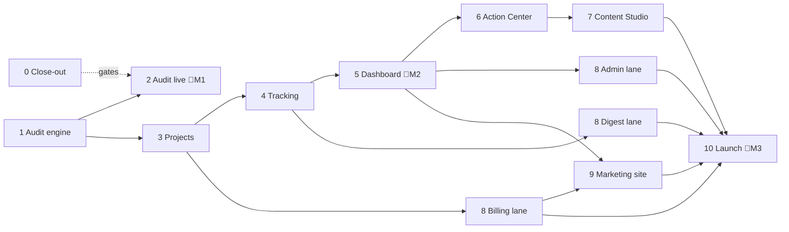

# AEO Corner — Milestones (Phases 7–15)

| | |
|---|---|
| **Document** | Execution order for the rest of the MVP: Phases 7–15 of [BUILD_PLAN.md](BUILD_PLAN.md), reorganized into 11 sequential milestones of single-action tasks |
| **Date** | 2026-10-03 |
| **Status** | In progress. Milestone 5 (dashboard): the screens and their tests are built (5.01–5.10); open are deploying to production (5.11) and onboarding the design partners (5.12), which need the production server (Milestone 2) and the founder. Milestone 4 (tracking engine): all tasks 4.01–4.12 are built and tested on fixture engines; open on its Definition of Done: a real project's unattended weekly run on staging, and the cost per prompt-run from the ledger (both need real keys and the staging server). Milestone 1 (audit engine) is built. Milestone 3: all tasks 3.01–3.15 are built. Open on the Definition of Done: a real-Clerk sign-up run (needs 0.15) and one live-model run of the extractor and generator (costs money). Milestone 2: the audit screens (2.01–2.07) and the provisioning runbook (2.08) are built; the Droplets, the staging E2E, the load test and the production switch (2.09–2.13) are waiting on the founder's accounts and keys |
| **Companion docs** | [BUILD_PLAN.md](BUILD_PLAN.md) (phase detail and required tests) · [MVP.md](MVP.md) §13 · [CUSTOMER_JOURNEY.md](CUSTOMER_JOURNEY.md) §7 · [UI_DESIGN.md](UI_DESIGN.md) · [CLAUDE.md](../CLAUDE.md) |

## 1. How to read this plan

- **Milestones run in order.** Each has prerequisites, tasks, and a Definition of Done (DoD).
- **A milestone is done when every DoD box is ticked.** All earlier test suites must still pass.
- **Task IDs** are `<milestone>.<nn>`. The **Needs** column lists the tasks that must finish first.
  - `—` means the task can start as soon as the milestone starts.
  - Tasks whose Needs are all done can run **in parallel**.
- **🔒 marks a blocker:** other tasks wait on it. Do these first.
- **👤 marks founder work:** accounts, keys, sign-offs, legal text, decisions.
- **Every task also follows the standing rules** ([CLAUDE.md](../CLAUDE.md)), so they aren't repeated per task:
  - A new repository function or organization route ships with its cross-tenant leak test.
  - A new page goes in `tests/e2e/pages.js` (and `src/web/pages.js` if public), built from the component kit.
  - A paid call goes through `callProvider`; a fetch of someone else's URL goes through `createSafeFetcher`.
  - A changed decision updates the docs in the same pass; a one-way-door decision gets an ADR.
- **Tick boxes here as work lands.** [BUILD_PLAN.md](BUILD_PLAN.md) Phases 7–15 stay as the reference for the detail and the required tests; mark a phase `✅ Complete` there when its milestone is done.

## 2. Overview

| # | Milestone | BUILD_PLAN phase | Flag | Can overlap with |
|---|---|---|---|---|
| 0 | Close-out & founder gates | Open items from 0–6 | — | Everything (it's mostly waiting on the founder) |
| 1 | Audit engine (backend) | 7 | — | Milestone 0 |
| 2 | Free audit live | 7 + deploy from 15 | 🚩 **M1** | Milestone 3 backend lane |
| 3 | Projects & setup | 8 | — | Milestone 2 |
| 4 | Tracking engine | 9 | — | Milestone 8 billing lane |
| 5 | Dashboard & design-partner beta | 10 | 🚩 **M2** | Milestone 8 billing lane |
| 6 | Action Center & proof | 11 | — | Milestone 7 lane B, Milestone 8 |
| 7 | Content Studio & WordPress | 12 | — | Milestone 8, Milestone 9 content |
| 8 | Billing, traffic, digest & admin | 13 | — | Milestones 4–7 (four independent lanes) |
| 9 | Marketing site | 14 | — | Content writing from Milestone 2 on |
| 10 | Hardening & launch | 15 | 🚩 **M3** | — |

**Critical path:** 1 → 2 → 3 → 4 → 5 → 6 → 7 → 10. Milestones 8 and 9 run beside it in lanes and must be done before 10.

### 2.1 What changed from BUILD_PLAN's phase order

| Change | Why |
|---|---|
| The audit's lite Brand Kit and question generator are built once, as shared services, in Milestone 1. Milestone 3 extends them | Phase 7 and Phase 8 each described a generator. Building two would double the eval and prompt work |
| The audit's visibility scorer lives in `src/core` from Milestone 1 and is reused by the dashboard | One scoring definition, so the audit and the dashboard can't disagree |
| Deployment (runbook, staging, production) moves from Phase 15 to Milestone 2 | "Free audit live" (🚩 M1) needs a production server. No phase before 15 provisioned one |
| Fallback adapters (carried from Phase 5) land in Milestone 4 | They matter once runs are unattended; MVP §13.3 needs a fallback or a documented degraded mode per engine |
| The six [CUSTOMER_JOURNEY.md §7](CUSTOMER_JOURNEY.md#7-proposed-changes-to-the-mvp-spec) changes each get a task: first run now (4.11), fix verified (6.06), action outcomes (6.08), D9 (0.12), "That's not us" (5.10), retention (8.24) | They were modeled in the schema but scheduled nowhere |
| The JSON-LD validator is a standalone first task in Milestone 7 | Milestone 9 reuses it, and it has no dependencies |
| Phase 13 is split into four lanes (billing, traffic, digest, admin) | They share nothing, and billing can start as soon as projects exist |
| The htmx CSRF client code (carried from Phase 2) is the first task of Milestone 3 | It's needed by the first signed-in htmx form, and every Milestone 3 screen has one |

---

## Milestone 0 — Close-out & founder gates

**Goal:** finish what Phases 0–6 left open, and line up the founder items each later milestone waits on.

**Pre-requisites:** none.

| # | Task | Needs | Gates |
|---|---|---|---|
| 0.01 | ✅ 2026-10-03 Confirm CI is green on `main` with Phases 4–6 pushed | — | Ticks Phase 1 and 4 CI boxes |
| 0.02 | ✅ 2026-10-03 Test the Bull Board page on the staff host under the CSP | — | Phase 3 close |
| 0.03 | ✅ 2026-10-03 Write the queue-design ADR and finish the Phase 3 docs pass | — | Phase 3 close |
| 0.04 | ✅ 2026-10-03 Record live DataForSEO calls (ChatGPT, Gemini) as fixtures | — | 1.09 tests |
| 0.05 | ✅ 2026-10-03 Fill in ADR-0006's results table | 0.04 | Phase 5 close |
| 0.06 | 👤 Review the golden-set labels (`npm run golden:review`) | — | 0.07 |
| 0.07 | Re-score on reviewed labels and finalize D4 | 0.06 | Phase 6 close |
| 0.08 | 👤 Add `ANTHROPIC_API_KEY` as a GitHub repository secret | — | Eval in CI |
| 0.09 | 👤 Approve brand basics ([UI_DESIGN.md §2](UI_DESIGN.md#2-brand-basics)) | — | 🔒 Milestone 2 |
| 0.10 | 👤 Sign off the public-site and audit-flow wireframes | — | 🔒 Milestone 2 screens |
| 0.11 | 👤 Get Terms and Privacy text lawyer-reviewed | — | 🔒 2.13 (real emails) |
| 0.12 | 👤 Decide D9 (trial vs. proof timing) and the cancelled-account retention policy | — | 🔒 8.02, 8.24 |
| 0.13 | 👤 Provide Turnstile, PostHog (cookieless) and Sentry keys | — | 🔒 2.07, 2.13 |
| 0.14 | 👤 Register `aeocorner.com` and `aeocorner.ai` | — | 🔒 2.10 |
| 0.15 | 👤 Provide Clerk dev keys; engineer runs ADR-0004's first-run checklist | — | 🔒 Milestone 3 DoD |
| 0.16 | 👤 Do the Clerk webhook, staff-app and Cloudflare Access setup | 0.15 | 🔒 Milestone 5 (partners sign in) |
| 0.17 | 👤 Fill in the `NULL` plan limits (DATABASE_SCHEMA §11 O7) | — | 🔒 8.01, 4.10 |
| 0.18 | 👤 Submit Google OAuth verification (GA4, Search Console) | — | 🔒 8.09 (weeks of lead time) |
| 0.19 | 👤 Sign off the remaining wireframe groups, each before its milestone | — | 🔒 3, 5, 6, 8 screens |

**Parallel:** every task except 0.05, 0.07 and 0.16 can start now. Start 0.18 today: it has the longest lead time.

**Definition of Done:**
- [ ] CI green on `main`.
- [ ] Bull Board page tested; queue ADR written.
- [ ] DataForSEO fixtures recorded and replayed by `test:adapters`.
- [ ] D4 marked final in ADR-0007 and MVP §17.
- [ ] Every 👤 item either done or dated with the milestone it gates.

---

## Milestone 1 — Audit engine (backend)

**Goal:** a domain goes in, a complete audit result comes out, with no screens yet.

**Pre-requisites:** Phases 3–6 engineering (done). 0.04 for the ChatGPT/Gemini test path.

| # | Task | Needs |
|---|---|---|
| 1.01 | 🔒 Write the `audits` repository (`src/db/repos/audits.js`) ✅ 2026-10-03 | — |
| 1.02 | 🔒 Finish `scan-results.js` and move `org-scans` onto it ✅ 2026-10-03 | — |
| 1.03 | Persist audit-owned scans (`site_scans.audit_id`, no organization) ✅ 2026-10-03 | 1.01, 1.02 |
| 1.04 | List the audit lookups in the tenancy coverage test as reviewed cross-org access ✅ 2026-10-03 | 1.01 |
| 1.05 | 🔒 Build the shared Brand Kit extractor, lite mode (`src/llm/brand-kit.js`) ✅ 2026-10-03 | — |
| 1.06 | 🔒 Build the shared question generator, 5-question audit mode ✅ 2026-10-03 | — |
| 1.07 | 🔒 Build the visibility scorer in `src/core` (pure) ✅ 2026-10-03 | — |
| 1.08 | Build the fix-list generator from readiness checks and answer gaps ✅ 2026-10-03 | 1.07 |
| 1.09 | Store `audit_answers` per engine and question ✅ 2026-10-03 | 1.01 |
| 1.10 | Build the `audit.run` job: scan → brand kit → questions → collect ×4 → sync extract → score → fixes ✅ 2026-10-03 | 1.03, 1.05, 1.06, 1.08, 1.09 |
| 1.11 | Add a daily global audit budget to the spend guard ✅ 2026-10-03 | — |
| 1.12 | Reuse a recent audit of the same domain instead of re-running ✅ 2026-10-03 | 1.10 |
| 1.13 | Build OTP codes: issue, store hashed, expire, limit attempts ✅ 2026-10-03 | 1.01 |
| 1.14 | Verify Cloudflare Turnstile tokens server-side ✅ 2026-10-03 | — |
| 1.15 | Rate-limit audits by IP, email and domain; write `abuse_blocks` ✅ 2026-10-03 | 1.01 |
| 1.16 | Capture leads into `leads` with the consent flag as ticked ✅ 2026-10-03 | 1.01 |
| 1.17 | Send the verification-code and report-ready emails through Resend ✅ 2026-10-03 | 1.13 |

**Parallel:** two lanes from the start. **Lane A** (data): 1.01, 1.02 → 1.03, 1.04, 1.09, 1.13, 1.15, 1.16. **Lane B** (logic): 1.05, 1.06, 1.07, 1.11, 1.14 → 1.08. Both join at 1.10.

**Definition of Done:**
- [x] Integration: a fixture-provider audit runs end to end and stores scan, answers, score and fixes.
- [x] Integration: a retried `audit.run` writes no duplicate rows or ledger entries.
- [x] Integration: OTP: right code passes; wrong, expired and over-limit codes fail.
- [x] Integration: Turnstile and rate-limit bypass attempts are rejected. (Rate limits, blocks and throwaway emails are integration-tested against Redis and MySQL; Turnstile is unit-tested against a fake Cloudflare, since a real token needs the keys from 0.13.)
- [x] Integration: an unticked consent box is stored as no consent.
- [x] Unit: scorer and fix-list against hand-computed fixtures.
- [x] Unit: the global audit budget stops new audits at the cap.
- [ ] Cost per audit from the ledger ≤ $0.75 on one live run.
- [x] Tenancy coverage test passes with the new lookups listed.

---

## Milestone 2 — Free audit live (🚩 M1)

**Goal:** a stranger runs a free audit on the production site and gets a report in under 10 minutes.

**Pre-requisites:** Milestone 1. 0.09, 0.10, 0.11, 0.13, 0.14.

| # | Task | Needs |
|---|---|---|
| 2.01 | Build the URL form → email step, with consent box and legal links ✅ 2026-10-03 | — |
| 2.02 | Build the 6-digit code screen ✅ 2026-10-03 | — |
| 2.03 | Build the live progress page over server-sent events (CSP-safe) ✅ 2026-10-03 | — |
| 2.04 | Build the report page with the honesty note, methodology link and "track weekly" button ✅ 2026-10-03 | — |
| 2.05 | Build the report email from the email base ✅ 2026-10-03 (built in Milestone 1: `audit-report` template, `sendReportReady`) | — |
| 2.06 | Publish the `/bot` page ✅ 2026-10-03 | — |
| 2.07 | Fire the PostHog audit funnel events (anonymous only) ✅ 2026-10-03 (server-side, `src/lib/funnel.js`) | 2.01–2.04 |
| 2.08 | 🔒 Write the provisioning runbook: Droplet, PM2, Nginx, Chromium, Spaces prefix and lifecycle rule ✅ 2026-10-03 ([RUNBOOK_PROVISIONING.md](RUNBOOK_PROVISIONING.md); not yet run on a real Droplet) | — |
| 2.09 | 🔒 Provision and deploy staging | 2.08 |
| 2.10 | Provision production on `aeocorner.com` | 2.08 |
| 2.11 | Run the Playwright audit E2E against staging (desktop and 375 px) | 2.01–2.05, 2.09 |
| 2.12 | Run a burst load test on the audit path against staging | 2.09 |
| 2.13 | Replace the Terms/Privacy drafts, switch the homepage form to the live audit, deploy production | 2.10, 2.11, 2.12, 0.11 |

**Parallel:** **UI lane** 2.01–2.06 all at once. **Infra lane** 2.08 → 2.09, 2.10. They join at 2.11.

**Definition of Done:**
- [ ] E2E on staging: domain in → report out, desktop and 375 px, fixture providers.
- [x] Axe sweep passes on every audit screen (locally, 2026-10-03: email, code, progress, report, partial and failed report, plus the email and code error states).
- [ ] Burst load stays inside per-provider and global rate limits.
- [ ] One real audit on production finishes in < 10 minutes.
- [ ] Terms and Privacy live without the draft banner; `/bot` live.
- [ ] A lead row and a funnel event appear for the production test audit.

---

## Milestone 3 — Projects & setup

**Goal:** a signed-in customer creates a project and ends with a Brand Kit and a question set ready to track.

**Pre-requisites:** Milestone 1 (shared generators). 0.15 (real Clerk). Onboarding wireframes signed off (0.19).

| # | Task | Needs |
|---|---|---|
| 3.01 | ✅ 2026-10-03 🔒 Add the htmx CSRF header, the `<meta>` token and reload-on-401 | — |
| 3.02 | ✅ 2026-10-03 🔒 Build `forOrg().projects` create, read, update, archive (repository, create form, project page, leak tests) | — |
| 3.03 | ✅ 2026-10-03 Store the engines chosen per project (`project_engines`) (repository; the on/off screen comes with onboarding) | 3.02 |
| 3.04 | ✅ 2026-10-03 Build domain verification (DNS TXT or a file on the site) (DNS TXT or file; repository, checker, card on the project page) | 3.02 |
| 3.05 | ✅ 2026-10-03 Ignore `robots.txt` only for verified domains (the crawl job obeys robots.txt until the domain is verified) | 3.04 |
| 3.06 | ✅ 2026-10-03 Extend the Brand Kit extractor to the full profile, versioned (`src/llm/brand-kit.js` reads up to 30 pages into a v1 kit and up to 8 suggested competitors; the `brandkit.extract` job saves it as "extracted"/"reanalyzed" and never over a newer edit. Not yet run against the live model) | 3.02 |
| 3.07 | ✅ 2026-10-03 Build `tracked_entities` and `entity_aliases` repositories (brand, competitors, aliases; competitors form on the project page) | 3.02 |
| 3.08 | ✅ 2026-10-03 Build the Prompt Manager repository: generate, import, edit (repository only; the screen is 3.14) | 3.02 |
| 3.09 | ✅ 2026-10-03 Enforce the intent-coverage rules in the generator (MVP §7.7) (`src/llm/questions.js` project mode: the mix is planned in code, replies are judged by `prompt-rules.js`; the `questions.generate` job saves them as generated questions. Not yet run against the live model) | 3.08 |
| 3.10 | ✅ 2026-10-03 Queue the first readiness scan when a project is created (a new project queues its first scan) | 3.02 |
| 3.11 | ✅ 2026-10-03 Prefill a new project from the visitor's audit ("track weekly") (a short-lived HttpOnly cookie carries the audit; the project gets its lite kit, suggested competitors and claims the audit) | 3.02 |
| 3.12 | ✅ 2026-10-03 Build the onboarding screens: brand → competitors → questions → integrations (`/setup/:step`; the connect step is "coming soon" and the last step does not start tracking: that is Milestone 4) | 3.01, 3.06, 3.07, 3.08 |
| 3.13 | ✅ 2026-10-03 Build the Brand Kit screen (four sections, competitors, version history, restore, read again) | 3.01, 3.06 |
| 3.14 | ✅ 2026-10-03 Build the Prompt Manager screen (filters, coverage check, add, reword, pause/archive, paste-in CSV import, write for me) | 3.01, 3.08 |
| 3.15 | ✅ 2026-10-03 Build the client-seat (`membership_projects`) screen (the member's access page and the invite form) | 3.01, 3.02 |

**Parallel:** 3.01 and 3.02 at once. After 3.02, tasks 3.03–3.11 run in parallel. Screens 3.12–3.15 follow their repository.

**Definition of Done:**
- [ ] Leak tests for every new repository function and route.
- [ ] Unit: editing the Brand Kit makes a new version and keeps history.
- [ ] Unit: `tracked_entities.brand_project_id` is right after insert and update.
- [ ] Integration: generated questions meet the intent-coverage rules.
- [ ] Integration: an unverified domain's scan obeys `robots.txt`; a verified one doesn't.
- [ ] Axe sweep passes on onboarding, Brand Kit and Prompt Manager.
- [ ] Against real Clerk: sign up → create project → Brand Kit and questions ready.

---

## Milestone 4 — Tracking engine

**Goal:** a project runs on its weekly slot unattended and produces correct rollups, even when an engine fails.

**Pre-requisites:** Milestone 3. 0.07 (D4 final). 0.17 for "run now" quotas.

| # | Task | Needs |
|---|---|---|
| 4.01 | ✅ 2026-10-03 🔒 Build the `runs` repository keyed by project + slot (`forOrg().runs`: `start` is idempotent on the slot, a run only moves forward, ten starts at once make one run) | — |
| 4.02 | ✅ 2026-10-03 Build the hourly scheduler that finds due projects (the Phase 3 tick now has its handler: it queues `tracking.start` for each active project whose slot is due, once per project per week) | 4.01 |
| 4.03 | ✅ 2026-10-03 🔒 Build the orchestrator: questions × engines × samples → `collect.answer` jobs (`tracking.start`, `tracking.run`, `tracking.advance` in `src/worker/handlers/tracking.js`; planning is safe to repeat, advancing is a state machine whose state is the database) | 4.01 |
| 4.04 | ✅ 2026-10-03 Route extraction: Batch API for weekly runs, synchronous for a first run (`runs.extraction_mode`; a "check now" is also synchronous) | 4.03 |
| 4.05 | ✅ 2026-10-03 Write `cell_results` and `cell_entity_results` (`runs.settle`, one transaction, replaced on repeat; an answer collected but not read counts as "couldn't check", never as "not mentioned") | 4.04 |
| 4.06 | ✅ 2026-10-03 Mark runs complete, partial or failed (answers still out at the 4-hour deadline become "couldn't check" and the run finishes with the rest) | 4.05 |
| 4.07 | ✅ 2026-10-03 Build the daily rollup into `metric_daily` (sums, never rates) (`metrics.rollupDay`: one row per engine × tracked entity, replaced on repeat) | 4.05 |
| 4.08 | ✅ 2026-10-03 🔒 Build the significance test in `src/core` (pure) (`significance.js`: Wilson interval, two-proportion z-test, p < 0.05 and at least 5 points, 20 answers per window) | — |
| 4.09 | ✅ 2026-10-03 Emit `change_events` for significant changes (`trends.js` + `changes.detect`: the last 28 days against the 28 before, per engine and overall; a day an engine did not finish cleanly is left out of that engine's windows) | 4.07, 4.08 |
| 4.10 | ✅ 2026-10-03 Build "run now" against the plan quota (`quota_usage`) ("Run a check now" on the project page; the allowance is taken in one statement so ten clicks take exactly the allowance. Plans have no "run now" number yet, so 4 a month is a placeholder until task 0.17) | 4.03 |
| 4.11 | ✅ 2026-10-03 Start the first run as soon as onboarding finishes ("Start tracking" on the last setup step switches the project to active and starts its first check; it takes this week's slot, so the scheduler does not run it again) | 4.03 |
| 4.12 | ✅ 2026-10-03 Build the fallback adapters, or document each engine's degraded mode (documented, no fallback adapters for the MVP: [ADR-0006 decision 11](adr/0006-engine-adapters.md)) | — |

**Parallel:** 4.08 and 4.12 are independent from day one. The pipeline 4.01 → 4.03 → 4.04 → 4.05 → 4.07 → 4.09 is strictly sequential.

**Definition of Done:**
- [x] Integration: a scheduled run on fixture adapters produces the expected fact rows and rollups. (`tests/integration/tracking-run.test.js`)
- [x] Integration: the same slot fired twice counts once.
- [x] Unit: significance test matches known statistical fixtures. (`src/core/significance.test.js`)
- [x] Unit: a failed or partial collection is left out of trends, never counted as "not mentioned". (`tracking.test.js`, `trends.test.js`)
- [ ] Staging: a real project completes its weekly run unattended.
- [ ] Cost per prompt-run from the ledger ≤ $0.12.

---

## Milestone 5 — Dashboard & design-partner beta (🚩 M2)

**Goal:** 10–15 design partners sign in and use the dashboard and citation views.

**Pre-requisites:** Milestone 4. 0.16 (Clerk production setup). Dashboard wireframes signed off (0.19).

| # | Task | Needs |
|---|---|---|
| 5.01 | ✅ 2026-10-03 🔒 Build score, mention rate, share of voice, position and sentiment in `src/core` (`src/core/dashboard.js`, pure: the score, mention rate, share of voice, citation share, position, sentiment and recommendation rate with Wilson ranges, the trend lines, win rate and the question-matrix cell. A figure with nothing readable behind it is "couldn’t check", never 0; a change is coloured only when it passed the significance test) | — |
| 5.02 | ✅ 2026-10-03 🔒 Build the dashboard read queries in `forOrg()` (`forOrg().dashboard`: `matrix`, `question`, `answers`, `competitorCells`, `citations`, `reportAnswer`, `reportsFor`, each with a leak test; the daily figures come from `metrics.range`) | — |
| 5.03 | ✅ 2026-10-03 Choose and vendor a CSP-safe chart library (Chart.js or ECharts) (Chart.js 4.5.1, self-hosted and loaded only on pages with a chart: [ADR-0009](adr/0009-charts.md)) | — |
| 5.04 | ✅ 2026-10-03 Add a chart component with a data-table alternative to the kit and styleguide (`ui.chart`: a line or bar chart with a 95% band and gaps, always with its values as a table; in the styleguide) | 5.03 |
| 5.05 | ✅ 2026-10-03 Build the dashboard overview (`/projects/:pid/dashboard`: four headline figures, three more, the trend, the engines, the competitors, and what changed, for the last 4, 8 or 12 weeks) | 5.01, 5.02, 5.04 |
| 5.06 | ✅ 2026-10-03 Build the per-question drilldown with answer excerpts (`/projects/:pid/answers` is the question matrix and `/answers/:qid` the drilldown: history, who was named, and the latest answers with their excerpts, who they named and what they cited) | 5.02 |
| 5.07 | ✅ 2026-10-03 Build the competitor comparison view (`/projects/:pid/compare`: share of voice as bars, and a table of mention rate, change, position, sentiment and win rate) | 5.01, 5.02, 5.04 |
| 5.08 | ✅ 2026-10-03 Build citation intelligence: cited domains and URLs, gaps vs. competitors (`/projects/:pid/citations`: cited sites and pages, their share, and the sites cited in answers that did not name the brand) | 5.02 |
| 5.09 | ✅ 2026-10-03 Show the incomplete-data banner and "couldn't check" cells for partial runs (an "incomplete" banner naming the engines, "Couldn’t check" for an engine or cell that could not be read, a stale-data banner after 14 days, and a running-check banner) | 5.05 |
| 5.10 | ✅ 2026-10-03 Add "That's not us" / "misread" feedback that writes `review_items` (the buttons under each answer, for editors and above; they write `review_items` as `customer_report`, once per person and reason) | 5.06 |
| 5.11 | Deploy to production | 5.05–5.10 |
| 5.12 | 👤 Onboard 10–15 design partners | 5.11 |

**Parallel:** 5.01, 5.02 and 5.03 at once. Screens 5.05–5.08 in parallel once their inputs exist.

**Definition of Done:**
- [x] Route tests: every dashboard endpoint requires sign-in and is organization-scoped. (`tests/routes/project-dashboard.test.js`)
- [x] Unit: score and share of voice match hand-computed fixtures. (`src/core/dashboard.test.js`)
- [x] Render test: a partial run shows the banner and "couldn't check", never zeros. (`tests/routes/project-dashboard.test.js`)
- [x] E2E: a signed-in user opens the dashboard and drills into one question. (`tests/e2e/app-flows.spec.js`)
- [x] Axe sweep passes on dashboard, drilldown, competitor and citation screens. (registered in `tests/e2e/pages.js`)
- [x] Leak tests for every new read query. (`tests/tenancy/repositories.test.js`)
- [ ] 10–15 partners onboarded and active.

---

## Milestone 6 — Action Center & proof

**Goal:** a partner sees a prioritized fix, marks it done, sees it verified the same day, and later sees a measured before/after.

**Pre-requisites:** Milestone 5. Action Center wireframes signed off (0.19).

| # | Task | Needs |
|---|---|---|
| 6.01 | 🔒 Build the rules engine: checks, metrics, citations → recommendations keyed by `open_key` | — |
| 6.02 | Build ICE scoring in `src/core` | — |
| 6.03 | Build the evidence-only narrative generator | 6.01 |
| 6.04 | Build an eval that flags any narrative fact missing from its evidence | 6.03 |
| 6.05 | 🔒 Build the recommendation lifecycle (`done → verified/unverified → measuring → proven_win/no_change/declined`) | 6.01 |
| 6.06 | Build the same-day "fix verified" re-check with the crawler (`fix_verifications`) | 6.05 |
| 6.07 | Capture the baseline when a recommendation is marked done | 6.05 |
| 6.08 | Build the +2 and +4 week `action_outcomes` job using the significance test | 6.07 |
| 6.09 | Build the Action Center list and detail screens | 6.02, 6.05 |
| 6.10 | Count "proven wins" per project | 6.08 |

**Parallel:** 6.01 and 6.02 at once. After 6.05: 6.06, 6.07 and 6.09 in parallel. 6.03 → 6.04 runs beside them.

**Definition of Done:**
- [ ] Unit: the same condition always gives the same recommendation key (no duplicates on re-run).
- [ ] Unit: ICE scoring math.
- [ ] Integration: "done" captures a baseline and compares at +2 and +4 weeks.
- [ ] Integration: a fixed page is marked verified the same day; an unfixed one unverified.
- [ ] Eval: no narrative states a fact absent from its evidence.
- [ ] Axe sweep and leak tests pass for the new screens and queries.

---

## Milestone 7 — Content Studio & WordPress

**Goal:** a recommendation becomes a published WordPress post with valid structured data, and the recommendation closes with a baseline.

**Pre-requisites:** Milestone 6. Content Studio wireframes signed off (0.19).

| # | Task | Needs |
|---|---|---|
| 7.01 | 🔒 Build the JSON-LD validator against schema.org | — |
| 7.02 | 🔒 Decide the WordPress test instance (ADR) | — |
| 7.03 | Build the evidence pack from a recommendation | — |
| 7.04 | Build the research step (Claude with web search and fetch) | 7.03 |
| 7.05 | Build the brief generator | 7.04 |
| 7.06 | Build the streamed draft generator | 7.05 |
| 7.07 | Build the QC rubric scorer | 7.06 |
| 7.08 | Check TipTap against the strict CSP (ADR-0003), then vendor it | — |
| 7.09 | Build the editor and approval flow with `content_revisions` | 7.06, 7.08 |
| 7.10 | Build the WordPress REST connection with encrypted credentials | 7.02 |
| 7.11 | Build the WordPress plugin: schema and meta injection, IndexNow (contractor) | 7.02 |
| 7.12 | Publish → mark the recommendation done → capture the baseline | 7.01, 7.09, 7.10 |

**Parallel:** **Lane A** (content pipeline) 7.03 → 7.07, strictly sequential. **Lane B** (publishing) 7.02 → 7.10, 7.11; the contractor can start 7.11 as soon as 7.02 is decided. 7.01 and 7.08 are independent. All join at 7.12.

**Definition of Done:**
- [ ] Unit: JSON-LD is validated before every save.
- [ ] Unit: QC rubric scores good and bad fixture drafts correctly.
- [ ] Integration: draft → publish against the WordPress test instance.
- [ ] Contract: the plugin's injection checked on a real WordPress install.
- [ ] Axe sweep and leak tests pass for the new screens and queries.

---

## Milestone 8 — Billing, traffic, digest & admin

**Goal:** a customer subscribes and is billed correctly, sees AI-traffic charts and gets a weekly digest; staff can run the system.

**Pre-requisites, per lane:** Billing: Milestone 3, 0.12, 0.17, billing wireframes. Traffic: 0.18 approved. Digest: Milestone 4. Admin: Milestone 5.

| # | Lane | Task | Needs |
|---|---|---|---|
| 8.01 | Billing | 🔒 Create Stripe products and prices from the `plans` table | — |
| 8.02 | Billing | Build Checkout with the 14-day card trial | 8.01 |
| 8.03 | Billing | 🔒 Build the Stripe webhook: signature, `webhook_events` dedupe | — |
| 8.04 | Billing | Sync `subscriptions` and `entitlement_grants` from webhooks | 8.03 |
| 8.05 | Billing | Add the Customer Portal link | 8.04 |
| 8.06 | Billing | Report add-on usage to Stripe meters | 8.04 |
| 8.07 | Billing | Build the plan-limit guard | 8.04 |
| 8.08 | Billing | Build the billing and settings screens: plan picker, trial, limit reached | 8.02, 8.07 |
| 8.09 | Traffic | Build Google OAuth for GA4 and Search Console with encrypted tokens | — |
| 8.10 | Traffic | Sync GA4 into `traffic_daily` | 8.09 |
| 8.11 | Traffic | Sync Search Console into `search_console_daily` | 8.09 |
| 8.12 | Traffic | Build the AI-referral charts | 8.10 |
| 8.13 | Digest | Build the weekly digest content | — |
| 8.14 | Digest | Alert on significant drops and negative claims | — |
| 8.15 | Digest | Send through `notifications` with dedupe keys and suppressions | 8.13, 8.14 |
| 8.16 | Digest | Add one-click unsubscribe | 8.15 |
| 8.17 | Admin | Build the cost dashboard from `usage_ledger` | — |
| 8.18 | Admin | Build the provider-health view | — |
| 8.19 | Admin | Allow job retry from admin | — |
| 8.20 | Admin | Build the extraction review queue over `review_items` | — |
| 8.21 | Admin | Build feature flags | — |
| 8.22 | Admin | Write `admin_audit_log` on every staff action | — |
| 8.23 | Admin | 🔒 Wire staff routes to the 2FA-required check | — |
| 8.24 | Billing | Build the cancelled-account retention job (per 0.12) | 8.04 |

**Parallel:** the four lanes are independent. Inside each lane, tasks with `—` start at once. 8.23 comes before the other admin screens ship.

**Definition of Done:**
- [ ] Integration: Stripe webhook replay is a no-op (created, updated, canceled).
- [ ] Unit: plan-limit guard blocks over-quota and allows in-quota.
- [ ] Integration: GA4 and Search Console sync against recorded fixtures.
- [ ] Unit: digest on a fixture week: no drop, no alert; a real drop, an alert.
- [ ] Admin routes reject non-staff and staff without a second factor.
- [ ] Axe sweep passes on billing and settings screens.
- [ ] A test card subscribes in Stripe test mode and the plan applies.

---

## Milestone 9 — Marketing site

**Goal:** the full public site is live, indexable, accurate on pricing and passes our own readiness checks.

**Pre-requisites:** 8.01 (pricing from `plans`). Milestone 5 (case studies). 7.01 (validator). Content writing can start any time after Milestone 2.

| # | Task | Needs |
|---|---|---|
| 9.01 | 👤 Agree the launch topic list | — |
| 9.02 | Build the four product pages (Measure, Diagnose, Fix, Prove) | — |
| 9.03 | Build the agency page | — |
| 9.04 | Build the pricing page from the `plans` table | — |
| 9.05 | Finish the methodology page (sample sizes, significance, limits) | — |
| 9.06 | 👤 Write two design-partner case studies | — |
| 9.07 | Publish the launch guides and articles | 9.01 |
| 9.08 | Add Organization, Product and FAQ JSON-LD | — |
| 9.09 | Add UTM capture and the full PostHog funnel to sign-up | — |
| 9.10 | List every public page in `sitemap.xml` | 9.02–9.07 |
| 9.11 | Run our readiness checks on our own site (production config) and fix critical failures | 9.10 |
| 9.12 | 👤 Sign off all public copy | 9.02–9.07 |

**Parallel:** 9.02–9.06, 9.08 and 9.09 at once. 9.10 → 9.11 at the end.

**Definition of Done:**
- [ ] Route, raw-HTML, axe and responsive checks cover every new page.
- [ ] Integration: change a `plans` row and the pricing page changes.
- [ ] Link check from the sitemap: no broken links, no app or admin pages listed.
- [ ] JSON-LD validates on every page that has it.
- [ ] Our own readiness check shows no critical failures.
- [ ] Production allows the AI crawlers; staging blocks all crawlers.
- [ ] Funnel events fire in Playwright with no personal data.

---

## Milestone 10 — Hardening & launch (🚩 M3)

**Goal:** every box in [MVP §13.3](MVP.md#133-mvp-definition-of-done) is ticked; public launch.

**Pre-requisites:** Milestones 2–9.

| # | Task | Needs |
|---|---|---|
| 10.01 | Run the automated leak sweep over every table with `org_id` | — |
| 10.02 | Audit secrets encryption | — |
| 10.03 | Audit webhook signature checks (Clerk, Stripe, providers) | — |
| 10.04 | Re-run the SSRF, auth and tenancy suites as one security pass | — |
| 10.05 | Load test at 2× target concurrency on staging (k6) | — |
| 10.06 | Measure cost per prompt-run and per audit under that load | 10.05 |
| 10.07 | Verify spend caps really pause collection | — |
| 10.08 | Polish first-run, empty states and copy from partner feedback | — |
| 10.09 | Write the incident-response and provider-outage runbooks | — |
| 10.10 | 👤 Publish the DPA and subprocessor list | — |
| 10.11 | Check the subprocessor list against the vendors in the code | 10.10 |
| 10.12 | Build the full-journey E2E: audit → trial → first run → executed recommendation | 10.08 |
| 10.13 | Run every suite green in one CI run | 10.01–10.12 |
| 10.14 | 👤 Launch | 10.13 |

**Parallel:** everything except 10.06, 10.11, 10.12, 10.13 and 10.14 starts at once.

**Definition of Done:**
- [ ] A new user goes from free audit to first executed recommendation with no human help (10.12 passes).
- [ ] Golden-set accuracy meets the MVP §10 targets; the eval runs in CI.
- [ ] Cost per prompt-run ≤ $0.12 and per audit ≤ $0.75 under load; spend caps tested.
- [ ] Every engine has a working fallback or a documented degraded mode.
- [ ] SSRF, auth and tenancy tests pass; secrets encrypted; webhooks verified.
- [ ] ToS, Privacy Policy, DPA and subprocessor list published.
- [ ] Full axe sweep green; every suite green in one CI run.

## 3. Open questions this plan surfaced

| # | Question | Needed by | Why it matters |
|---|---|---|---|
| Q1 | Chart.js or ECharts? | 5.03 | Both must work under the strict CSP with no inline styles; pick one before the dashboard |
| Q2 | Does TipTap run under ADR-0003's CSP? | 7.08 | Editors often set inline styles; a "no" means a different editor or a CSP exception and an ADR |
| Q3 | Where does the WordPress test instance live? | 7.02 | No Docker; a throwaway install on the staging Droplet is the current idea |
| Q4 | How long is an audit reused for the same domain? | 1.12 | Trades provider cost against freshness; MVP R9 asks for a cache but no number |
