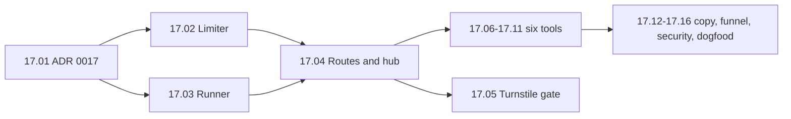

# AEO Corner — Milestone 17: Free tools

| | |
|---|---|
| **Document** | Plan for a small set of free, no-sign-up tools on the public site (a robots.txt checker for AI crawlers, a structured-data validator, a sitemap checker, and three generators). They bring in search traffic and lead into the free audit |
| **Date** | 2026-10-06 |
| **Status** | **Built 2026-10-07: all 16 tasks done. All six tools are listed and public: the robots.txt checker, the structured data validator, the sitemap checker, the robots.txt generator, the schema markup generator and the llms.txt generator.** Founder decisions G1–G5 (§3) are taken as the recommended answers, provisional until the founder answers. Open for the founder: sign-off of the copy and G1–G5, and a first live run with Turnstile keys |
| **Companion docs** | [MILESTONES.md](MILESTONES.md) (conventions) · [MILESTONES_SERVICES.md](MILESTONES_SERVICES.md) · [MVP.md](MVP.md) · [UI_DESIGN.md](UI_DESIGN.md) · [adr/0005-fetching-other-peoples-websites.md](adr/0005-fetching-other-peoples-websites.md) · [CLAUDE.md](../CLAUDE.md) |

## 1. Why this milestone

On 2026-10-06 we looked at the free tools page on aeoengine.ai (about 25 single-purpose tools, each aimed at a search phrase such as "robots.txt checker", each ending in a call to the paid service). The idea is worth copying: a person searching for one of those phrases finds a useful tool, then finds the free audit. The tool list itself is not worth copying.

| What we take | What we leave |
|---|---|
| Single-purpose tools with one input, no account and no email | Per-engine "visibility checkers" (the free audit already asks four real engines; a second, thinner version would cost money and say less) |
| Tools that run code we already own: the readiness checks, the JSON-LD validator, the AI-crawler list, the sitemap parser | Scores with nothing behind them ("citation readiness") and authority or backlink metrics (we have no such data) |
| A hub page and one page per tool, each a normal registry page | The ROI calculator, the Google Business Profile audit, and any tool that needs a model call to be useful |

**What a tool must be:** free to run (no provider call, no email sent, nothing stored), honest about what it cannot see, and a doorway to the audit, never a wall in front of it.

**Where the code already exists**

| Tool | Reuses |
|---|---|
| Robots.txt checker for AI crawlers | `src/crawler/robots.js` (`parseRobots`, `evaluateRobots`), `src/core/ai-crawlers.js`, the A1 and A2 checks |
| Structured data validator | `src/core/jsonld.js` (`validateJsonLd`), `extractPage` in `src/crawler/html.js`, the C3 check |
| Sitemap checker | `src/crawler/sitemap.js` (`parseSitemap`, `SITEMAP_LIMITS`), the A4 check |
| Robots.txt generator for AI crawlers | `AI_CRAWLERS` (with its `guidance` per bot), `mergeRobotsLines` and `isRobotsLines` in `src/core/autofix-fixes.js` |
| Schema markup generator | `src/core/content-schema.js` builders, `validateJsonLd` before anything is shown |
| llms.txt generator | Pure text from typed fields; the F4 check already treats llms.txt as informational |

## 2. What we decided in this plan

| # | Decision | Why |
|---|---|---|
| T1 | **Six tools in version 1:** the three checkers and three generators above. Deferred: canonical-tag checker, meta-description generator and prompt generator | The six reuse existing code and need no model. The meta-description and prompt generators would need Claude to be better than a template, which adds cost and the "model writes facts" risk for a page that earns little |
| T2 | **No provider call, no database table, no email.** The tools read, parse and answer. Counting happens in the funnel (PostHog) and in Redis limits | Keeps the cost at zero and keeps tenancy and the purge out of this milestone |
| T3 | **Tools run inside the web request** with a total deadline (10 seconds), at most 5 outbound requests per run, and a cap on tools running at once in the process. No job, no queue | A fetch of one robots.txt or sitemap is quick. A queue and polling page would triple the work for no gain. The cap means a burst of visitors gets "busy, try again", never a slow site |
| T4 | **A checker never returns what it fetched.** It returns findings built from the parsed file, each line cut to a length, a count of lines, and nothing else. A page that errors says "couldn't check", never "missing" or "blocked" | The tool must not work as a proxy, a scanner or an XSS carrier. Page content is hostile input ([CLAUDE.md](../CLAUDE.md), "Crawler") |
| T5 | **robots.txt rules, as for the free audit:** the tool fetches `/robots.txt`, `/sitemap.xml` and `/llms.txt` directly (files made for crawlers), and obeys robots.txt as `AEOCornerBot` for any other page it fetches (the validator's "check a page" mode) | Same policy as the free audit: we obey it. Domain verification is for signed-in projects and does not apply |
| T6 | **A short ADR (0017) before code**: the tools run in the web process, with these limits and the "returns findings, never content" rule | It sets the shape of every later tool |

## 3. Founder decisions this plan needs

| # | Decision | Needed by | Options and a recommendation |
|---|---|---|---|
| G1 | Does a tool that fetches someone else's site need Turnstile? | 17.05 | **Yes (recommended):** the same widget as the audit's email step, once per run. Without it a script can use us to make requests to any site. **No:** no friction, but limits alone carry the whole risk. The generators and the paste-in validator need no Turnstile either way |
| G2 | Which tools in version 1? | 17.01 | **The six in T1 (recommended).** Add or remove any; each is its own task |
| G3 | Do we ask for an email to show results? | 17.07 | **No (recommended):** the result is shown at once, the only ask is "run the full free audit". An email wall would cut the traffic these pages exist to win |
| G4 | The address | 17.04 | **`/tools` and `/tools/<slug>` (recommended)**, for example `/tools/robots-txt-checker`. The slug is the search phrase |
| G5 | Does the copy say what each tool cannot do? | 17.12 | **Yes (recommended):** every page says in a sentence what the tool cannot see (for example "robots.txt is a request, not a lock; it cannot tell you whether an engine actually names you. The free audit asks the engines"), and the llms.txt page says plainly that engines are not known to need the file |

## 4. Rules this milestone keeps

They add no new rules. They are the existing ones in [CLAUDE.md](../CLAUDE.md), listed because each task touches them.

- **Every fetch of a URL we did not choose goes through `createSafeFetcher`.** No second HTTP client. Tests attack each tool with a URL that points at this machine, a redirect to a private address and a response that never ends.
- **"Couldn't check" is never "missing", "blocked" or 0.** A 404 on robots.txt means "no rules, so everything is allowed" (that is what the file means); a timeout, a 5xx, a firewall page or a refusal is "Couldn't check".
- **Page content is hostile input.** Parsers are linear in the size of their input, nesting is capped (`nestsDeeperThan`), every size has a cap, and each new parser has a hostile-input test. Pasted input is cut to a length and validated with zod at the boundary.
- **Strict CSP:** no inline script, handlers or `style=""`. Results are server-rendered; htmx may swap them in, and the form still works without JavaScript. Text from a fetched file is escaped, never `html`.
- **A public page is a registry entry** in `src/web/pages.js`, complete in the raw HTML, with a unique title and description, a breadcrumb, structured data that passes `src/core/jsonld.js`, and a line in `tests/e2e/pages.js`.
- **Result pages are quiet:** `Cache-Control: no-store`, `Referrer-Policy: no-referrer`, noindex, no analytics script. The tool's own page (the form and the explainer) is the indexed page and may opt in to cookieless analytics like the other marketing pages.
- **The funnel is counted on the server** ([`src/lib/funnel.js`](../src/lib/funnel.js)): one new event with an allow-listed property (the tool's slug). No domain, no URL, no pasted text can be sent.
- **The marketing copy claims only what ships.** No promise of rankings, citations or traffic.

## 5. Overview

| Lane | What | Tasks |
|---|---|---|
| A (foundation) | ADR, the limiter, the runner (deadline, request cap, concurrency cap), the routes, the hub page | 17.01–17.05 |
| B (the tools) | Six tools, each one pure module in `src/core`, one route entry and one page. They need only lane A's runner and can be built in parallel | 17.06–17.11 |
| C (finish) | Copy, funnel, security pass, dogfood, e2e, docs | 17.12–17.16 |

**Size:** Medium. No migration, no new table, no new repository, no provider and no new vendor, so the tenancy tests, the purge list and the subprocessor list are untouched (the subprocessor test still runs and must stay green).

## Milestone 17 — Free tools

**Goal:** a visitor can search for "robots.txt checker for AI crawlers" (or the other five), land on a page that answers at once with no account, and be offered the free audit, at no cost to us and with no way to use our servers against anyone else's.

**Pre-requisites:** Milestones 1, 2 and 9 (the audit, its abuse guards and the marketing site). Founder decisions G1–G5, or their recommended answers.

| # | Task | Needs |
|---|---|---|
| 17.01 | ✅ 2026-10-06 🔒 Write ADR-0017: the tools run in the web process; limits (10 s deadline, 5 outbound requests, N tools at once); "returns findings, never content"; no table, no email, no provider. Update the ADR index (written as [ADR-0017](adr/0017-free-tools-run-in-the-web-request-and-return-findings.md): 10 s deadline, 5 requests a run, 4 tools in flight a process; fetching tools 6 runs an IP a minute, 40 an IP a day, 20 a domain an hour; generators 20 an IP a minute; a staff flag `free_tools`; G1–G5 taken as the recommended answers) | G1–G5 |
| 17.02 | ✅ 2026-10-06 **Limiter** `createToolLimiter` (`src/lib/tool-limits.js`): per IP per day, per target domain per hour, per IP per minute for burst. One Lua script, as in `audit-limits.js`, with the counting rule in `src/core` and unit-tested; keys by hash, none in the clear. It reuses the existing `db.abuse.active` check for a blocked IP and the audit's strike rule (enough refusals in a day blocks the IP for a day). Redis down: the tool says it is closed, it never opens up. **Not** the audit limiter: that one is keyed by email (built: the rule and its in-memory model are `src/core/tool-limits.js` (fixed UTC windows; fetch tools 6 an IP a minute, 40 an IP a day, 20 a domain an hour; generators 20 an IP a minute and no strikes); the Lua version is `src/lib/tool-limits.js`, and `tests/integration/tool-limits.test.js` replays 15,000 random requests through both and they give the same answer every time. A staff block on the target domain also refuses a fetch tool; a blocked IP is refused by every tool, generators too; the automatic block writes a real `abuse_blocks` row. Redis down: `admit` throws and the caller closes the tool. Counters hold a hash, never an address or domain) | 17.01 |
| 17.03 | ✅ 2026-10-06 **Runner** (`src/lib/tool-runner.js`): runs one tool with an `AbortSignal` deadline, a cap of 5 outbound requests (a counting wrapper around the safe fetcher), a per-process cap on tools in flight, and a catch that turns any thrown error into "Couldn't check" with a plain reason (never the error text). Takes the fetcher and the robots gate as arguments so tests use the fixture servers. The robots.txt, sitemap and llms.txt reads that the scan already does inside `runSiteScan` (`src/crawler/scan.js`) are moved into small exported functions (`fetchRobots`, `fetchSitemaps`, `fetchLlmsTxt`) that the scan calls too; scan tests must pass unchanged (built: `src/lib/tool-runner.js` with `CouldntCheck` and `plainReason`. **Differs from the plan:** the safe fetcher takes no abort signal, so the deadline is kept by clamping every request's `timeoutMs` to the time left, refusing any request after the deadline, and giving up on a tool that is still running when it passes; a cap of 5 fetches is joined by a cap of 15 connections, because a redirect is a connection too. The shared reads are `src/crawler/gather.js` (`fetchRobots`, `readSitemap`, `fetchLlmsTxt`, plus `createGet`, `sitemapCandidates` and `newSitemapState`); the scan now calls them, and all 408 crawler tests, the scan integration tests and the dogfood scan pass unchanged. Tests: `src/lib/tool-runner.test.js` (including every private-address and bad-scheme case through the real safe fetcher), `src/crawler/gather.test.js`. Both new test files are in `test:security`) | 17.01 |
| 17.04 | ✅ 2026-10-06 **Routes and hub:** `src/web/routes/tools.js`, registered in `createApp` with its services (`{ limiter, turnstile, runner, funnel }`); without them the tool pages still render and say "This tool opens soon" on submit (the audit's stub pattern). Page registry entries in `src/web/pages.js` (`/tools` and six slugs) fed by a tools table in `src/web/content/tools.js` (slug, title, description, one-line promise, what it cannot see, FAQ). A `POST /tools/:slug` returns the result page (quiet headers). Input is a zod schema per tool; an address is normalized by the same function the audit uses (built, with these differences from the plan: **a tool is one module** in `src/web/tools/` listed in `src/web/tools/index.js` (its words, its form fields, its zod schema, its `run`), not a row in a content table, and **nothing is public until a tool is listed**: the registry adds the hub and a tool's page only for a listed tool, so no empty hub reaches the sitemap, and `/tools` is a plain 404 today. **Every tool returns the same findings shape** (`src/core/tool-findings.js`, new): headline, sections of rows with a state (`good`, `warn`, `bad`, `neutral`, `unknown`), a few quoted lines, a generator's output, notes. `normalizeFindings` is the gate that enforces ADR-0017 decision 2: every string is cut (a quoted line to 300 characters, at most 20 lines), control and text-direction characters are removed, extra fields are dropped, a wrong shape is an error shown as "couldn't check". One partial (`partials/tool-findings.ejs`) draws it escaped, and the form is drawn from the tool's `fields`, so 17.06–17.11 are data and logic, not six sets of views. The run order in the route is: services present, staff flag `free_tools` (unreadable means closed), the form's zod schema (a 422, and a mistake costs no check), Turnstile for a fetch tool, busy (before the limiter, so waiting costs no check), the limiter (Redis down means closed), the run, the gate. An answer is quiet (no-store, no-referrer, noindex, no analytics) and the tool's own page is a normal indexed marketing page with its FAQPage data. `free_tools` is in `KNOWN_FLAGS`. The footer links to `/tools` only once a tool is listed. `server.js` builds the services from the database, Redis and the audit's Turnstile; with no Turnstile secret the fetch tools stay closed and the generators run. Tests: `tests/routes/tools.test.js` (29, with stand-in tools), `src/core/tool-findings.test.js`; both are in `test:security`) | 17.02, 17.03 |
| 17.05 | ✅ 2026-10-06 **Turnstile gate** on the three fetching tools (G1): widget on the form (`turnstile: true` in the page locals, as the audit's email step), verified in the route before the limiter, failing closed. Generators and the paste-in validator skip it (**mostly built in 17.04**: the route verifies the token before the limiter and refuses a fetch tool when no Turnstile is wired, and the form draws the widget; what is left for 17.05 is the browser check that the script loads only on a fetch tool's page and that a token is single-use across a failed validation, plus the route tests against Cloudflare's published test keys) (done, in `tests/routes/tools-robots.test.js` and `tests/routes/tools.test.js`, with the real `createTurnstile` and a stand-in for Cloudflare's siteverify: a passing token runs the tool and Cloudflare is asked with the secret, the token and the visitor's address; a refusal, a token for another site, Cloudflare's own `internal-error`, a reply of the wrong shape and an unreachable Cloudflare each stop the run before the limiter and before any fetch (422, or 503 when it is Cloudflare's trouble); a missing or over-long token never reaches Cloudflare; a mistake in the form costs no token because the form is checked first; every refusal page carries a fresh widget; the token is not handed on to the tool; the script and the widget appear only on a fetch tool's page, not on a generator's or the hub; the content policy allows Cloudflare's script and frame. **The browser can't show the widget in the e2e run** (it starts with `TURNSTILE_SITE_KEY` empty, which the third-party-request test depends on), so that part is checked in the route tests) | 17.04 |
| 17.06 | ✅ 2026-10-06 **Robots.txt checker:** input a site address. Fetch `/robots.txt` once; for every bot in `AI_CRAWLERS` say allowed, blocked, or "no rule" (with the group that decided it), and say separately the three states of the file (found, none, couldn't check). Training bots (`business_choice`) are labelled a choice, never a fault. Shows the exact lines that block, cut to a length. Ends with: "Allowed in robots.txt does not mean a firewall lets the bot in. The free audit tests that too" (built: judging in `src/core/tool-robots.js` (pure), the fetch and the words in `src/web/tools/robots-txt-checker.js`, the first tool listed in `src/web/tools/index.js`, so `/tools` and `/tools/robots-txt-checker` are now public and in the sitemap. It tests the home page path (`/`) as check A1 does, and lists Disallow lines for other paths as "some pages" rather than guessing paths; a blocked answer or search crawler is a problem, a blocked training crawler is neutral, and a crawler allowed with some paths off limits is a warning. The three states of the file stay apart: a file found, no file (a neutral finding that says it is not a fault), and "couldn't check" for a 429, a 5xx, a firewall page, a timeout or a failed connection, each with its own words. Only the lines that block are quoted, so comments and other content in the file never come back. The label of the field is "Website to check", because the page's closing audit band has a field called "Your website". **Differences from the plan:** the hub's description is built from the tools that are listed, so it never names a tool that does not exist yet; the hub's heading is "Choose a tool", not a question, because the dogfood scan reads a question heading with no paragraph under it as a weak answer (E2) and the score check failed until it was changed. Tests: `src/core/tool-robots.test.js` (a hostile file with 200,000 rules stays inside the caps), `tests/routes/tools-robots.test.js` (24: the real tool, runner and safe fetcher, with only the network and Cloudflare as stand-ins, including a name that resolves to a private address, which is refused before any connection), `tests/e2e/tools.spec.js` (the form with JavaScript off and on)) | 17.04, 17.05 |
| 17.07 | ✅ 2026-10-06 **Structured data validator:** two modes, paste JSON-LD (no fetch, no Turnstile) or "check a page" (one page through the safe fetcher, robots.txt obeyed as `AEOCornerBot`, `extractPage` for its blocks). Runs `validateJsonLd` on each block and lists problems as `path: message` (`problemLines`). A page behind a challenge, a sign-in or a JavaScript-only shell is "Couldn't check", never "no structured data". Says which types we validate (`SUPPORTED_TYPES`) and that any other type was read for syntax only (built; `src/web/tools/structured-data-validator.js`, judging in `src/core/tool-structured-data.js`. **Changes made to shared code, each with tests:** (1) `validateJsonLd` takes `{ lenient: true }` for markup somebody else wrote: a type, property or keyword outside the vocabulary we write is returned in a new `unchecked` list instead of being an error, a node with several types is read by its first known one, and a property we expect but is missing is a warning; wrong values, structure and a missing @context stay errors, and everything that writes our own markup still calls it strictly. Without this a visitor's valid `Recipe` or `hasMap` would have been called wrong. (2) `readJsonLdBlocks(html)` in `src/crawler/html.js` returns the parsed blocks and what was wrong with the others, with the scan's limits (50 blocks, 256 KB a block, nesting 512); a scan still does not keep them, so stored page facts stay small. **Two ways in, so the kind of run is per submission:** a definition may have `kindFor(input)`, and the route works out after the form is read whether this is a pasted block (a `generate` run: no request leaves us, no bot check, the cheaper limit) or a page address (a `fetch` run: bot check, the stricter limits, one page, robots.txt obeyed as `AEOCornerBot`, and a redirect to another site is judged by that site's robots.txt). A tool may also set the hub card's `badge`. A 404, a server error, a firewall page, something that is not HTML and a page nested absurdly deep are each "couldn't check" in their own words, never "no structured data"; a page with none is an answer that says a script may add it later. **A defect found by the tests:** the form body limit of 256 KB would have refused a realistic paste (every quote in pasted JSON is three characters in a form post), so it is now 1 MB; a larger body is still a 413 before any tool reads it. **Found by the dogfood scan:** the paragraph under "What this tool cannot tell you" must be 60 words or fewer, like every answer under a question heading, so a test now holds every tool's `cannotSee` and FAQ answers to 5 to 60 words. Tests: `src/core/tool-structured-data.test.js`, the lenient tests in `src/core/jsonld.test.js`, `readJsonLdBlocks` in `src/crawler/html.test.js`, `tests/routes/tools-structured-data.test.js` (24, including hostile code), `tests/e2e/tools.spec.js` (with JavaScript off and on)) | 17.04, 17.05 |
| 17.08 | ✅ 2026-10-06 **Sitemap checker:** input a site address or a sitemap address. Finds the sitemap from robots.txt (`Sitemap:` lines) or `/sitemap.xml`, reads it with `parseSitemap`, follows an index at most one level and at most 3 children within the request cap, and reports: found or not, URL count, how many have a `lastmod`, how recent, and whether robots.txt points to it. Counts and a handful of example addresses only (built; `src/web/tools/sitemap-checker.js`, judging in `src/core/tool-sitemap.js`, reusing `fetchRobots`, `readSitemap` and `sitemapCandidates` from `src/crawler/gather.js`, so the checker and the scan read a sitemap the same way. **Where it looks:** the address the visitor typed if it looks like a sitemap (a path ending in `.xml`, `.xml.gz` or `.txt`, or containing "sitemap"), else the ones robots.txt names, else the three usual addresses, stopping at the first real one; robots.txt is always read to see whether it points to the sitemap. **The budget is planned, not hoped for:** the runner now offers `ctx.fetchesLeft()`, and the checker gives an index at most `min(3, fetches left)` children, so a run is robots.txt plus the index plus three sitemaps, five fetches and no more. **It says:** found or not, its kind, whether robots.txt points to it (with the exact `Sitemap:` line to add when it does not), how many addresses (`at least` when an index was only partly read), how many have a last-modified date and how recent (a warning for none, for under half, and for a newest date over a year old), addresses on another site (a subdomain counts as the site) and http addresses on an https site, and ten example addresses with a count of the rest. **"Couldn't check" is never "no sitemap":** a firewall page, a 429, a 5xx or a failed connection on any address tried, or an unreadable robots.txt, with no sitemap found, ends the run as "couldn't check"; trouble on one address does not hide a sitemap found at another. Only a site that answered "not found" everywhere is told it has none, and that is a gentle answer ("a sitemap is optional"). Sitemaps are fetched directly, as ADR-0017 says, since they are files made for crawlers. Tests: `src/core/tool-sitemap.test.js` (12, including 50,000 hostile addresses), `tests/routes/tools-sitemap.test.js` (18, with the real runner and safe fetcher), `tests/e2e/tools.spec.js` (JavaScript off and on), and `fetchesLeft` in `src/lib/tool-runner.test.js`) | 17.04, 17.05 |
| 17.09 | ✅ 2026-10-06 **Robots.txt generator:** a form with a choice per crawler group (answer and search bots: allow; training bots: allow or block; and the site's own sitemap line), defaults from `AI_CRAWLERS.guidance`. Output is plain text from a pure function, shown to copy or download as a file served from the response (no storage). It says what it cannot do: it does not edit the site and it does not replace an existing file. A test checks that the output parses with `parseRobots` and decides every bot as chosen (built; `src/web/tools/robots-txt-generator.js`, the file and findings in `src/core/tool-robots-generator.js`. **A safety decision that differs from the plan:** the plan's "answer and search bots" group would have let a visitor block Googlebot and Bingbot and so drop out of ordinary search. The crawlers are now three groups the visitor decides on (AI answer crawlers, AI training crawlers, other AI crawlers) and **Googlebot, Bingbot and Applebot are never offered**: the page says so and the file never names them. A test fails if a crawler is added to `AI_CRAWLERS` without being placed in a group. **How the file is built:** `User-agent: *` carries the paths to keep out (or `Allow: /`), a blocked group is one block of `User-agent` lines with `Disallow: /`, and an allowed crawler gets no group of its own, because a crawler with its own group ignores the `*` rules and would walk past the paths. A path of just `/` is refused with the reason (it would block search engines too); paths must start with `/`, have no spaces or `#`, and are at most 30; the sitemap is normalized to a full address. The three dropdowns start on Allow, so a visitor who changes nothing blocks nothing. **Download, for all three generators:** a definition with `download: true` gets a Download button and `POST /tools/:slug/download`, the same run with the same checks and limits answered as `text/plain` with `attachment`, `nosniff` and no-store; the choices travel in hidden fields, so nothing is stored between the page and the file, and a tool without the flag has no such address (404). Tests: `src/core/tool-robots-generator.test.js` (14, including all 16 combinations of choices parsed back by `parseRobots`/`evaluateRobots`), `tests/routes/tools-robots-generator.test.js` (17), the download describe in `tests/routes/tools.test.js` (5), `tests/e2e/tools.spec.js` (JavaScript off, including a real download)) | 17.04 |
| 17.10 | ✅ 2026-10-06 **Schema markup generator:** a form for Organization, LocalBusiness, FAQPage and Article using the `content-schema.js` builders; only what the visitor typed is included (an empty field is left out, never invented). The output goes through `validateJsonLd` before it is shown and the page shows its problems if any. The page says where to paste it (built; `src/web/tools/schema-markup-generator.js`, the document and findings in `src/core/tool-schema-generator.js`. **Differs from the plan:** it does not use the `content-schema.js` builders, which are made from a finished draft's HTML; it builds each node from typed fields. **Nothing is invented:** a field left empty is left out of the markup, there is no default, no address object unless an address field was typed, no empty list; a test holds the exact keys. **Where the markup comes from:** the document is validated strictly (the check our own markup passes) and the `` or `<!--` is refused with a message. A missing recommended property (a logo, profile links) is a suggestion ("add it above if it applies"), never an error. The notes say where to paste it and where each type belongs (Organization on the home page once, an article on its own page, FAQ markup only on a page that shows those questions), that the markup must say only what the page says, and that it promises no search result or AI mention. Tests: `src/core/tool-schema-generator.test.js` (16), `tests/routes/tools-schema-generator.test.js` (13), `tests/e2e/tools.spec.js` (JavaScript off, with a download, and on)) | 17.04 |
| 17.11 | ✅ 2026-10-07 **llms.txt generator:** a form (name, one-line summary, up to 10 links with titles and a one-line description). Output is the plain file in the common format. The page states, without hedging, that no engine is known to need it and that it is harmless to add. Built: `src/core/tool-llms-generator.js` (pure; the file is `# name`, `> summary`, a `## Key pages` list of `- [title](address): note`) and `src/web/tools/llms-txt-generator.js` (a `generate` run with a download). The links are one per line, `Title | address | optional note`, up to 10, each refused by line number; a title, note or name may not hold brackets or line breaks, and parentheses in an address are escaped, so one link is always one line and a field cannot break the Markdown. Nothing is invented: no summary or links means none in the file. The page and the findings say, without hedging, that no engine is known to need the file and that nobody has shown it changes what an engine says. Tests: `src/core/tool-llms-generator.test.js`, `tests/routes/tools-llms-generator.test.js` (also in `test:security`), three browser tests in `tests/e2e/tools.spec.js` | 17.04 |
| 17.12 | ✅ 2026-10-07 **Copy and structure:** one page per tool, built from the component kit, in the same shape as the other marketing pages (question headings with the answer right under each, an FAQ list from `partials/faq-list.ejs`, the "what it cannot see" sentence from G5, a CTA to the audit). Each page's structured data: Organization and WebSite (everywhere), BreadcrumbList and FAQPage, plus a `WebApplication` type added to the vocabulary in `jsonld.js` with a test. The copy is a draft until the founder signs it off. Built: the tool pages already had the shape (one h1, question headings with the answer right under, the FAQ list, "What this tool cannot tell you", a link to the audit); this task added `WebApplication` to the vocabulary in `src/core/jsonld.js` (with a test) and to every tool page's markup (free, any system, provided by AEO Corner), and a route test that checks every listed tool page for one h1, the cannot-see section, the audit link, the canonical address and valid Organization, WebSite, WebApplication, BreadcrumbList and FAQPage blocks. The copy for sign-off is [FREE_TOOLS_COPY.md](FREE_TOOLS_COPY.md), written from the live definitions (regenerate it if a tool's text changes) | 17.06–17.11 |
| 17.13 | ✅ 2026-10-07 **Funnel:** one new event `tool_used` with the property `tool` (allow-listed slugs) in `src/lib/funnel.js`, counted on the server when a run finishes (including "Couldn't check"), and the audit CTA on a result page carries `utm_source=tools` through `cleanUtm`. A test reads the events back from the PostHog stand-in and checks that no address or pasted text is in any of them. Built: `tool_used` carries `tool` (from `src/core/tool-slugs.js`, a test keeps it equal to the listed tools) and `outcome` (`ok` or `couldnt_check`); a run is counted once (the file button re-runs the same input and is not counted again); a refusal or a mistake is not a use. The link to the audit on the hub and every tool page is `/?utm_source=tools&utm_campaign=<slug>#audit` (the hub uses `hub`). Tests: `funnel.test.js`, the route describe "the funnel counts a run", and a Playwright test that reads the event back from the PostHog stand-in | 17.04 |
| 17.14 | ✅ 2026-10-07 **Security tests** (`tests/routes/tools-security.test.js`, added to `test:security`): each fetching tool against a fixture server that returns a redirect to `127.0.0.1`, a private address in DNS, a body that never ends, a 20 MB body, a gzip bomb sitemap, a robots.txt with a million lines, and JSON-LD nested 10,000 deep; results must be "Couldn't check" within the deadline and the process must stay up. Reflected-content test: a robots.txt containing `<script>` and an `onerror=` comes back escaped. No-proxy test: a result never contains a byte range of the fetched file longer than the line cap. Built: `tests/routes/tools-security.test.js` (31 tests) runs the three fetching tools through the real route, runner and safe fetcher against a fixture server on this machine (a stand-in turns the typed name into the fixture port; redirects and the guard are the real ones). Redirects to 127.0.0.1, [::1] and 169.254.169.254, a private address in DNS (never connected to) and a redirect loop; a body that never ends and a 20 MB body (inside the deadline); gzip bombs (as `Content-Encoding` and as a `.gz` file), a million-line robots.txt and JSON-LD nested 10,000 deep (bounded answer, never "no sitemap"); pasted JSON nested 10,000 deep; a robots.txt with `<script>`, `onerror=` and a `javascript:` sitemap line is escaped; and no 301-character stretch of a fetched file comes back. The process serves after each group | 17.06–17.08 |
| 17.15 | ✅ 2026-10-07 **Tests and e2e:** unit tests beside each pure module (including a hostile-input test for each parser we touch); `tests/routes/tools.test.js` (every tool, the stub mode, Turnstile fail-closed, limits, the quiet headers on a result, sitemap lists the pages, titles and descriptions unique); `tests/e2e/pages.js` entries for the hub and each tool (axe and responsive sweeps); a Playwright test that each form works with JavaScript off. Built: most of this existed from 17.06–17.14 (every tool has its unit tests and a hostile-input test, `tests/routes/tools.test.js` covers the stub mode, Turnstile fail-closed, limits, quiet headers, the registry and the structured markup, the sitemap and unique titles are covered by `marketing-pages.test.js`, every tool has a JavaScript-off form test, and the hub and tool pages are in the axe and 375/768px sweeps because they are registry entries). This task added: a hostile-input test for the llms.txt generator (200,000 lines, million-character lines, an address of 500,000 parentheses; an address over 2,048 characters is now refused), and an axe and 375px sweep of the ANSWERED page of each tool, which found that the sitemap result scrolled sideways by 96px (a long address in the headline); the findings partial now breaks long words | 17.06–17.14 |
| 17.16 | ✅ 2026-10-07 **Close-out:** run `tests/adapters/dogfood.test.js` (our own pages are scanned too, and the score must stay at 90 or more); update the CLAUDE.md section, the registry row in its documents table, [UI_DESIGN.md](UI_DESIGN.md) (screen inventory and a wireframe for the hub and one tool page, a proposal until the founder signs it off), the marketing test that checks claims, and the header of [MILESTONES.md](MILESTONES.md) | 17.15 |

**Definition of Done:**
- [ ] All six tools answer from a real request in the browser, with and without JavaScript, and a run costs nothing: no provider call, no email, no row written. (a test fails if a tool's route imports `callProvider` or the mailer)
- [ ] A failed fetch of any kind is "Couldn't check" on every tool, and never "missing", "blocked" or "none". (`tests/routes/tools.test.js`)
- [ ] The security describe passes: no tool reaches a private address, none outlasts the deadline, none returns fetched content beyond the line cap, none returns unescaped text.
- [ ] Limits: the limiter refuses with a plain message, never counts a refusal against another allowance, blocks a bot that keeps going, and the tools close (not open) when Redis is down.
- [ ] The free audit and every earlier suite pass unchanged (`npm run test:all`), the scan tests pass after the move in 17.03, and `npm run test:e2e` passes with the new pages.
- [ ] The marketing claims test and the subprocessor test pass with no new vendor.
- [ ] The dogfood scan of our own site stays at 90 or more with the new pages.

## 6. Risks

| Risk | Consequence | What we do |
|---|---|---|
| A tool is used to send requests to other people's sites | We are blamed for a scan or a flood | Turnstile (G1), per-IP and per-domain limits, 5 requests a run, `AEOCornerBot` user agent, robots.txt obeyed for pages, a blocked IP stays blocked |
| A checker says "blocked" or "missing" when it could not look | A visitor edits a working robots.txt | The three-state rule in §4; tests for each failure mode |
| The tools bring traffic that never reaches the audit | Time spent for nothing | One CTA per result, `tool_used` and the audit's own funnel events let us see the step; if a tool does not lead anyone to the audit after a quarter, drop it |
| Pages are thin and add nothing to what exists | Little search value | Each page answers the question it is named for, in the direct-answer shape our own readiness checks reward; the dogfood score is the guard |
| llms.txt and similar tools promise an effect nobody has shown | Customers lose trust in us | G5: the page says plainly what is and is not known |
| More public routes than the web process should serve | A traffic spike slows the site for customers | The in-flight cap (T3), `Cache-Control` on the static explainer pages, and a staff flag `free_tools` (kill switch, ON by default) checked per request |

## 7. After this milestone

- Tick the boxes here and add a one-line pointer in [MILESTONES.md](MILESTONES.md).
- Update CLAUDE.md for what changed (a "Free tools (Milestone 17)" section) and the documents table, in the same pass.
- **Candidates for later, only if the tools earn their keep:** a canonical-tag checker (reuses F1), a title and meta-description checker (reuses F3), and a page-level "does the answer sit under the question" checker (reuses E1 and E2). None needs a model.
