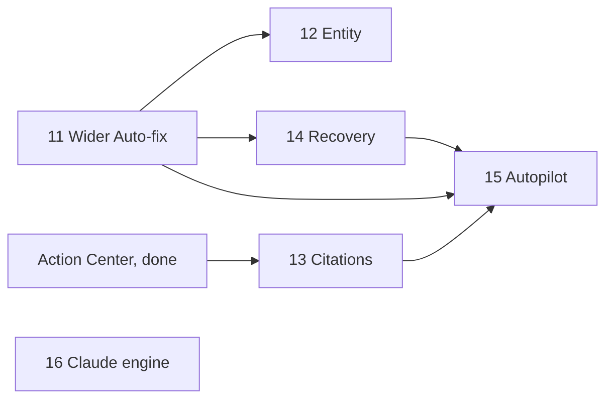

# AEO Corner — Milestones for the partly covered services (Milestones 11–16)

| | |
|---|---|
| **Document** | Plan for the five services on [aeoengine.ai/services](https://aeoengine.ai/services) that AEO Corner covers only in part: LLM visibility (#5, "mostly"), agentic SEO (#6), entity optimization (#7), AI citation optimization (#9) and AI visibility recovery (#11) |
| **Date** | 2026-10-04 |
| **Status** | **Planned. Nothing is started.** Work begins only when the founder asks for a milestone. Milestones 0–10 in [MILESTONES.md](MILESTONES.md) come first for launch; this plan is the roadmap after them |
| **Companion docs** | [MILESTONES.md](MILESTONES.md) (conventions, Milestones 0–10) · [MVP.md](MVP.md) · [UI_DESIGN.md](UI_DESIGN.md) · [DATABASE_SCHEMA.md](DATABASE_SCHEMA.md) · [adr/0006-engine-adapters.md](adr/0006-engine-adapters.md) · [adr/0010-recommendations-and-proof.md](adr/0010-recommendations-and-proof.md) · [adr/0011-content-studio-and-wordpress.md](adr/0011-content-studio-and-wordpress.md) · [CLAUDE.md](../CLAUDE.md) |

## 1. What this plan is for

On 2026-10-04 we compared AEO Corner with the 12 services on aeoengine.ai. Four are fully built (answer engine optimization, generative engine optimization, schema markup, AI search analytics). Three are out of scope for a self-serve product (the managed AEO agency, AI-assisted classic SEO, SEO + AEO). Five are partly built, and this plan finishes the part that software can do.

| Service | Where we are today | What is missing | Milestone |
|---|---|---|---|
| #5 LLM visibility optimization | Four engines measured: ChatGPT, Perplexity, Gemini, Google AI Overviews | Claude is not measured | **16** |
| #6 Agentic SEO | Content Studio writes a draft and Auto-fix writes JSON-LD, but only when a person starts and approves each step | Preparing work on its own each week, a review inbox, safe limits | **15** |
| #7 Entity optimization | Brand entity, aliases, competitors, Brand Kit; checks D1–D4 and an Organization check | Checking the brand's profiles, whether engines describe it correctly, fill-in-the-blank guidance per profile | **12** |
| #9 AI citation optimization | Citations screen, citation gaps, recommendations | Source types, which of the brand's own pages get cited, citable-page briefs, citation share as a proof metric | **13** |
| #11 AI visibility recovery | Significance-tested change detection, alerts, recommendations, re-checks, proof | A "case" for a lasting decline: a diagnosis with evidence, a recovery plan and a way to close it | **14** |

One more milestone widens what Auto-fix can change. It is not a service of its own, but #6, #7 and #11 all use it, so it comes first.

| Added | Milestone |
|---|---|
| Auto-fix beyond the home page's two JSON-LD blocks: key-page schema, titles and descriptions, `robots.txt` lines | **11** |

**Not in this plan, on purpose:** the managed agency (#2), AI-assisted classic SEO (#3), Google ranking tracking and SEO + AEO (#12). They need people or a different product, and the marketing copy must keep saying so ([CLAUDE.md](../CLAUDE.md), "Marketing site").

## 2. Overview

| # | Milestone | Services | Size | Needs |
|---|---|---|---|---|
| 11 | Wider Auto-fix | #6, #7, #8 | Medium | Milestones 7 and 10 |
| 12 | Entity checks and guidance | #7 | Medium | 11 (for the `sameAs` fix); the checks can start without it |
| 13 | Citation opportunities | #9 | Medium | Milestone 6 |
| 14 | Visibility recovery cases | #11 | Large | 11 (to re-verify earlier fixes), Milestone 8 alerts |
| 15 | Autopilot | #6 | Large | 11, 13, 14 and a founder decision (15.01) |
| 16 | Claude as a fifth engine | #5 | Small to medium | Founder decision (16.01); independent of the rest |

**Suggested order:** 11 → 12 and 13 in parallel → 14 → 15, with 16 slotted in whenever the founder decides what "Claude" should mean and accepts the cost. Sizes are relative: Small is a few tasks that reuse existing parts, Large adds a new table and a new screen.

## 3. Rules these milestones keep

They add no new rules. They are the existing ones in [CLAUDE.md](../CLAUDE.md), listed because each milestone touches them.

- **A model writes words, code decides facts.** Entity checks, source types, diagnoses and fixes are decided in `src/core`; Claude may only word what code has already decided, and its reply is dropped if it adds a fact.
- **"Couldn't check" is never "failed" or 0.** This covers every new check: a profile that blocks our fetch, a Wikidata lookup that times out, a diagnosis with too little data.
- **Only a person approves a change to a customer's site, and approval pins what was shown** (the fingerprint). Milestone 15 is the one place that could weaken this, which is why 15.01 is a founder decision with an ADR.
- **Only the system verifies and judges.** New fixes use the same re-check and outcome machinery.
- **Tenancy, safe fetcher, `callProvider`, strict CSP, component kit, leak tests, `tests/e2e/pages.js`** apply to every task, as in MILESTONES.md §1.
- **The marketing copy claims only what ships.** Each milestone ends with a copy review; a page is changed in the same pass that the feature lands, never before.

## 4. Founder decisions this plan needs

| # | Decision | Needed by | Options and a recommendation |
|---|---|---|---|
| F1 | How autonomous is "Autopilot"? | 15.01 | **A (recommended):** it prepares fixes and drafts each week and a person approves in one inbox. **B:** a person sets a standing approval for low-risk JSON-LD fixes on a verified domain, with a daily cap and automatic undo. B changes the rule that every change is approved by a person, so it needs an ADR and a plain statement in the product |
| F2 | What does "Claude" mean as an engine? | 16.01 | **A (recommended):** the Claude API with its web-search tool on, which is close to what a person gets in claude.ai with search. **B:** the model alone, with no search; cheaper, but it can't cite anything. Either way it costs more per prompt-run, which is already above the $0.12 target |
| F3 | Which plans get which of these? | 11–16 | Ties to the open plan limits (task 0.17). Suggested: Auto-fix breadth and Recovery on the paid tiers, Claude as an add-on or on the top tier, Autopilot on the top two |
| F4 | When does a drop count as "lasting"? | 14.02 | Suggested: significant in the 28-vs-28 window and still lower over the most recent 14 days. Founder picks the days and whether a one-engine drop counts |
| F5 | Existing projects and the new engine | 16.05 | Suggested: not added automatically (it costs money), offered once per project |

## Milestone 11 — Wider Auto-fix

**Goal:** a customer with the WordPress plugin can approve more kinds of fix than "home-page Organization and WebSite JSON-LD", each with the same approval screen, fingerprint, undo and same-day re-check.

**Pre-requisites:** Milestones 7 and 10. Today Auto-fix offers only `readiness.C1` and `readiness.C4` (`AUTOFIX_RULES`); `readiness.A1` (crawlers allowed), `A4` (sitemap), `C2` (page-type schema) and `F3` (titles and descriptions) keep steps plus "Mark as done".

| # | Task | Needs |
|---|---|---|
| 11.01 | 🔒 Read the plugin and decide the new set, with an addendum to ADR-0011: what the plugin can change today (titles and descriptions already exist), what needs a new route (`robots.txt` lines, schema on pages other than home), and what stays guidance (the sitemap: WordPress already serves one, so we report, we don't write) | — |
| 11.02 | Generalise `site_changes` to carry a kind (`jsonld`, `meta`, `robots`) and a `previous_value` that fits each kind, so undo knows what to put back. Migration `0007`, SQL-first, applied to dev and test | 11.01 |
| 11.03 | Key-page schema for `readiness.C2`: choose key pages from the latest scan, build WebPage, Article, FAQPage or Product JSON-LD from what the page itself says (`content-schema.js`), validate with `jsonld.js`. Nothing invented. One block per address, as the plugin already does | 11.01 |
| 11.04 | Titles and descriptions for `readiness.F3`: propose a unique title and description for each page missing one, built in code from the page's own headline and first paragraph. Show before and after; the plugin stores the old values for undo | 11.02 |
| 11.05 | `robots.txt` lines for `readiness.A1`: add the Allow lines for the answer crawlers through WordPress's virtual `robots.txt`. If the site has a real file on disk, show the exact lines as guidance instead. Show the exact result; undo removes only our lines | 11.02 |
| 11.06 | Plugin version bump: the new signed routes in PHP and `signRequest` mirrored; the wrong-site refusal still applies to every address; `npm run test:wordpress` on the oldest supported WordPress and the latest | 11.01 |
| 11.07 | Make the approve, apply and undo jobs and the repository functions handle each kind, with the fingerprint covering exactly what was shown | 11.02, 11.06 |
| 11.08 | The D3 screen shows a kind-specific preview (code, a before/after table, or the exact lines) and what was left out | 11.03–11.05 |
| 11.09 | Re-check mapping: each kind gets the readiness check that proves it (`C2`, `F3`, `A1`) through the existing `fix.verify`; a scan that could not look is "couldn't check" | 11.07 |
| 11.10 | Docs and copy: CLAUDE.md Auto-fix bullet, UI_DESIGN D3 row, the product pages' wording | 11.08 |

**Parallel:** 11.03, 11.04 and 11.05 once 11.02 lands. 11.06 can start right after 11.01.

**Definition of Done:**
- [ ] Unit: each kind's proposal is deterministic and passes `jsonld.js` or its own validator; nothing is invented (a field the customer did not give is left out).
- [ ] Integration: approve → apply → re-check → undo for each kind against the WordPress stand-in; undo restores the earlier value exactly.
- [ ] Contract: the plugin changes the real page on WordPress 6.2 / PHP 7.4 and the latest (`npm run test:wordpress`), and refuses a wrong-site address.
- [ ] A changed fingerprint refuses the approval for every kind.
- [ ] Axe sweep and leak tests pass for the changed screens and new queries.

## Milestone 12 — Entity checks and guidance (#7)

**Goal:** a customer sees which profiles describe the brand, whether the engines describe it correctly, and gets the exact text to put on each profile. We can fix what lives on their own site (Organization `sameAs`, the About page) and guide the rest. We do not write to Google's Knowledge Graph, and we say so.

**Pre-requisites:** Milestone 6. Task 12.06 needs Milestone 11.

| # | Task | Needs |
|---|---|---|
| 12.01 | 🔒 Add an entity profile to the Brand Kit (a new schema version: legal name, founding year, profile links by platform, Wikidata ID if known). Every save stays an immutable version; competitors stay outside it | — |
| 12.02 | Profile check: for each profile the customer typed, fetch it through the safe fetcher (robots obeyed, since it is not their domain) and report reachable, names the brand, links back to the domain. A platform that blocks us is "couldn't check", never "fail" | 12.01 |
| 12.03 | Wikidata presence check through its public API: found, not found or ambiguous. Add the host to `src/core/subprocessors.js`, or the subprocessor test fails | 12.01 |
| 12.04 | Entity accuracy, in code, from answers we already read: for the brand-intent questions, compare the engines' stated facts (the `claims` rows) with the Brand Kit's. Each fact is right, wrong, or not mentioned; a wrong fact is the finding | 12.01 |
| 12.05 | New recommendation rules keyed `entity.<what>:<subject>` (a wrong fact, an unverified profile, no Wikidata item), with ICE priors in `recommendations.js`; none is raised when the check could not run | 12.02–12.04 |
| 12.06 | Organization JSON-LD `sameAs`, `foundingDate` and `legalName` from the checked profiles and typed facts only, through the Milestone 11 machinery (`readiness.D3`) | 11.07, 12.02 |
| 12.07 | Platform checklists for the profiles we can't touch (Google Business Profile, LinkedIn, Crunchbase, Wikidata, a trade directory): the steps and the exact text, filled in from the Brand Kit. We create no accounts and post nothing | 12.05 |
| 12.08 | About page from Content Studio (`readiness.D2`): a content type built from the Brand Kit's facts, through the existing research → plan → draft → check pipeline and the usual approval | — |
| 12.09 | The Entity screen `/projects/:pid/entity`: profile table, Wikidata status, engine accuracy per fact, next steps. Wireframe signed off first | 12.02–12.05 |

**Parallel:** 12.02, 12.03 and 12.04 together after 12.01. 12.08 any time.

**Definition of Done:**
- [ ] Unit: the accuracy comparison (right, wrong, missing) over fixture claims; a profile that errors is never "failed".
- [ ] Hostile-input test for each new page parser (a profile page is hostile input; linear time).
- [ ] Integration: a wrong engine fact raises one recommendation, and the same condition never raises a second.
- [ ] The `sameAs` fix includes only profiles that passed the check, and its undo works.
- [ ] Subprocessor test passes with the new host. Axe sweep and leak tests pass.

## Milestone 13 — Citation opportunities (#9)

**Goal:** the Citations screen answers "which sources do engines trust on my questions, which of my own pages do they cite, and what should I make or get listed on?", and a citation fix is judged on citation share.

**Pre-requisites:** Milestone 6 (the Citations screen, citation gaps and the evidence pack already exist).

| # | Task | Needs |
|---|---|---|
| 13.01 | 🔒 Source types in `src/core/citation-types.js` by rules and a reviewed list: own site, review or directory, forum, news, documentation or wiki, competitor, marketplace, other. An unrecognised site is "other", never guessed by a model | — |
| 13.02 | Own-page citations: which of the brand's pages are cited, how often and by which engine, from the `citations` rows (URLs reached only through the organization's own citation ids) | — |
| 13.03 | The format of each frequently cited page (list, comparison, review, guide, documentation), read once with the existing linear parsers and kept in the global URL dictionary | 13.01 |
| 13.04 | Citation opportunities per question: the cited sources that did not name the brand, ranked by how often engines cite them and the share of answers they affect, each with its type and format | 13.01, 13.03 |
| 13.05 | New rules: `citation.gap:<domain>` and `citation.own_page_uncited:<url>`. Paths: a page in the format engines cite (Content Studio), or a "get listed" checklist with a copyable outreach note built from facts. We never send it | 13.04 |
| 13.06 | Content Studio: a target format on the brief, the evidence pack's cited pages as the model to beat, and quality checks for what makes a page citable (a named author, dates, sources linked, original figures) | 13.03 |
| 13.07 | Outcome metric per rule family: a citation fix is measured on citation share, not mention rate, with the same significance test and windows. Needs a migration (`0008`) and a change to `outcomes.measure` | 13.05 |
| 13.08 | Citations screen (C4) upgrade: type breakdown, trend, own-page table, an opportunities tab | 13.02, 13.04 |

**Parallel:** 13.01 and 13.02 start together; 13.06 and 13.07 run beside 13.08.

**Definition of Done:**
- [ ] Unit: source types over fixture sites; an unknown site is "other"; opportunity ranking is deterministic.
- [ ] Hostile-input test for the format reader.
- [ ] Integration: a citation fix is measured on citation share and judged by the same test as before; a mention-rate fix is unchanged.
- [ ] Nothing in an outreach note is a fact that is not in the evidence.
- [ ] Axe sweep and leak tests pass.

## Milestone 14 — Visibility recovery cases (#11)

**Goal:** when visibility drops and stays down, AEO Corner opens a case, says what probably caused it and what the evidence is, proposes repairs through the existing Action Center, and closes the case with proof that it recovered. When the evidence is thin it says "we can't tell", not a guess.

**Pre-requisites:** Milestone 8 (alerts), Milestone 11 (to check that earlier fixes are still on the site).

| # | Task | Needs |
|---|---|---|
| 14.01 | 🔒 `recovery_cases` table (org and project owned, the triggering change event, engine scope, metric, opened, status `diagnosing → repairing → recovered | closed_noise | closed_unknown`) and `recovery_events`. Migration `0009`, composite FK to projects | — |
| 14.02 | 👤 The persistence rule (F4) in pure code (`src/core/recovery.js`): a decline is lasting only if it passed the significance test and is still lower over the latest days. A one-run dip opens nothing. Test with replayed fixture histories | — |
| 14.03 | The diagnosis engine in `src/core`: candidate causes, each with evidence and a confidence band. Candidates: a site change (`site_changes`), a readiness regression between scans, an earlier fix no longer on the page, an engine-wide move, a competitor's gain, a lost citation, an engine that stopped showing an answer. Fewer than two supporting facts means "can't tell" | 14.02 |
| 14.04 | Immediate re-checks when a case opens: a fresh scan, and each earlier fix's live check (a theme or plugin update can remove injected markup). Reuses `fix.verify` and `live-check.js`; "couldn't look" is its own result | 11.07 |
| 14.05 | Recovery recommendations: each diagnosis links to an existing rule so the repair is an ordinary action. "SEO-safe" rule: a repair never blocks crawlers, removes `noindex` handling or changes a canonical without a person's approval | 14.03 |
| 14.06 | Close the case in the system's own words: `recovered` only when the metric is back inside its earlier range by the same test, `closed_noise` when it recovers by itself, `closed_unknown` after a set time. Proof card "Recovered" | 14.01, 14.03 |
| 14.07 | Recovery screen `/projects/:pid/recovery` and the case page: a timeline of what changed and when, the diagnosis with its evidence, the repairs in progress. Wireframe signed off first | 14.03, 14.06 |
| 14.08 | Alert "a decline has lasted" (plan-gated like the other alerts, once per case, a claim told once) and a digest line | 14.01 |
| 14.09 | Eval: replayed declines with a known cause; the engine must name it or say "can't tell", and must never name a cause the evidence does not support | 14.03 |

**Parallel:** 14.02 beside 14.01. 14.04, 14.05 and 14.08 beside 14.07 once 14.03 lands.

**Definition of Done:**
- [ ] Unit: the persistence rule on noisy and genuinely falling series; the diagnosis with each cause and with none.
- [ ] Eval: no diagnosis states a cause missing from its evidence.
- [ ] Integration: a decline opens exactly one case however many times the refresh runs; recovery closes it once.
- [ ] A day an engine did not finish is never counted as the customer's decline (same rule as `trends.js`).
- [ ] Axe sweep and leak tests pass for the new screens and queries.

## Milestone 15 — Autopilot (#6)

**Goal:** each week AEO Corner prepares the next fixes and drafts by itself, and the customer reviews them in one place. It does not publish content or change a site without a person's approval, unless the founder chooses option B in 15.01.

**Pre-requisites:** Milestones 11, 13 and 14; Milestone 8's billing, quota and spend caps; the draft and "check now" allowances.

| # | Task | Needs |
|---|---|---|
| 15.01 | 👤🔒 Decide F1 (prepare only, or standing approval for low-risk JSON-LD) and write ADR-0013. This task sets the size of the rest | — |
| 15.02 | Autopilot settings per project (`autopilot_settings`: on or off, which kinds it may prepare, a weekly draft budget). Owner and admin only, off by default. Migration `0010` | 15.01 |
| 15.03 | `autopilot.tick` (queue `content`, after each weekly refresh): take the top open recommendations that have a path, prepare an Auto-fix proposal (status `proposed`, nothing written to the site) or run a content draft up to its quality check. Respects the draft allowance, spend caps, a connected WordPress, and a daily limit | 15.02 |
| 15.04 | A "Ready for you" inbox `/projects/:pid/autopilot`: each item shows exactly what was prepared, with approve, edit or reject (a reason is kept and used to recalibrate ICE). Each approval carries its fingerprint or pinned revision | 15.03 |
| 15.05 | Digest and notifier kind: "3 changes are ready for your approval", linking to the inbox. The link needs sign-in; nothing is approved from an email | 15.03 |
| 15.06 | Safety: a project-level pause, a kill switch for staff, a flag `autopilot`, audit entries in `recommendation_events`, and a view in the staff console | 15.03 |
| 15.07 | Only if F1 = B: standing approvals for JSON-LD kinds on a verified domain, with a daily cap, a record of who set the policy, and automatic undo of our own change when its re-check fails. Content is never published this way | 15.01, 15.06 |
| 15.08 | Evals and tests: no content is ever published without a person; no site change without a matching fingerprint; budgets and caps are kept; the same state always prepares the same items | 15.03–15.07 |
| 15.09 | Copy review: "agentic" wording on the marketing pages says exactly what Autopilot does | 15.08 |

**Definition of Done:**
- [ ] Integration: a weekly tick prepares items, spends only inside the allowance, and a second tick for the same week prepares nothing more.
- [ ] A rejected item is not prepared again without new evidence.
- [ ] Under option A, nothing reaches the customer's site or `published` state without a person's approval (tested at the repository, not only the route).
- [ ] Spend cap and pause stop the tick at once; the kill switch is audited.
- [ ] Axe sweep and leak tests pass.

## Milestone 16 — Claude as a fifth engine (#5)

**Goal:** a project can track whether Claude names the brand, shown beside the other four engines with the same "couldn't check" rules.

**Pre-requisites:** the founder's decision F2. Anthropic is already a vendor (extraction), so the subprocessor list likely needs no new row, but the test decides.

| # | Task | Needs |
|---|---|---|
| 16.01 | 👤🔒 Decide F2 (with web search, or the model alone), the plans that include it (F3), and write an addendum to ADR-0006 | — |
| 16.02 | Add `claude` to the engine list: `ENGINES` in `src/engines/contract.js`, the `engines` seed, and every engine ENUM column. ENUM values are appended at the end; do this before the fact tables grow. Migration `0011` on dev and test, then `prisma generate` | 16.01 |
| 16.03 | The adapter behind the contract: `submit`, `poll`, `normalize`, `estimateCostMicros`, with web-search results turned into citations. "No answer" only when Claude says so; a reply we can't read is `bad_response`. Goes through `callProvider` as provider `anthropic`. Errors carry no body or URL | 16.02 |
| 16.04 | Fixtures: hand-built ones for the error cases, and one recorded real answer through `npm run engines:try -- --engine claude --record` (a paid call, reviewed before it becomes a fixture). A "changed shape throws" test | 16.03 |
| 16.05 | Project opt-in (F5): not added to existing projects automatically; offered once; new projects follow the plan. The `projectEngines` and entitlement rules decide how many engines a plan may track | 16.02 |
| 16.06 | Screens: the engine filter, matrix column, per-engine cards, compare, citations and digest all list five engines, and a project without Claude says "Not tracked", never 0 | 16.03 |
| 16.07 | Cost: update `src/core/unit-cost.js`, run `npm run cost:report` on a real run, and tell the founder the cost per prompt-run with five engines | 16.03 |
| 16.08 | Keep it out of the free audit: the audit's $0.75 budget stays on four engines unless the founder says otherwise | 16.01 |

**Definition of Done:**
- [ ] Contract: the Claude adapter passes the same contract tests as the other four.
- [ ] A failed or unread Claude answer is "couldn't check" everywhere it is shown, and never lowers a rate.
- [ ] A project with four engines is unchanged after the migration.
- [ ] Cost per prompt-run is measured and reported. Axe sweep and leak tests pass.

## 5. Risks

| Risk | Consequence | What we do |
|---|---|---|
| Cost per prompt-run is already above the $0.12 target; a fifth engine and more drafts add to it | Margin falls faster than revenue | Measure first (16.07), gate by plan (F3), keep Claude out of the free audit |
| Widening Auto-fix changes real customer sites | A bad change costs trust | Same approval, fingerprint, undo and re-check for every kind; plugin contract-tested on real WordPress; no kind ships without a working undo |
| Autopilot looks like it publishes by itself | Customers and press read "agentic" as "uncontrolled" | Prepare-only by default (F1), explicit copy, an audit trail |
| Diagnoses that sound sure | A wrong cause sends a customer in the wrong direction | Evidence for every cause, "can't tell" below two facts, an eval (14.09) |
| Third-party profile pages block our fetch | Entity checks look broken | "Couldn't check" is its own state; guidance still works |
| New ENUM values on large fact tables | A slow migration later | Add the Claude engine (16.02) while tables are small, or choose a lookup-table design first |

## 6. After each milestone

- Tick the boxes here and add a one-line pointer in [MILESTONES.md](MILESTONES.md).
- Update the CLAUDE.md section for what changed and the affected UI_DESIGN rows, in the same pass.
- A one-way-door decision (15.01, 16.01) gets its ADR before code.
- Run the suites that apply: `npm test`, `test:routes`, `test:integration`, `test:tenancy`, `test:e2e`, and `test:wordpress` for Milestones 11 and 12, `test:adapters` for 16, `test:security` for 11 and 15.
