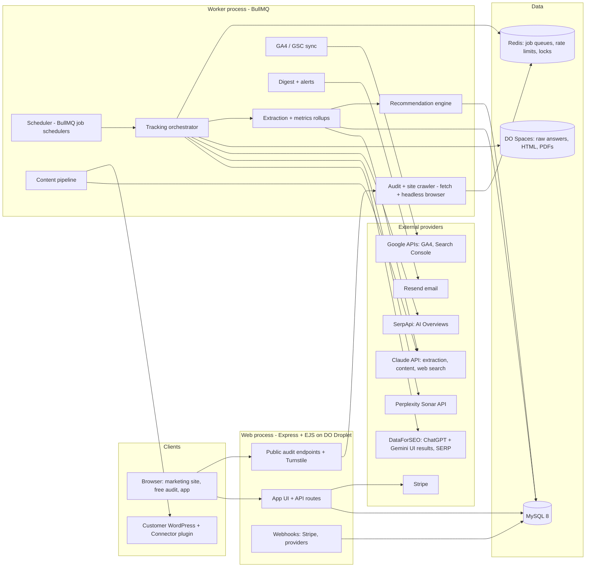
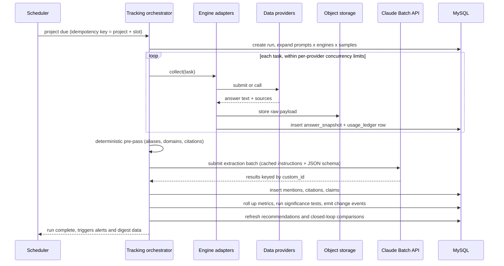
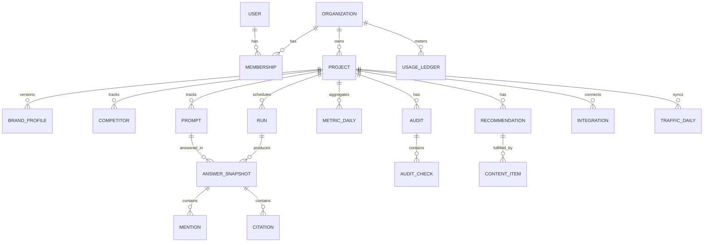

# AEO Corner — MVP Product & Architecture Specification

| | |
|---|---|
| **Product name** | **AEO Corner** (decided; see [D6](#17-decisions-needed-from-the-founder)) · Tagline: *"Corner your market in AI answers."* |
| **Domains** | `aeocorner.com` (primary), `aeocorner.ai` (redirect). Both unregistered on 2026-09-28. Register before any public mention |
| **Document** | MVP specification, v0.1 (draft for founder review) |
| **Date** | 2026-09-28 |
| **Reference product analyzed** | [aeoengine.ai](https://aeoengine.ai) (homepage, platform, pricing guide, free AEO report, module pages) |
| **Status** | Draft. Open decisions are listed in [§17](#17-decisions-needed-from-the-founder) |
| **Code status** | No code yet. This document is the source of truth for the MVP build |
| **Companion docs** | [CUSTOMER_JOURNEY.md](CUSTOMER_JOURNEY.md): customer experience, stage-by-stage data flow, messages, and 6 proposed changes to this spec · [ADMIN_OPERATIONS.md](ADMIN_OPERATIONS.md): internal admin console, staff roles, admin flows, recurring tasks, background jobs, alerts · [DATABASE_SCHEMA.md](DATABASE_SCHEMA.md): MySQL schema v1 (64 tables; Clerk + Prisma; DDL in [db/schema.sql](db/schema.sql)), tenancy rules, query patterns, retention, grants |

---

## 0. TL;DR

- **What we are building:** A self-serve SaaS that shows a brand how often AI answer engines (ChatGPT, Perplexity, Gemini, Google AI Overviews) **mention, recommend and cite it compared with its competitors**. It explains *why*, helps *fix* it, and then **proves whether the fix worked**.
- **Why this can win:** The market has split in two:
  - **Dashboards** (Otterly, Peec, Profound, Scrunch, AthenaHQ; about $29–$495/mo) measure the problem but leave the fixing to you.
  - **Agencies** such as AEO Engine ($1,597–$10,000+/mo) fix it with humans plus agents, but they are expensive and not self-serve.
  - **The gap:** software that closes the whole **Measure → Diagnose → Fix → Prove** loop at SMB prices. Newer tools now claim the loop too (AnswerLift, AirOps, Goodie, Webflow AEO; see [§1.3](#13-competitive-landscape)). Our edge must be SMB price, WordPress-first execution and measurement rigor.
- **MVP (12 weeks, 2 engineers + designer + founder):**
  1. A free AEO audit as the lead magnet.
  2. An auto-generated Brand Kit and prompt set.
  3. Multi-engine tracking with statistical sampling.
  4. A visibility, share-of-voice and citations dashboard.
  5. An Action Center of ranked fixes.
  6. A Content Studio for answer-ready briefs, drafts and JSON-LD.
  7. WordPress publishing.
  8. AI-referral traffic from GA4.
  9. A weekly digest and Stripe billing.
- **What the MVP leaves out on purpose:** backlink buying, Reddit/Quora "seeding", PR wire distribution, parasite SEO, and bulk auto-publishing. These are either human *services* rather than software, or they breach search/platform policies (see [§11.4](#114-what-we-deliberately-will-not-build)).
- **Architecture:** A Node.js modular monolith (Express + EJS + Tailwind, with htmx/Alpine.js for interactivity) on DigitalOcean. It runs a web process plus a BullMQ worker process, with MySQL 8, Redis, and DigitalOcean Spaces for raw AI answers.
  - We *buy* the answer data from licensed providers (DataForSEO, Perplexity Sonar API, SerpApi), behind a swappable **engine-adapter** interface.
  - We *build* the intelligence (extraction, metrics, recommendations, closed-loop proof) on the Claude API.
- **Unit economics:** Each tracked prompt-run (4 engines, 10 sampled answers) costs about **$0.055–$0.115**. At $79 / $249 / $599 tiers, tracking and content cost 19–47% of revenue depending on the extraction model. The extraction-model choice is the **#1 margin lever** and is decided by an eval in week 3 ([§12](#12-unit-economics--pricing-hypothesis)).

---

## 1. Problem & market analysis

### 1.1 The shift

Buyers increasingly *ask* ChatGPT, Perplexity, Gemini or Google's AI Overviews instead of clicking through ten blue links. An AI answer typically names **2–7 brands** and cites a handful of sources. If your brand is not in that answer, you are invisible at the moment of decision. Traditional SEO tools track rankings and backlinks, but they **cannot see inside AI answers**. That blind spot is what the AEO/GEO category exists to fill.

### 1.2 Deconstructing the reference product (AEO Engine)

AEO Engine calls itself a *"Service-as-a-Software"* agency: senior humans set the strategy and a fleet of agents does the execution. The table below separates what is really software from what is really service.

| Capability | How AEO Engine delivers it | Nature | Our MVP |
|---|---|---|---|
| Free "AEO Checker" | URL + work email (OTP) + optional competitor. Returns a 0–100 score across 5 buyer prompts per engine, competitor comparison, revenue estimate and top 5 fixes, emailed in ~10 min | Software (lead magnet) | ✅ **Build** (F1) |
| AI visibility tracking | ChatGPT, Perplexity, Gemini, AI Overviews. Prompts auto-generated or CSV. Share of voice, win rate, citation share. Auto-test **once a month (1st)**, plus manual runs | Software | ✅ **Build**, but weekly and with multi-sampling (F4–F6) |
| Brand Intelligence | URL in; out come voice/tone, values, products, audiences, competitors, author personas and banned words. Re-analyze quarterly | Software (LLM) | ✅ **Build** (F2) |
| AI blog writer | "14-step pipeline" (research → outline → writing → images → links → FAQ → QC → publish → index). 30–60 articles/mo. Publishes to WordPress, Shopify, Webflow, GoHighLevel | Software + human QC | ✅ **Build**, human-approved and lower volume (F8) |
| On-page SEO agents | Daily at 3 AM UTC: titles, metas, alt text, "year" freshness, schema. QC agent plus optional approval workflow | Software | ◐ **Recommend + one-click apply on WordPress** in MVP. Autonomous agent in v2 |
| Internal linking ("LinkALot") | Weekly scan, auto-inserts links into the CMS | Software | ⏭ v1.1 |
| Bulk indexer | Pushes URLs to Google, Bing, Yandex | Software | ◐ **IndexNow only** (see §11.4 on Google's Indexing API) |
| Backlinks (3–10/mo), AI-optimized PR (400+ outlets) | Link network and PR distribution | **Service** | ❌ Out. Possible partner marketplace later |
| Reddit & Quora "seeding" (3–10/mo) | Brand mentions placed in communities | **Service, policy risk** | ❌ Replaced by a *Community Opportunity Finder* (v1.1). Humans post, with disclosure |
| Parasite SEO | Content on third-party high-authority sites | **Policy risk** | ❌ Won't build |
| Weekly reports, Slack, strategist, 30%-traffic guarantee | Account management | Mixed / service | ◐ Weekly digest in MVP. No guarantee |

**Insight:** Roughly two-thirds of AEO Engine's listed deliverables are software-shaped. Their price premium comes from the **human service layer** (links, PR, community, strategy). A software-first product can deliver the measurable, fixable core at **~5–15% of the agency price**, and agencies are themselves a customer segment for it.

### 1.3 Competitive landscape

Published pricing below comes from third-party round-ups dated 2026. Verify before any external use.

| Player | Type | Published price range | What they do | Where they fall short |
|---|---|---|---|---|
| **AEO Engine** | Agency + in-house platform | $1,597 → $2,997/mo; Enterprise from $10K/mo | Done-for-you content, links, PR, tracking | Price, sales-led, not self-serve |
| **Otterly.ai** | Tracker | $29 → $489/mo (15–400 prompts, 4 engines; other engines are add-ons) | Monitoring, GEO audit | Measure-only |
| **Peec AI** | Tracker | ~$95 → $495/mo (3 base engines, surcharge per extra engine) | Monitoring, sources, sentiment | Measure-only |
| **Profound** | Enterprise tracker | $99 (ChatGPT-only starter) / $399 / custom | Deep analytics, AI-crawler ("agent") analytics | Enterprise complexity and price |
| **Scrunch AI** | Tracker + AI-agent experience | $250 → $500+/mo | Monitoring, AI-facing site layer | Measure-heavy, seat-based |
| **AthenaHQ** | Tracker | Free → $295/mo | Monitoring, credits model | Measure-heavy |
| **Semrush AI Visibility Toolkit** | Suite add-on | $99 → $549/mo | Bundled with the SEO suite | Generalist |
| **Prefer / PromptWatch / Evertune** | Tracker + light content | ~$24 → $800/mo | Some article drafting | Early, thin execution |
| **Mentionable** | Tracker | €79/mo → €299/mo Agency (5,000 credits, unlimited projects) | Daily tracking across ~7–8 engines, including AI Mode, Grok and Copilot; public MCP server so agents can query the data | Measure-focused. Its entry price matches our Starter tier |
| **AnswerLift** | Tracker + execution | Not verified (7-day free trial) | Claims the full loop: visibility scores → ranked GEO action plans → citation-ready content | **Direct overlap with our loop.** Early and unfunded (Tracxn). Watch closely |
| **AEOProof** | Tracker + proof | Free sample → Pro from $29/mo | Stores raw AI answers for replay and before/after proof | Overlaps our "Prove" step. Fewer engines, thin fixing |
| **AirOps / Goodie / Webflow AEO** | Content platforms / agentic optimization | Not verified | Tie visibility data to content execution. Goodie pushes fixes via API. Webflow AEO is a closed-loop system for Webflow sites | Mid-market/enterprise focus, or locked to one CMS (Webflow) |

**Takeaways**
1. **Tracking alone is commoditizing fast.** Prices are falling and suites (Semrush, Ahrefs, HubSpot) are bundling it. We cannot win on dashboards alone.
2. The top complaint about trackers is that they **surface problems but don't fix them**.
3. **Price anchors:** $79–$299/mo for SMB, $500+/mo for agencies.
4. **The "closed loop" claim is no longer unique.** AnswerLift, AirOps, Goodie and Webflow AEO all market the measure → fix → measure loop (found during naming research, 2026-09-28). Our edge has to come from:
   - SMB pricing
   - WordPress-first, server-side execution
   - Sampling-based measurement with confidence ranges
   - Explicit before/after proof per action

   "We fix it too" is not enough on its own.
5. **Our differentiation:**
   - **Execution:** fixes, content and publishing.
   - **Proof:** before/after on the targeted prompts, plus AI-referral traffic.
   - **Honest methodology:** sampling and confidence ranges.
   - **Agency-ready multi-project model.**

---

## 2. Product vision & positioning

> **"Don't just find out you're invisible in AI answers. Fix it, and prove it."**

```
   ┌──────────┐     ┌───────────┐     ┌─────────┐     ┌─────────┐
   │ MEASURE  │ ──▶ │ DIAGNOSE  │ ──▶ │   FIX   │ ──▶ │  PROVE  │ ──┐
   │ tracking │     │ audit +   │     │ actions,│     │ before/ │   │
   │ 4 engines│     │ citation  │     │ content,│     │ after + │   │
   │ sampled  │     │ gaps      │     │ schema, │     │ AI      │   │
   └──────────┘     └───────────┘     │ publish │     │ traffic │   │
        ▲                             └─────────┘     └─────────┘   │
        └───────────────────────────────────────────────────────────┘
```

**Defensibility that builds over time**
1. **Closed-loop outcome data.** Every executed action is linked to the prompts it targets and to measured visibility before and after. Over time this tells us *which fixes actually move AI visibility*, for which engine, in which vertical. We then use that data to calibrate our recommendations and scores. Dashboards can't copy this.
2. **Agency workflow lock-in:** multi-project, client seats, and white-label reports in v1.1.
3. **Integration surface:** a CMS connector that also becomes a data source (AI-crawler logs in v1.1).

---

## 3. Target users

| Segment | Who | Main job-to-be-done | Willingness to pay | MVP priority |
|---|---|---|---|---|
| **A. In-house SMB / mid-market marketer** | Marketing lead at B2B SaaS, ecommerce or professional/local services. 1–3 sites, usually WordPress, no dedicated SEO team | "Tell me if AI recommends us, why not, and give me the fixes I can ship this week." | $79–$299/mo | **Primary** (self-serve, product-led growth via the free audit) |
| **B. SEO / marketing agency or freelancer** | Manages 5–30 client brands. Needs AI-visibility reporting to sell AEO retainers | "Show each client their AI visibility, produce the work, and prove ROI in a monthly report." | $500–$1,500/mo | **Secondary** (plan exists in MVP; white-label comes in v1.1) |
| **C. Enterprise brand team** | Multi-brand, multi-region | Governance, many locales, API/BI export | $2K+/mo | Later |

**Key personas**
- **Maya, marketing manager (Segment A):** Non-technical but CMS-capable. Measured on pipeline. Needs plain-language priorities and one-click fixes.
- **Omar, agency owner (Segment B):** Needs the same insights across 20 clients, credible methodology, and reports that carry his brand.

**Recommendation:** Launch self-serve for Segment A, but model **Organization → Projects** from day one. That way Segment B becomes a pricing configuration rather than a rebuild.

---

## 4. MVP scope (MoSCoW)

### Must (MVP 1.0)

| ID | Feature | One-liner |
|---|---|---|
| F1 | Free AEO Audit | Public, email-verified audit: readiness score + live visibility snapshot + top fixes |
| F2 | Onboarding & Brand Kit | Domain → auto-extracted brand profile, products, competitors, voice. Editable and versioned |
| F3 | Prompt Manager | Generate, import and edit tracked buyer prompts, with intent, cluster and locale |
| F4 | Visibility Tracking Engine | Scheduled multi-engine, multi-sample answer collection, then extraction |
| F5 | Visibility Dashboard | Score, mention rate, share of voice, position, sentiment, trends, per-prompt drilldown |
| F6 | Citation & Source Intelligence | Which domains and URLs AI cites; "citation gap" versus competitors |
| F7 | Action Center | Evidence-backed, prioritized recommendations with closed-loop before/after |
| F8 | Content Studio | Answer-ready brief → draft in brand voice → QC → JSON-LD → approve |
| F9 | WordPress Connector | Publish drafts; server-side schema and meta injection via a small plugin; IndexNow |
| F10 | AI Traffic Analytics | GA4 and Search Console: AI-referral sessions, conversions, landing pages |
| F11 | Reports & Alerts | Weekly email digest; alerts on significant drops or negative claims |
| F12 | Accounts, Plans, Billing, Admin | Orgs, roles, Stripe subscriptions, plan limits, usage ledger, internal admin |

### Should (ship in MVP if on schedule, otherwise v1.1)
- Public share link and PDF export of reports
- CSV export of answers, mentions and citations
- Prompt-volume estimates (e.g., DataForSEO AI keyword data) to prioritize prompts
- Directional "opportunity" estimate in the audit, with every assumption shown
- Slack alerts

### Could (v1.1)
- More engines: Claude, Microsoft Copilot, Google AI Mode, Grok, Meta AI
- AI-crawler analytics (bot hits logged by the WordPress plugin or a Cloudflare Worker)
- Internal-linking suggestions and one-click insertion
- White-label reports and client seats (Agency plan)
- Shopify app and Webflow connector
- **Accuracy monitor:** flags AI answers that state wrong facts (pricing, locations) about the brand
- Community Opportunity Finder (relevant Reddit/Quora/forum threads, with disclosed reply drafts for humans to post)

### Won't (MVP, and several never)
- Automated backlink acquisition or link buying
- Automated Reddit/Quora posting
- Parasite SEO
- Mass auto-publishing without human approval
- Google Indexing API for ordinary pages
- Cloaking (serving AI bots different content from humans)
- Revenue or traffic guarantees

---

## 5. Feature specifications

### F1 — Free AEO Audit (lead magnet)

**Purpose:** The top-of-funnel acquisition engine and the first "aha" moment. It also pre-builds the trial project.

**Flow**
1. The visitor enters a URL, plus an optional competitor URL.
2. A Cloudflare Turnstile check runs, then a safe fetch validates the domain.
3. The visitor enters a work email and receives a 6-digit OTP. The audit only runs after verification.
4. A progress page updates live. On completion, the report page is shown and emailed.

**Pipeline**
1. Fetch `robots.txt`, the sitemap(s) and the homepage.
2. Select up to 20 key pages (nav, sitemap priority, About/Pricing/Product/Service).
3. Take a raw-HTML fetch for all selected pages, plus a headless-rendered fetch for 5 of them (render comparison).
4. Run the readiness checks ([§6.6](#66-aeo-readiness-rubric-v0)).
5. Run a lite Brand Kit extraction: name, category, products, top 3 competitors (LLM-suggested, confirmed by the answers).
6. Generate 5 high-intent buyer prompts (discovery ×2, comparison ×1, problem/solution ×1, brand ×1).
7. Query 4 engines × 5 prompts × 1 sample, using live/priority provider modes.
8. Extract mentions and citations, compute the scores, and generate the top 5 fixes.

**Output**
- A report with an unguessable ID, showing:
  - AEO Score (0–100), with readiness and visibility sub-scores
  - Per-engine visibility
  - Competitor comparison
  - The actual answer excerpts
  - Top 5 fixes
- A CTA: "Track this weekly": starts a trial with the project, brand kit and prompts pre-filled.

**Acceptance criteria**
- p90 completion ≤ 10 min; p50 ≤ 5 min.
- Variable cost ≤ $0.75 per audit.
- Limits: 3 audits per email per day; 10 per IP per day; the same domain within 24 h is served from cache.
- Every fix links to its evidence: a failing check or specific answers.
- All user-supplied URL fetching goes through the SSRF-safe fetcher ([§11.2](#112-application-security)).

### F2 — Onboarding & Brand Kit

**User stories**
- As a marketer, I enter my domain and get a correct brand profile in under 2 minutes, so tracking is set up without me writing anything.
- As a marketer, I can correct the profile. Corrections persist and improve prompts and content.

**Brand Kit fields** (versioned JSON, v1)
- **Identity:** brand name, aliases/misspellings, legal name, domain(s), one-sentence definition, category, geography served.
- **Offerings:** products/services (name, URL, description, price point if public), target audiences / ICPs, differentiators/USPs.
- **Facts registry:** founding year, locations, pricing and similar facts, used later by the accuracy monitor and to ground content.
- **Voice:** tone traits, reading level, do/don't words, author personas (name, bio, credentials).
- **Competitors:** 3–10, each with a name, domain and aliases.

**Acceptance criteria**
- User time from signup to first tracking run ≤ 5 minutes.
- Extraction reads ≤ 30 pages and takes < 120 s at p90.
- Every field is editable, and a re-analysis creates a new version (no silent overwrite).

### F3 — Prompt Manager

**Prompt model**
- `text`: the conversational form, e.g. *"What's the best CRM for a 10-person real-estate team?"*
- `search_query`: the keyword form used for AI Overviews / AI Mode, e.g. *"best crm for small real estate team"*. AI Overviews trigger on searches, not chat prompts.
- `cluster` (topic)
- `intent`: `discovery | comparison | problem_solution | brand | local | transactional`
- `funnel_stage`
- `priority` (1–3)
- `locale` (country, language, optional city)
- `status`
- `source`: `generated | imported | manual | audit`

**Functions**
- Auto-generate 25–50 prompts from the Brand Kit, spread across intents.
- CSV import, bulk tag, pause/resume, and duplicate detection (normalization + trigram similarity).
- Plan limits are enforced at save time. Edits take effect on the next run.

**Acceptance criteria:** Generated prompts pass an internal "would a real buyer ask this?" rubric in the eval set. Duplicates are flagged before save.

### F4 — Visibility Tracking Engine

**Engines (MVP):** ChatGPT, Perplexity, Gemini, Google AI Overviews. Collection methods are covered in [§6.2](#62-engines--collection-methods).

**Schedules**
- Weekly by default.
- Daily as a paid add-on, using 1 sample per engine.
- "Run now", capped per plan per month.
- Runs are spread across the week by a project-ID hash to smooth provider load.

**Sampling:** 3 samples per prompt for chat engines; 1 for AI Overviews ([§6.3](#63-sampling--statistics)).

**Per-answer processing:**
- Store the raw payload in object storage.
- Normalize to an answer snapshot.
- Run the deterministic pre-pass.
- Run LLM extraction (via the Batch API).
- Resolve entities.
- Persist mentions and citations.
- Roll up metrics.
- Detect significant changes.
- Refresh recommendations.

**Acceptance criteria**
- A 150-prompt weekly run completes within 2 h at p95 (standard provider queues).
- ≥ 98% of collection tasks succeed after retries. Failures are visible in admin and never silently counted as "not mentioned".
- Every snapshot records: provider, collection method, engine model/version (when exposed), locale, timestamp, cost, `extraction_version`.

### F5 — Visibility Dashboard

**Views**
- **Overview:**
  - AI Visibility Score trend
  - Mention rate by engine, with confidence bands
  - Share of voice versus competitors
  - Average position, sentiment and citation share
  - Only *statistically significant* wins and losses since the last period
- **Prompt matrix:** a heatmap of prompts × engines, showing "mentioned in k of n samples". Clicking a cell opens the actual answers, with the brand and competitors highlighted and the sources listed.
- **Competitors:** head-to-head by cluster and intent; win/loss per prompt; newly discovered brands appearing in answers.
- **Annotations:** executed recommendations and published content appear as markers on trend lines. This is the "proof" UX.

**Filters:** engine, cluster, intent, locale, date range.

**Acceptance criteria:** p95 dashboard load < 1.5 s for 500 prompts × 12 months (served from rollups).

### F6 — Citation & Source Intelligence

- **Domain leaderboard:** cited domains ranked by frequency and share, classified as **own / competitor / review site / UGC (Reddit, Quora, forums) / media / reference (Wikipedia etc.) / directory / other**.
- **Citation gap:**
  - Third-party domains and URLs cited in answers where competitors appear and we don't. These become presence or outreach targets.
  - Competitor pages that are cited, and their format (listicle, comparison, review, docs). This shows what content shape wins each prompt.
- **Own page performance:** which of our URLs are cited, for which prompts and engines; plus pages that *should* be cited for a prompt but aren't.

**Acceptance criteria:** Domain classification is ≥ 90% accurate on a labeled set. The citation gap updates after every run.

### F7 — Action Center

**The recommendation object**
- `type`, title, plain-language "why"
- Evidence: links to failing checks, answer snapshots and citations
- Affected prompts and pages
- `impact`, `confidence`, `effort` and an ICE score
- Status: `open → in_progress → done | dismissed`
- `fix_path`: `auto_fix | content | guidance`

**v0 rules** (a deterministic rule engine; an LLM writes the narrative and the specific steps)

| Signal | Recommendation | Fix path |
|---|---|---|
| AI *search/answer* bots disallowed in robots.txt (OAI-SearchBot, ChatGPT-User, PerplexityBot, Claude-SearchBot, Bingbot…) | Allow answer-engine bots (training bots stay a business choice) | Auto: generated robots.txt diff |
| Bot user-agent gets a 403 or challenge from the CDN/WAF | Allow-list verified AI bots in Cloudflare / WAF | Guidance with step-by-step instructions |
| Key content missing from raw HTML (JS-only) | Server-render or prerender key pages | Guidance |
| Missing or weak Organization / LocalBusiness schema, or no `sameAs` | Add Organization JSON-LD with `sameAs` profiles | Auto (WordPress plugin) |
| Product/service pages without Product/Service/FAQ schema | Add page-type JSON-LD | Auto (WordPress plugin) |
| **Lost prompt:** competitors mentioned, we are absent, no page of ours targets it | Create an answer page in the winning format | Content Studio (new) |
| We have a relevant page, but it is never cited | Add an answer-first block, FAQ, evidence and freshness | Content Studio (refresh) |
| A third-party domain is cited in ≥ 25% of lost prompts | Get presence there (review profile, list inclusion, directory, expert quote) | Guidance + target list |
| Negative sentiment or an inaccurate claim about the brand | Publish a clarifying facts page; fix third-party profiles | Content + guidance |
| Inconsistent brand naming or a weak About/entity page | Entity cleanup | Guidance + content |
| A cited or target page is stale (> 12 months) | Refresh with current data and a visible "updated" date | Content Studio (refresh) |

**ICE scoring (v0)**
- **Impact** = Σ(priority of affected prompts × engines affected), normalized.
- **Confidence** = the rule's prior, **recalibrated from closed-loop outcomes** as data accumulates.
- **Effort:** auto-fix = 1, content = 3, off-site = 5.

**Closed loop:** When an item is marked done (or its content is published), we snapshot the baseline for the linked prompts. At +2 and +4 weeks we show before and after, with a significance flag.

**Acceptance criteria:** No recommendation without evidence. Every "done" item gets a before/after card.

### F8 — Content Studio

**Pipeline** (each step is visible and editable)
1. **Target:** a lost prompt or cluster, chosen from the Action Center or manually.
2. **Evidence pack:** what each engine answers today, which URLs it cites (from our own tracking data), and the format of the winning pages.
3. **Research:** Claude with server-side web search and web fetch gathers facts, each with a source URL.
4. **Brief:**
   - Recommended format (comparison / best-of list / how-to / FAQ / glossary / facts page)
   - Outline with question-style H2/H3 headings
   - A **direct answer (≤ 60 words)** under each heading
   - Entities to mention, internal-link targets, and schema type
5. **Draft:**
   - Written in the brand voice from the Brand Kit, and grounded only in the Brand Kit facts registry plus the cited research.
   - Unsupported claims are marked `[needs source]`. Stats, testimonials and quotes are never invented.
6. **QC score (automated checklist):**
   - Answer-first
   - Heading structure
   - Reading level
   - Banned words
   - Unsupported claims
   - Overlap with existing site pages
   - Schema validity
7. **JSON-LD:** Article + FAQPage / HowTo / Product / Organization, built from typed templates and validated.
8. **Human approval** (mandatory in MVP). Then: export HTML/Markdown, or push to WordPress as a draft or scheduled post.

**Quotas:** Starter 4, Growth 15, Agency 40 drafts per month. Refreshes count as half a draft.

**Acceptance criteria:** Draft ready in < 3 min at p90. **Zero** publishing without an explicit approval action.

### F9 — WordPress Connector

**Key architectural fact:** Most AI crawlers **do not execute JavaScript**. Schema or content injected client-side (tag managers, JS snippets) is invisible to GPTBot, PerplexityBot, ClaudeBot and similar crawlers. Every fix must therefore be applied **server-side**.

**Two layers**
1. **REST API + Application Password** (no plugin needed): create and update posts and pages as drafts, categories, featured image.
2. **"AEO Corner Connector" plugin** (small PHP plugin, MVP scope):
   - Server-side JSON-LD injection per URL (managed from our app)
   - Title/meta overrides, writing to Yoast or Rank Math meta keys when those plugins are present
   - Hosting the IndexNow key and pinging on publish/update
   - *(v1.1, behind a feature flag)* logging AI-bot hits (user agent + URL + status), which feeds crawler analytics

**Security:** Per-site HMAC-signed requests, a nonce, a timestamp window, least-privilege capabilities, and a one-click disconnect.

**Other CMSs (MVP):** Copy-paste export (HTML + JSON-LD snippet). Shopify and Webflow follow in v1.1.

### F10 — AI Traffic Analytics (GA4 + Search Console)

- Google OAuth with **read-only** scopes; the user picks the GA4 property and GSC site.
- **Daily sync:**
  - Sessions, engaged sessions, key events/conversions and revenue, by **AI referrer** (see [Appendix B](#appendix-b--ai-referrer-sources-ga4)) and landing page.
  - From GSC: clicks and impressions for branded queries and target pages.
- **Charts:** AI-referral sessions by engine over time; top AI landing pages; AI-traffic conversion rate compared with organic.
- **Honesty caveat shown in the UI:** Part of AI-driven traffic arrives without a referrer (apps, copy-paste) and is counted as Direct, so AI referrals are a *floor*.
- ⚠️ **Lead time:** Google OAuth verification for sensitive scopes can take weeks. **Submit it in week 0.**

### F11 — Reports & Alerts

- **Weekly digest** (Monday, local time):
  - Score change
  - Significant wins and losses
  - Newly appearing competitors
  - Top 3 actions
  - Before/after for completed actions
- **Alerts:** a significant drop in visibility or share of voice; a new negative-sentiment or inaccurate claim; a competitor surge; tracking failures.
- *(Should)* PDF export and a public share link. *(v1.1)* White-label and a scheduled client report for agencies.

### F12 — Accounts, Plans, Billing, Admin

- **Organizations, users and roles:** `owner | admin | editor | viewer`. Multiple projects per organization.
- **Stripe:**
  - Checkout, Customer Portal and subscriptions.
  - Plan limits enforced server-side: projects, prompts, engines, runs, drafts, seats.
  - Add-ons: daily tracking, extra prompt packs.
- **Usage ledger:** every provider or LLM call is written with its USD cost. This gives per-org cost of goods sold, margin, and **per-org daily spend caps** (a circuit breaker).
- **Internal admin:**
  - Org lookup and impersonation (audited)
  - Per-org cost and margin
  - Provider health and error rates
  - Failed-job queue with retry
  - Feature flags
  - Extraction review queue

---

## 6. Measurement methodology (core IP)

### 6.1 Principles
1. **Measure what users see, and label the provenance.** UI-captured and API-grounded answers differ, so every snapshot carries its `collection_method`.
2. **Answers are stochastic.** Sample several times and report *rates with confidence*, not single yes/no results.
3. **Store raw first.** Metrics can be recomputed whenever extraction improves.
4. **Keep cause and outcome separate:**
   - **Readiness** = the site signals we control.
   - **Visibility** = observed outcomes in AI answers.
5. **Be transparent.** Publish a public methodology page. This builds trust and is a differentiator against black-box scores.

### 6.2 Engines & collection methods

| Engine | Primary collection (MVP) | Fallback | Samples/run | Notes |
|---|---|---|---|---|
| ChatGPT | **DataForSEO LLM Scraper**: real ChatGPT UI results with sources. $0.0012/result (standard queue, ≤ 45 min) / $0.004 (live, ≤ 90 s) | OpenAI Responses API + `web_search` tool (~$10/1K calls + tokens), labeled `api_grounded` | 3 | Logged-out, non-personalized answers. Buying licensed data avoids running our own scraping against OpenAI's terms |
| Gemini | **DataForSEO LLM Scraper** (Gemini UI) | Gemini API + Google Search grounding (Gemini 3: 5K free prompts/mo, then ~$14/1K) | 3 | |
| Perplexity | **Perplexity Sonar API** (returns citations). ~$5–12/1K requests + $1/M tokens | DataForSEO LLM Responses | 3 | API ≈ product; labeled `api_grounded` |
| Google AI Overviews | **SERP API**: SerpApi AI Overview API (~$0.01–0.025/search depending on plan) or the DataForSEO SERP AI Overview element | The other of the two | 1 | Uses `search_query`. Also tracks the *AIO trigger rate*, because not every query shows an overview |
| *v1.1:* Claude, Copilot, Google AI Mode, Grok, Meta AI | Provider/API per engine | — | 3 | Same adapter interface |

**Provider routing is configuration, not code:** each engine has a primary and a fallback adapter, with health-based failover (error rate > 10% over 15 min triggers a switch and an alert).

### 6.3 Sampling & statistics
- **Per cell** (prompt × engine × run): *n* samples, *k* of which mention the brand. Mention rate = k/n.
- **Aggregates:** Mention rate and share of voice across prompts, with **Wilson 95% intervals**, shown as bands on the charts.
- **Change detection:**
  - Compare the trailing 4-week window with the previous 4 weeks.
  - Flag as **significant** only if a two-proportion z-test gives p < 0.05 **and** the change is at least 5 percentage points.
  - Anything else is labeled *"within normal variation"*.
- **Why this matters:** Single-sample tools produce noisy swings that erode trust. Customers panic, then churn. Honest variance handling is a product feature.

### 6.4 Answer extraction pipeline
1. **Deterministic pre-pass (free):**
   - Alias and domain matching for tracked entities: word-boundary, case-insensitive, handles possessives and domain mentions.
   - Parse the provider's structured sources into citations.
2. **LLM extraction (Claude, structured outputs with a JSON schema).** Per answer:
   - `answer_type`: list / single_recommendation / comparison / explanatory / refusal
   - Entities, each with:
     - name, `tracked_entity_id` (or null)
     - `list_rank` and first-mention order
     - `prominence`: primary / secondary / passing
     - `stance`: recommended / neutral / cautioned / not_recommended
     - `sentiment` (−2 to +2), short excerpt
     - `claims[]`: attribute, value, polarity
   - Citations: URL and the entity each one supports.
3. **Entity resolution:** Normalize names, match against the alias table, and have the LLM confirm ambiguous cases. Frequent untracked brands appear as **"discovered competitors"** that the user can add.
4. **Cross-check:** The pre-pass and the LLM must agree on whether each tracked brand is present. Disagreements are logged into the eval/review queue.
5. **Versioning:** Every derived row carries an `extraction_version`, so history can be re-extracted from raw.

Illustrative extraction output (shape, not final schema):

```json
{
  "answer_type": "list",
  "entities": [
    {"name": "Acme CRM", "tracked_entity_id": "brand", "list_rank": 2, "prominence": "primary",
     "stance": "recommended", "sentiment": 1, "excerpt": "Acme CRM is popular with small teams…",
     "claims": [{"attribute": "pricing", "value": "from $12/user/month", "polarity": "neutral"}]}
  ],
  "citations": [{"url": "https://www.g2.com/…", "supports": ["Acme CRM", "RivalCRM"]}]
}
```

### 6.5 Metric definitions

| Metric | Definition |
|---|---|
| **Mention rate** | Share of answers that name the brand = Σk / Σn over the selected prompts, engines and period |
| **Share of voice (SoV)** | Brand mentions ÷ mentions of all tracked entities (brand + competitors) |
| **Recommendation rate** | Share of answers where the brand's stance is *recommended* |
| **Average position** | Mean `list_rank` when mentioned in list-type answers |
| **Citation share** | Citations pointing to our domain(s) ÷ all citations |
| **Sentiment** | Mean sentiment (−2…+2) over mentions |
| **Win rate vs competitor X** | Share of prompts where the brand ranks ahead of X (or X is absent while the brand is present) |
| **AIO trigger rate / AIO presence** | Share of search queries showing an AI Overview / share of those overviews that mention or cite the brand |
| **AI Visibility Score (0–100)** | See the formula below |

**AI Visibility Score (v0)**

```
VS = 100 × Σ_p Σ_e ( w_p · w_e · s(p,e) )  /  Σ_p Σ_e ( w_p · w_e )

s(p,e) = mean over samples of the presence value:
  1.00  sole recommendation or list rank 1
  0.85  list rank 2          0.70  list rank 3
  0.50  rank ≥ 4, or mentioned in a non-list answer
  0.25  our domain cited but brand not named
  0.00  absent
  × 0.5 if the stance is cautioned / not_recommended

w_p = prompt priority (1–3)     w_e = engine weight (equal by default; user-adjustable)
```

### 6.6 AEO Readiness rubric (v0)

These weights are v0 heuristics. After about 200 projects we **calibrate them** by regressing observed visibility on readiness features. Recalibrated weights are both a moat and a marketing asset ("what actually matters for AI visibility").

| Category (pts) | Check | Pts | Auto-fixable in MVP |
|---|---|---|---|
| **A. AI crawler access (20)** | A1 Answer/search bots allowed (OAI-SearchBot, ChatGPT-User, PerplexityBot, Perplexity-User, Claude-SearchBot, Claude-User, Bingbot, Googlebot) | 8 | robots.txt diff |
| | A2 Training-bot policy shown (GPTBot, ClaudeBot, Google-Extended, Applebot-Extended, CCBot). *Informational: a business choice, never penalized heavily* | 2 | — |
| | A3 No CDN/WAF block or challenge when fetched with bot user agents | 6 | Guidance |
| | A4 XML sitemap exists and is referenced in robots.txt | 4 | WordPress (via SEO plugin) |
| **B. Renderability (10)** | B1 Main content present in raw HTML (raw/rendered text ratio ≥ 80%) | 7 | Guidance |
| | B2 Key content not hidden behind interactions/iframes | 3 | Guidance |
| **C. Structured data (20)** | C1 Organization / LocalBusiness with name, logo, url, `sameAs` | 6 | ✅ plugin |
| | C2 Page-type schema on key pages (Product / Service / Article / FAQPage / HowTo) | 8 | ✅ plugin |
| | C3 JSON-LD is valid and server-rendered | 3 | ✅ plugin |
| | C4 WebSite + BreadcrumbList | 3 | ✅ plugin |
| **D. Entity clarity (15)** | D1 Consistent brand name across title, `og:site_name` and schema | 4 | ✅ meta |
| | D2 About page gives a clear who/what/where/for-whom definition | 4 | Content Studio |
| | D3 `sameAs` links to authoritative profiles (LinkedIn, Wikipedia/Wikidata, Crunchbase, G2, Google Business Profile) | 4 | ✅ plugin + guidance |
| | D4 Name/address/phone consistency (local businesses) | 3 | Guidance |
| **E. Content answerability (25)** | E1 Question-style H2/H3 headings that match buyer prompts | 5 | Content Studio |
| | E2 Direct answer (≤ 60 words) right under the question headings | 6 | Content Studio |
| | E3 Lists / tables / comparison structures | 4 | Content Studio |
| | E4 FAQ sections on key pages | 4 | Content Studio + FAQ schema |
| | E5 Evidence: stats with sources, author bylines and credentials | 3 | Content Studio |
| | E6 Freshness: visible "updated" dates, current information | 3 | Content Studio |
| **F. Technical foundations (10)** | F1 Key pages indexable (no stray noindex; canonical correct) | 4 | Guidance |
| | F2 HTTPS, 200 status, no redirect chains | 2 | Guidance |
| | F3 Titles and meta descriptions present and unique | 3 | ✅ meta |
| | F4 `llms.txt` present. *Informational, low weight: major engines haven't confirmed they use it* | 1 | ✅ generate |

**Audit AEO Score** = 0.6 × Readiness + 0.4 × Visibility (snapshot). Reports always show the sub-scores separately.

---

## 7. System architecture

### 7.1 Architecture principles
1. **Buy data, build intelligence.** Licensed providers collect answers. Our intellectual property is extraction, metrics, recommendations and the closed loop.
2. **Adapters at every external edge:** engines, CMSs, analytics, LLMs. Providers will churn and change prices.
3. **Async-first, idempotent, resumable jobs.** Every step can be retried safely.
4. **Raw-first storage:** immutable raw payloads, versioned derivations.
5. **Cost is a first-class metric:** a usage ledger on every external call, per-org caps, cost dashboards.
6. **Modular monolith:** one deployable web app plus one worker codebase sharing domain packages. No microservices at MVP.
7. **Tenant isolation by default:** `org_id` on every tenant row, enforced by a mandatory tenant-scoped repository layer. MySQL has no row-level security, so this layer is the only runtime defense. Automated cross-tenant leak tests in CI are the second line.

### 7.2 High-level architecture



### 7.3 Components

| Component | Responsibility |
|---|---|
| **Web app (Express + EJS)** | Server-rendered marketing pages, audit UI and authenticated app (htmx/Alpine.js for partial updates); JSON API routes; reads from MySQL rollups. The marketing site is plain server-rendered HTML, so AI crawlers can read it |
| **Public audit API** | Turnstile verification, OTP, rate limiting, enqueueing audit jobs, streaming progress (server-sent events from Express) |
| **Scheduler** | Hourly BullMQ job scheduler (repeatable job). Finds due project runs (hash-spread), enqueues them idempotently (`project_id + slot` as the job ID) |
| **Site crawler** | SSRF-safe HTTP fetcher; robots/sitemap parsing; raw-HTML and headless-rendered fetches; page selection; readiness checks |
| **Tracking orchestrator** | Expands prompts × engines × samples into tasks; applies per-provider concurrency and rate limits; submits and polls provider tasks (or receives webhooks); writes raw payloads and snapshots |
| **Engine adapters** | One per engine/provider pair, behind a common interface (§7.5) |
| **Extraction service** | Deterministic pre-pass; builds Claude batch requests; parses structured results; entity resolution; validation |
| **Metrics service** | Daily rollups by project × engine × cluster × intent × locale; significance tests; change events |
| **Recommendation engine** | Rule evaluation over checks, metrics and citations → recommendation upserts (stable keys, no duplicates); LLM narrative; closed-loop baselines |
| **Content pipeline** | Evidence pack → research (Claude + web search/fetch) → brief → draft → QC → JSON-LD → approval → publish |
| **Integrations** | WordPress (REST + plugin), Google OAuth (GA4/GSC), IndexNow. Credentials encrypted |
| **Billing & metering** | Stripe subscriptions and add-ons; plan-limit guard; usage ledger; spend caps |
| **Notifications** | Weekly digest, alerts, transactional email |
| **Internal admin** | Ops, cost, provider health, job retries, extraction review, feature flags |

### 7.4 Tech stack

*Decided 2026-09-28: the founder's stack, Node.js + Express + MySQL + EJS + Tailwind CLI, hosted on DigitalOcean. Familiarity beats theoretical advantages for a small team. The architecture in §7.1–7.3 is unchanged; only the frameworks differ.*

| Layer | Choice | Why | Alternatives |
|---|---|---|---|
| Runtime / language | **Node.js (LTS)**, JavaScript with **zod** validation at every boundary (LLM outputs, provider payloads, API input). TypeScript optional for `core/` and `engines/` | The team knows it. zod catches bad data shapes where they enter | Full TypeScript |
| Web | **Express** | Familiar, minimal, easy to reason about | Fastify |
| Views / UI | **EJS + Tailwind CLI (v4) + htmx + Alpine.js (CSP build)**; Chart.js or ECharts for charts; TipTap (vanilla) for the Content Studio editor. One component kit and a dev-only `/_styleguide` ([UI_DESIGN.md](UI_DESIGN.md)) | Server-rendered HTML (fast, and readable by AI crawlers). htmx/Alpine give dashboard interactivity without a SPA. Alpine's CSP build keeps the Content-Security-Policy free of `unsafe-eval` ([ADR-0003](adr/0003-strict-csp.md)) | React for the Content Studio only, if it outgrows htmx |
| Background jobs | **BullMQ + Redis** in a separate worker process: queues, retries with backoff, job schedulers (cron), per-queue concurrency, rate limiters, failed-job set as a dead-letter queue | The standard Node job system. Long runs are fine on our own Droplet (no serverless timeouts) | Trigger.dev (managed) |
| Database | **MySQL 8** (DigitalOcean) + **Prisma 7** with SQL-first migrations ([DATABASE_SCHEMA.md §10.2](DATABASE_SCHEMA.md#102-orm-prisma-7-with-sql-first-migrations)) | Familiar. JSON columns, window functions, CTEs and partitioning cover the MVP. Prisma was tested against the full schema | Add **ClickHouse** later for analytics facts (§8.3) |
| Cache / queues / limits | **Redis** (DigitalOcean) | BullMQ queues, token buckets per provider/org, locks, OTP store, cached user lookups | — |
| Object storage | **DigitalOcean Spaces** (S3-compatible, private bucket, via the AWS S3 SDK with a custom endpoint) | Raw answers, HTML snapshots, PDFs. Presigned URLs for downloads; lifecycle rules for retention | Cloudflare R2 |
| Auth | **Clerk** (`@clerk/express`) for sign-in, sessions and MFA. Staff use a separate Clerk app. Orgs, roles and invitations stay in MySQL ([DATABASE_SCHEMA.md §10.1](DATABASE_SCHEMA.md#101-auth-clerk-identity-only)) | Don't hand-roll auth. Clerk's built-in orgs lack our four roles and project-level access | Better Auth (self-hosted on our tables) |
| Billing | **Stripe** Billing + Checkout + Customer Portal (+ usage meters for add-ons) | Standard | Paddle (merchant of record) |
| Email | **Resend** (HTTPS API) with EJS email templates | DigitalOcean blocks outbound SMTP on Droplets by default, so an HTTP email API avoids that entirely | Postmark |
| Hosting | **DigitalOcean**: Droplet(s) for web + worker, Managed MySQL, Redis, Spaces, all in one region and VPC (§7.11) | Simple, predictable pricing, one vendor | — |
| LLM | **Claude API** (Anthropic SDK): structured outputs, Batch API, prompt caching, web search/fetch server tools | See §7.7 | — |
| LLM observability | Langfuse (traces, prompt versions, eval datasets) | Prompt/version regression tracking | Helicone |
| Product analytics | PostHog (events, funnels, feature flags) | One tool for analytics + flags | Amplitude + LaunchDarkly |
| Errors / logs | Sentry + OpenTelemetry logs | Standard | Datadog |
| Headless browser | Playwright (Chromium) inside the worker process, with a low concurrency cap (Chromium is memory-hungry) | Render comparison, PDF generation | Browserless (hosted) |
| Process manager / proxy | **PM2** (cluster mode for web, fork mode for worker) behind **Nginx** with Let's Encrypt TLS; Cloudflare (free plan) in front for DNS, CDN, WAF and Turnstile | Zero-downtime reloads, auto-restart | Docker Compose; systemd |
| WordPress plugin | PHP 8.x plugin, WordPress.org-compliant | Server-side schema/meta | — |

### 7.5 Engine adapter contract (design sketch)

```ts
// Design sketch only (not implementation), written in TypeScript notation for clarity.
// In the JavaScript codebase, express it as JSDoc types + zod schemas. All engines and providers implement this.
interface EngineAdapter {
  engine: 'chatgpt' | 'perplexity' | 'gemini' | 'google_aio';
  provider: 'dataforseo' | 'perplexity_api' | 'serpapi' | 'openai_api' | 'gemini_api';
  method: 'ui_capture' | 'api_grounded' | 'serp';
  submit(task: CollectTask): Promise<ProviderHandle>;         // async providers return a task id
  poll(handle: ProviderHandle): Promise<RawAnswer | 'pending'>; // or resolved via webhook/postback
  normalize(raw: RawAnswer): NormalizedAnswer;                // text, sources[], model_version, locale
  estimateCostUsd(task: CollectTask): number;                 // written to the usage ledger
}
// CollectTask = { runId, promptId, engine, sampleIdx, text | searchQuery, locale, mode: 'standard'|'priority'|'live' }
```

### 7.6 Key flows

**Scheduled tracking run**



**Free audit:** safe fetch → robots/sitemap → page selection → raw + rendered fetch → checks → lite Brand Kit → 5 prompts → live-mode collection (4 engines) → synchronous extraction → scores → fixes → report + email. Target is under 10 min.

**Content:** target prompt → evidence pack (our citations + answers) → research (web search/fetch) → brief → draft (streamed) → QC → JSON-LD → human approval → WordPress draft/publish → IndexNow → recommendation marked done → closed-loop baseline.

### 7.7 LLM usage map (Claude)

| Task | Volume | Model (default) | Mode | Notes |
|---|---|---|---|---|
| Answer extraction / classification | **High** | `claude-opus-5` at low effort | **Batch API (−50%)** + prompt caching + structured outputs | **Week-3 eval** against a 200-answer hand-labeled golden set, comparing with `claude-haiku-4-5` (cheaper tier). Switch the bulk route only if accuracy holds within the agreed tolerance ([§17](#17-decisions-needed-from-the-founder), D4) |
| Brand Kit extraction | Low | `claude-opus-5` | Sync, structured outputs | Up to 30 pages of text |
| Prompt generation | Low | `claude-opus-5` | Sync, structured outputs | Intent coverage rules in the prompt |
| Recommendation narratives | Medium | `claude-opus-5` | Batch | Evidence passed in; never free-form facts |
| Content research | Low | `claude-opus-5` + web search/fetch server tools | Streaming | Web search ~$10/1K searches + tokens |
| Brief + draft | Low | `claude-opus-5` (higher effort) | Streaming | Brand voice + facts registry + research in context |
| Content QC | Low | `claude-opus-5` | Structured outputs | Rubric scoring |
| JSON-LD | Low | Typed templates + `claude-opus-5` field filling | Structured outputs | Validated before save |

**LLM engineering practices**
- Prompts are versioned in the repo and traced in Langfuse.
- The golden-set eval runs in CI whenever prompts or schemas change.
- Stable instructions go first in the prompt, for cache hits.
- The Claude API's server-side model fallback is enabled; refusals are handled.
- Per-org token budgets are enforced.

**Measured versus reasoning models:** OpenAI, Google and Perplexity are **measured engines** (data sources). Claude is our **reasoning engine**. We never ask the measured engines to grade themselves.

### 7.8 Scheduling, concurrency & resilience
- Hourly BullMQ job scheduler. Each project's weekly slot is `hash(project_id) mod 168` hours, which flattens provider load. Job IDs are deterministic (`project_id + slot`), so a double-fire cannot create a duplicate run.
- Redis token buckets per provider (and per provider account/key), plus per-org concurrency caps, prevent one big agency from starving everyone else. Use one BullMQ queue per job type (audit, crawl, collect, extract, content, sync, digest), each with its own concurrency.
- Retries use exponential backoff with jitter (max 5). Jobs that still fail stay in BullMQ's failed set (our dead-letter queue), shown in admin with a retry button. Partial runs are marked `partial` and are **excluded from trend significance** rather than counted as zeros.
- Provider circuit breaker: an error rate > 10% over 15 min switches to the fallback adapter and alerts on-call.
- Per-org **daily spend cap** from the usage ledger. Hitting it pauses collection and notifies the org.

### 7.9 Repository layout (planned)

A single Node.js repository with two entry points: `src/web/server.js` for the web process and `src/worker/index.js` for the worker process. Both share the domain modules.

```
aeo-corner/
├─ src/
│  ├─ web/                 # Express app: routes, controllers, middleware, SSE, webhooks
│  │  ├─ views/            # EJS layouts, partials, pages, email templates
│  │  └─ public/           # built Tailwind CSS, htmx, Alpine.js, Chart.js, images
│  ├─ worker/              # BullMQ workers + job schedulers: audit, crawl, tracking, extraction, content, sync, digest
│  ├─ core/                # domain logic: scoring, metrics, significance tests, recommendation rules
│  ├─ db/                  # Prisma client + tenant-scoped repositories (schema and SQL migrations in prisma/)
│  ├─ engines/             # engine adapters + provider routing config
│  ├─ llm/                 # Claude client wrapper, prompt templates, zod/JSON schemas
│  ├─ crawler/             # SSRF-safe fetcher, robots/sitemap parsers, readiness checks
│  ├─ integrations/        # WordPress, Google (GA4/GSC), IndexNow, Stripe, Spaces
│  └─ lib/                 # config, logger, queue definitions, Redis client, crypto
├─ tailwind/               # Tailwind CLI input CSS: design tokens, base, component kit
├─ scripts/                # small dev scripts (vendoring front-end assets)
├─ plugins/
│  └─ wordpress-connector/ # PHP plugin
├─ evals/                  # golden sets (labeled answers, prompts, domains)
├─ tests/                  # unit, integration, cross-tenant leak tests
├─ deploy/                 # Nginx config, PM2 ecosystem file, provisioning runbook
└─ docs/                   # this spec, ADRs, methodology page source
```

### 7.10 Environments & delivery
- **Environments:**
  - `dev`: local, with MySQL + Redis via Docker Compose and a `dev/` prefix in a Spaces bucket.
  - `staging`: a small Droplet with its own database, bucket and a capped provider budget.
  - `prod`.
- **CI (GitHub Actions):** lint, unit tests, **cross-tenant leak tests**, migration check, **extraction eval** when `src/llm` changes, `npm audit`.
- **Deploy (GitHub Actions → SSH):**
  1. `git pull` and `npm ci --omit=dev`.
  2. Build Tailwind.
  3. Run migrations.
  4. `pm2 reload` for a zero-downtime web reload, then restart workers gracefully (BullMQ finishes in-flight jobs).
  
  `main` auto-deploys to staging. Production deploys from tagged releases.
- Architecture decisions are recorded as ADRs in `docs/adr/`.
- Feature flags (PostHog) for every engine, integration and risky feature.

### 7.11 DigitalOcean deployment topology

One region (US, per D7) and one VPC. The database and Redis are reachable only over the private network.

| Resource | MVP setup | Notes |
|---|---|---|
| **Droplet** | Ubuntu LTS, **2 vCPU / 4 GB RAM minimum**. Runs Nginx, PM2 web (cluster mode) and PM2 worker (fork mode) | Chromium needs the memory. **Scale step 1:** move the worker to its own Droplet when CPU/RAM stays above 70% or audit jobs queue. **Step 2:** DO Load Balancer + 2 web Droplets. BullMQ makes adding workers trivial |
| **MySQL 8** | **DO Managed MySQL (recommended)**, trusted sources limited to the Droplets | Daily backups + point-in-time recovery and patching. A standby node can be added later for failover. DO Managed MySQL requires a primary key on every table (our schema already has one). Self-hosting on the Droplet is possible, but then you own the backups, restore tests and upgrades |
| **Redis** | DO managed (Redis-compatible) or self-hosted on the Droplet | **Must set `maxmemory-policy noeviction`**, or Redis can silently evict queued BullMQ jobs. If self-hosted, enable AOF persistence and keep it off the public interface |
| **Spaces** | One private bucket per environment, accessed server-side with the AWS S3 SDK (custom endpoint) | Presigned URLs for PDF downloads; lifecycle rule deletes raw payloads after 13 months (§8.3); versioning on raw data |
| **Edge** | Cloudflare (free plan) for DNS, TLS, CDN and WAF; Turnstile on the free audit | Hides the Droplet IP. Rate-limits abusive traffic before it reaches Express |
| **Security** | DO Cloud Firewall (80/443 in; SSH only from admin IPs, keys only, no root login), unattended security upgrades, fail2ban | The database and Redis are never exposed publicly |
| **Secrets** | `.env` readable only by the app user. The envelope-encryption master key is stored apart from the database and the repo (DO has no KMS) | Move to a secrets manager (Doppler / Infisical) when the team grows |
| **Monitoring** | DO Monitoring alerts (CPU, RAM, disk), uptime check on `/healthz`, Sentry, Bull Board queue dashboard inside the internal admin | Alerts go to email/Slack |

**Rough monthly cost (MVP, verify on DigitalOcean's pricing page):** Droplet 4 GB ≈ $24 + Managed MySQL ≈ $15 + managed Redis ≈ $15 + Spaces $5 + Droplet backups ≈ $5, so **about $65–80/month** before providers and SaaS tools.

---

## 8. Data model

### 8.1 Entity-relationship overview



### 8.2 Key tables (abridged)

> **Superseded by the full schema:** [DATABASE_SCHEMA.md](DATABASE_SCHEMA.md) and [db/schema.sql](db/schema.sql) (2026-09-28). Where they differ from this table, they win. The differences and reasons are listed in [DATABASE_SCHEMA.md §12](DATABASE_SCHEMA.md#12-changes-from-mvp-82). This table is kept as the original overview.

| Table | Key columns | Notes |
|---|---|---|
| `organizations` | id, name, plan, stripe_customer_id, spend_cap_usd_daily | Tenant root |
| `projects` | id, org_id, domain, country, language, city?, schedule, status | One brand/site |
| `brand_profiles` | id, project_id, version, data (JSONB), created_by | Immutable versions; the latest is active |
| `competitors` | id, project_id, name, domain, aliases[] | Also entities for extraction |
| `prompts` | id, project_id, text, search_query, cluster, intent, funnel_stage, priority, locale, status, source | Unique on the normalized text per project |
| `runs` | id, project_id, slot, trigger (schedule/manual/audit), status, started_at, finished_at, cost_usd | Unique (project_id, slot) |
| `answer_snapshots` | id, run_id, prompt_id, engine, provider, method, sample_idx, collected_at, model_version, locale, raw_uri, text_excerpt, cost_usd, extraction_version | Full text lives in object storage. **Partitioned monthly** |
| `mentions` | id, snapshot_id, entity_type (brand/competitor/discovered), entity_id, list_rank, prominence, stance, sentiment, excerpt | Partitioned monthly |
| `citations` | id, snapshot_id, url, domain, domain_class, position, supports_entity_ids[], is_own | Partitioned monthly |
| `claims` *(v1.1)* | id, snapshot_id, entity_id, attribute, value, accuracy_status | For the accuracy monitor |
| `metric_daily` | project_id, date, engine, cluster, intent, locale, n, k, mention_rate, sov, avg_rank, citation_share, sentiment, vis_score | Serves the dashboards |
| `audits` / `audit_checks` | audit_id, check_id, status, points, evidence (JSONB), fix | Audits are also stored for anonymous leads |
| `recommendations` | id, project_id, rule_id, stable_key, type, evidence (JSONB), impact, confidence, effort, ice, status, baseline (JSONB), done_at | Upsert on `stable_key` |
| `content_items` | id, project_id, recommendation_id?, target_prompt_ids[], brief, draft, qc (JSONB), jsonld, status, cms_ref, published_url, published_at | |
| `integrations` | id, project_id, type (wordpress/ga4/gsc), config, secret_ciphertext, status | Envelope-encrypted secrets |
| `traffic_daily` | project_id, date, source_engine, landing_page, sessions, engaged, conversions, revenue | From GA4 |
| `usage_ledger` | id, org_id, project_id, meter, provider, qty, cost_usd, ref_id, ts | Cost of goods, limits, margin |
| `leads` | id, email, domain, audit_id, consent_marketing, verified_at | Free-audit funnel |

### 8.3 Volume, scaling & retention
- **Volume estimate:** 500 projects × 150 prompts × 10 answers × 4.33 runs ≈ **3.2M snapshots/month**, which means ≈ 16M mentions and ≈ 20M citations per month.
- **MVP target:** 50–100 paying projects, so a few million fact rows per month. MySQL 8 is enough, provided that:
  - Dashboards read only from daily rollup tables.
  - Fact tables have composite indexes led by `(project_id, date)`.
  - Old raw payloads live in Spaces, not in MySQL.

  Add monthly RANGE partitioning on the fact tables when they pass ~50M rows. MySQL partitioning does not allow foreign keys on partitioned tables, so those tables enforce integrity in the application.
- **Migration trigger for ClickHouse** (facts only; MySQL stays the system of record): more than ~200M fact rows, **or** dashboard p95 above 1.5 s.
- **MySQL notes:**
  - `JSONB` in §8.2 means MySQL's `JSON` column type. Index the fields we filter on through generated columns.
  - Array fields such as `target_prompt_ids[]` become join tables or JSON arrays.
  - Fuzzy brand-alias matching (planned for `pg_trgm`) moves to the application's deterministic pre-pass.
- **Storage estimate** ([DATABASE_SCHEMA.md §7](DATABASE_SCHEMA.md#7-volume-sizing-and-partitioning)): about 2–3 GB/month at 100 projects × 100 questions, so roughly 30–40 GB by month 13. The smallest Managed MySQL plan assumed in §7.11 is too small for that. Size the plan before the beta, or keep only 6 months of facts in MySQL (decision O3 there).
- **Retention:**
  - Raw payloads: 13 months (year-over-year comparisons), then deleted.
  - Rollups: kept for the account's lifetime.
  - Unconverted audit leads: 12 months.
  - Deleted accounts: purged within 30 days.

---

## 9. API surface (internal, v1)

| Area | Endpoints (REST-style route handlers; typed client) |
|---|---|
| Audit (public) | `POST /api/audits` (URL, competitor?, turnstile) · `POST /api/audits/:id/verify` (OTP) · `GET /api/audits/:id` (status/report) |
| Projects | `GET/POST /api/projects` · `GET/PATCH/DELETE /api/projects/:id` |
| Brand Kit | `GET/PUT /api/projects/:id/brand-kit` · `POST …/brand-kit/reanalyze` |
| Prompts | `GET/POST/PATCH/DELETE /api/projects/:id/prompts` · `POST …/prompts/generate` · `POST …/prompts/import` (CSV) |
| Competitors | `GET/POST/PATCH/DELETE /api/projects/:id/competitors` |
| Runs & answers | `POST /api/projects/:id/runs` (run now) · `GET …/runs` · `GET …/answers?prompt&engine&from&to` |
| Metrics | `GET /api/projects/:id/metrics?engine&cluster&intent&from&to&granularity` |
| Citations | `GET /api/projects/:id/citations/domains` · `GET …/citations/gap` |
| Recommendations | `GET /api/projects/:id/recommendations` · `PATCH …/recommendations/:rid` (status) · `POST …/recommendations/:rid/apply` (auto-fix) |
| Content | `POST /api/projects/:id/content` (from recommendation/prompt) · `GET/PATCH …/content/:cid` · `POST …/content/:cid/approve` · `POST …/content/:cid/publish` |
| Integrations | `POST /api/projects/:id/integrations/wordpress` · `GET /api/oauth/google/callback` · `DELETE …/integrations/:iid` |
| Reports | `POST /api/projects/:id/reports` (PDF) · `POST …/reports/:rid/share` |
| Billing | `POST /api/billing/checkout` · `POST /api/billing/portal` |
| Webhooks | `POST /api/webhooks/stripe` · `POST /api/webhooks/providers/:provider` · `POST /api/webhooks/wordpress` |

A public customer API and a Looker Studio/BI connector come in v2.

---

## 10. Non-functional requirements

| Area | Target (MVP) |
|---|---|
| Availability | App 99.5% monthly. Tracking runs are eventually consistent and retry automatically |
| Performance | Dashboard p95 < 1.5 s; API p95 < 500 ms (reads from rollups); audit p90 ≤ 10 min; weekly 150-prompt run ≤ 2 h at p95 |
| Scale (MVP design point) | 200 orgs · 500 projects · 75K prompts · ~3M snapshots/month, with no re-architecture |
| Data correctness | ≥ 95% agreement with the golden set on "is the tracked brand mentioned"; ≥ 90% on stance/rank; failed collections never counted as absences |
| Cost | Variable cost ≤ 30% of revenue per plan (gross margin ≥ 70% target, ≥ 60% floor); per-org spend caps |
| Security | OWASP ASVS L2 for core flows; encrypted secrets; audited admin actions |
| Backup / DR | DO Managed MySQL daily backups + point-in-time recovery (RPO ≤ 15 min, RTO ≤ 4 h), with a restore drill before launch; Spaces versioning on raw data; the Droplet is rebuildable from the repo + runbook in < 1 h |
| Accessibility | WCAG 2.1 AA for audit, onboarding and dashboard |
| Localization | English UI at MVP. Tracking locales are any country/language the providers support |
| Observability | Tracing on every job; SLO dashboards: run success rate, provider error rate, extraction disagreement rate, cost per prompt-run |

---

## 11. Security, privacy, compliance & ethics

### 11.1 Identity & tenancy
- Authentication via Clerk; staff sign in through a separate Clerk app with 2FA required. Roles `owner/admin/editor/viewer` live in our database. Clerk manages the session (a short-lived token it refreshes); CSRF protection on every form and htmx request.
- Every query goes through a tenant-scoped repository that injects `org_id`. Raw SQL outside the repository layer is banned by lint rule. MySQL has no row-level security, so **cross-tenant leak tests in CI** are the second line of defense.
- Internal impersonation requires a reason and is recorded in the audit log.

### 11.2 Application security
- **SSRF-safe fetcher.** This is critical, because the audit fetches arbitrary URLs.
  - Resolve DNS, then block private, loopback, link-local, CGNAT and cloud-metadata ranges. Repeat the check after every redirect.
  - Only http/https on ports 80/443.
  - Caps: body 5 MB, timeout 15 s, maximum 5 redirects.
- **Our crawler's identity:** `AEOCornerBot/1.0 (+https://aeocorner.com/bot)`, with per-domain politeness (≤ 2 concurrent requests, ≥ 500 ms apart).
- **Secrets:** envelope encryption (AES-256-GCM). Data keys are wrapped by a master key held outside the database and repo (DigitalOcean has no KMS; see §7.11). WordPress application passwords and Google refresh tokens are never logged.
- **Webhooks:** signature verification (Stripe, providers, WordPress HMAC), replay windows, idempotency keys.
- **Content-Security-Policy:** strict (`script-src 'self'`, `style-src 'self'`, no `unsafe-inline` or `unsafe-eval`), so views have no inline scripts, handlers or `style=""` attributes. Third-party origins (Turnstile, PostHog) are added only when configured. See [ADR-0003](adr/0003-strict-csp.md).
- **Cross-site forms:** the public audit form refuses requests that came from another site (`Sec-Fetch-Site` / `Origin`); authenticated forms add synchroniser tokens in Phase 2.
- **Abuse:** Turnstile, OTP, rate limits, disposable-email blocking on the audit.
- **Dependencies:** automated updates and an audit in CI.

### 11.3 Privacy & legal
- A GDPR/CCPA-ready privacy policy, a DPA template, and a public **subprocessor list**: Anthropic, OpenAI*, Google, Perplexity, DataForSEO, SerpApi, DigitalOcean, Cloudflare, Clerk, Stripe, Resend, PostHog, Sentry, Langfuse (if cloud-hosted). (*Only if the fallback adapter is enabled.)
- Marketing consent is separate from audit delivery.
- **Analytics on the public site is cookieless** (decided 2026-10-02): PostHog in `cookieless_mode: 'always'`, so there are no cookies, no local storage and no consent banner. The app's own sign-in cookies are strictly necessary. See [UI_DESIGN.md §9](UI_DESIGN.md#9-analytics-and-consent).
- Data subject rights: export and deletion within 30 days.
- **Provider terms:** We do not scrape consumer AI apps ourselves. We rely on licensed data providers and official APIs. Legal reviews each provider's terms before launch and re-checks them every 6 months.

### 11.4 What we deliberately will not build

These choices are about policy safety and long-term customer trust, and they are also our positioning: *durable AEO that won't get you penalized*.

| Tactic | Why not |
|---|---|
| Automated Reddit/Quora "seeding" | Breaks platform rules on spam and undisclosed promotion; risks bans and backlash; also runs into FTC endorsement rules. **Instead:** the v1.1 Community Opportunity Finder, where humans post with disclosure |
| Parasite SEO | Google's *site reputation abuse* spam policy |
| Link buying / automated link schemes | Google's *link spam* policy |
| Mass auto-published AI articles | Google's *scaled content abuse* policy. We require human approval and quality gates, and default quotas are modest |
| Google Indexing API for ordinary pages | Officially limited to JobPosting / livestream (BroadcastEvent) pages. We use **IndexNow** (Bing, Yandex and others) and sitemaps |
| Cloaking / bot-only content or hidden prompt-injection text aimed at LLMs | Deceptive; search-engine spam; high reputational risk |
| Fake reviews, testimonials or invented statistics | FTC rule on fake reviews and testimonials; also destroys trust with AI engines |

---

## 12. Unit economics & pricing hypothesis

> Provider prices were researched on 2026-09-28 from vendor pages and third-party round-ups. **Re-verify before signing contracts.**

### 12.1 Cost inputs

| Input | Price used |
|---|---|
| ChatGPT / Gemini UI answer (DataForSEO LLM Scraper) | $0.0012 per result (standard queue) · $0.004 (live) |
| Perplexity answer (Sonar API) | ≈ $0.006 per answer ($5–12 per 1K requests + ~$1/M tokens) |
| Google AI Overview (SERP API) | ≈ $0.01 per search (SerpApi Production tier; DataForSEO likely cheaper) |
| Claude Opus 5 | $5 / $25 per M input/output tokens; Batch −50%; cache reads at a fraction of input price |
| Claude Haiku 4.5 | $1 / $5 per M input/output tokens |
| Claude web search tool | $10 per 1K searches + tokens |

**Extraction cost per answer** (~0.7K answer tokens + ~1.5K shared instructions/schema/entity list, ~0.4K output, Batch API, instructions cached):
- `claude-opus-5`: ≈ **$0.008**
- `claude-haiku-4-5`: ≈ **$0.002**

For the cached prefix to qualify, it must meet the model's minimum cacheable length. Padding it with few-shot examples also helps accuracy.

### 12.2 Cost per tracked prompt-run
One prompt-run = 10 answers: ChatGPT ×3, Gemini ×3, Perplexity ×3, AI Overviews ×1.

| Item | With Opus 5 extraction | With Haiku 4.5 extraction |
|---|---|---|
| Collection (3×$0.0012 + 3×$0.0012 + 3×$0.006 + 1×$0.01) | $0.035 | $0.035 |
| Extraction (10 answers) | $0.080 | $0.020 |
| **Total per prompt-run** | **≈ $0.115** | **≈ $0.055** |

- Other costs: one content draft (research + brief + draft + QC on Opus 5) is **≈ $0.65–0.80**; one free audit (live-mode collection, synchronous extraction) is **≈ $0.60**.

### 12.3 Plan hypothesis & margin check (weekly tracking = 4.33 runs/month)

| Plan | Price/mo | Includes | Variable cost, Opus 5 | Margin, Opus 5 | Variable cost, Haiku 4.5 | Margin, Haiku 4.5 |
|---|---|---|---|---|---|---|
| **Starter** | $79 | 1 project · 50 prompts · 4 engines · weekly · 4 drafts · WordPress · GA4 | $25 + $3 = **$28** | **64%** | $12 + $3 = **$15** | **81%** |
| **Growth** | $249 | 3 projects · 150 prompts · weekly · 15 drafts · alerts · CSV | $75 + $12 = **$87** | **65%** | $36 + $12 = **$48** | **81%** |
| **Agency** | $599 | 10 projects · 500 prompts · weekly · 40 drafts · client seats · (white-label v1.1) | $249 + $32 = **$281** | **53%** | $119 + $32 = **$151** | **75%** |
| Add-on: daily tracking | +$129 per 50 prompts | 1 sample per engine per day | ≈ $65 (Opus 5) | ~50% | ≈ $35 (Haiku 4.5) | ~73% |
| Free | $0 | One audit per domain every 30 days | ≈ $0.60 per audit | Acquisition cost | — | — |

Fixed platform cost at MVP is roughly **$150–400/month** before usage:
- **DigitalOcean infrastructure:** ≈ $65–80 (§7.11).
- **SaaS tools** (monitoring, email, analytics, LLM tracing): mostly free tiers at first. **Clerk Pro is $25/month from launch** (needed for staff 2FA).

**Conclusions**
1. **The extraction model is the biggest margin lever.** With Opus-5-only extraction, Starter and Growth are viable (~65%) but Agency misses target.
2. **Levers, in order:**
   - (a) The week-3 eval decides whether Haiku 4.5 is accurate enough for bulk extraction.
   - (b) Pre-pass gating: skip full LLM extraction on samples where no tracked entity appears, and extract discovered brands on only one sample per cell (≈ −30% of extraction calls).
   - (c) 2 samples instead of 3 on the Agency tier.
   - (d) Agency priced at $699–$799.
3. Pricing is a **hypothesis**. Validate it with design partners (§14) before publishing.

---

## 13. Delivery plan

### 13.1 Team (MVP)
- **2 senior full-stack Node.js engineers** (Express, MySQL, BullMQ; the founder's stack). One leans backend/data (workers, adapters, extraction, metrics); the other leans product/UI (app, dashboard, Content Studio).
- **1 product designer (≈50%)** for the audit report, onboarding, dashboard and Action Center.
- **Founder as PM and AEO domain lead.** Owns prompt taxonomies, recommendation rules, golden-set labeling, and design partners.
- **Contractor (1–2 weeks)** for the WordPress plugin (PHP).

### 13.2 12-week timeline

The narrative shape of the build. For the actual checkable work items and the required tests per phase, see [BUILD_PLAN.md](BUILD_PLAN.md).

| Week | Focus | Deliverables / exit criteria |
|---|---|---|
| **0** (pre-start) | Setup & long-lead items | Repo, CI; DigitalOcean provisioning (Droplet, Managed MySQL, Redis, Spaces, Cloudflare in front) per §7.11; provider accounts and budgets; **Google OAuth verification submitted**; ToS/Privacy/DPA drafts; 20 design-partner conversations started |
| **1–2** | Foundations + crawler | Auth/orgs, database schema v1, job infrastructure, usage ledger; SSRF-safe fetcher; robots/sitemap parsing; readiness checks v0; **spikes on all 4 engine adapters** with raw storage; **design system, wireframes and the public site shell** (homepage, methodology v1, Terms, Privacy) |
| **3** | Extraction + eval | Extraction schema; **200-answer golden set** labeled; eval of Opus 5 (low effort) vs Haiku 4.5; score formulas v0; decision **D4** recorded as an ADR |
| **4** | 🚩 **M1: Free audit live** | Public audit (Turnstile, OTP, report page, email); rate limits; lead capture; audit analytics funnel; Terms and Privacy already live before any real email is collected. *Starts generating leads while the rest is built* |
| **5–6** | Tracking core | Projects, Brand Kit, Prompt Manager, scheduler, orchestrator, batch extraction, entity resolution, rollups, significance tests |
| **7–8** | 🚩 **M2: Design-partner beta** | Dashboard (overview, prompt matrix, competitors), Citation Intelligence; 10–15 design partners onboarded |
| **9** | Action Center | Rules engine, ICE scoring, narratives, closed-loop baselines, before/after cards |
| **10** | Content Studio + WordPress | Brief, draft, QC, JSON-LD, approval; WordPress REST + Connector plugin (schema/meta/IndexNow) |
| **11** | Analytics, digest, billing | GA4/GSC OAuth + sync, AI-traffic charts; weekly digest and alerts; Stripe plans, limits, trial. Public marketing site work starts (product pages, pricing page driven by the `plans` table) |
| **12** | 🚩 **M3: Public launch** | Load and cost test at 2× target; security review; public marketing site finished (final methodology page, case studies, launch content, passes our own readiness checks); onboarding polish; runbooks |

### 13.3 MVP Definition of Done
- [ ] A new user goes from free audit → trial → first weekly run → first executed recommendation with **no human help**.
- [ ] Golden-set accuracy meets the §10 correctness targets; the eval runs in CI.
- [ ] Measured cost per prompt-run ≤ $0.12 and per audit ≤ $0.75; spend caps tested.
- [ ] Every provider has a working fallback, or a documented degraded mode.
- [ ] SSRF, auth and tenancy tests pass; secrets are encrypted; webhooks are verified.
- [ ] Legal: ToS, privacy policy, DPA and subprocessor list are published.

---

## 14. Success metrics & validation

**North-star metric: "Proven wins" per month.** This is the number of (project, prompt) pairs where visibility improved significantly after an executed action. It measures the exact value we sell.

| Stage | Metric | MVP target (first 90 days after launch) |
|---|---|---|
| Acquisition | Audits completed / month | 1,000 |
| Conversion | Audit → trial | ≥ 5% |
| Activation | Trial project with a completed first run ≤ 24 h | ≥ 70% |
| Engagement | Active projects that executed ≥ 1 recommendation in 30 days | ≥ 50% |
| Monetization | Trial → paid | ≥ 15% |
| Retention | Paid logo retention at month 3 | ≥ 85% |
| Value | Projects with ≥ 1 proven win within 60 days | ≥ 40% |
| Economics | Blended gross margin | ≥ 70% |

**Validation before and during the build**
1. **Design partners (weeks 0–8):** 10–15 brands and 3–5 agencies. Free during the beta in exchange for weekly feedback, a case study, and a pricing interview (Van Westendorp).
2. **Audit as demand test (week 4+):** measure the audit → "track weekly" click-through before billing exists.
3. **Methodology credibility check:** blind-compare our visibility readings with manual checks on 50 prompts.

---

## 15. Risks & mitigations

| # | Risk | Likelihood / impact | Mitigation |
|---|---|---|---|
| R1 | **Measurement validity:** API answers differ from what users see; answers vary run to run; personalization | High / High | UI-capture providers where available; provenance labels; multi-sampling; confidence bands; public methodology page |
| R2 | **Provider dependency or terms changes** (scraper providers, engine UI changes) | Medium / High | Adapter interface; a fallback per engine; raw storage for re-parsing; periodic terms review; budget for a second provider |
| R3 | **Cost volatility:** price changes, token growth | Medium / Medium | Usage ledger, spend caps, Batch API, caching, week-3 model eval, pre-pass gating |
| R4 | **Commoditization** by SEO suites (Semrush, Ahrefs, HubSpot) | High / Medium | Differentiate on execution + proof + agency workflow; pick a vertical beachhead; build the calibration dataset |
| R5 | **Search-policy harm** to customers from AI content | Medium / High | Human approval, QC gates, modest quotas, no link/community automation (§11.4) |
| R6 | **Attribution fuzziness:** AI traffic hidden in Direct | High / Medium | Show AI referrals as a floor; add visibility + branded-search trend; be explicit in reports |
| R7 | **Google OAuth verification delay** blocks GA4/GSC | Medium / Medium | Submit in week 0; the MVP works without GA4 (shown as "connect later") |
| R8 | **Engine landscape shifts** (new engines, AI Mode replacing AI Overviews, ChatGPT shopping) | High / Medium | Engine = config + adapter; add an engine in ≤ 1 week; track AI Overview trigger rate |
| R9 | **Abuse of the free audit** (cost drain, SSRF) | Medium / Medium | Turnstile, OTP, rate limits, cache, SSRF-safe fetcher, daily global audit budget |
| R10 | **Small-team scope creep** | High / High | This MoSCoW list is the contract; "Could" items need a documented trade |

---

## 16. Post-MVP roadmap

| Horizon | Themes |
|---|---|
| **v1.1 (months 4–6)** | Engines: Claude, Copilot, Google AI Mode · AI-crawler analytics (WordPress plugin + Cloudflare Worker) · Accuracy monitor (claims vs facts registry) · Shopify app, Webflow · White-label and client portal for agencies · Internal-linking suggestions · Community Opportunity Finder · Slack |
| **v1.2 (months 6–9)** | Prompt-volume weighting · Multi-locale/city tracking at scale · Content refresh autopilot (with approval) · Scheduled PDF reports · Public API (read) |
| **v2 (months 9–12)** | Autonomous on-page agent with approval queues (titles/meta/schema/alt text) · Calibrated recommendations from closed-loop data ("fixes that work in your vertical") · ClickHouse analytics tier · SSO/SAML, audit logs, enterprise roles · Partner marketplace for human services (PR, reviews outreach) run by vetted agencies |

---

## 17. Decisions needed from the founder

| # | Decision | Options | Recommendation |
|---|---|---|---|
| **D1** | Beachhead customer | (a) In-house SMB self-serve · (b) Agencies first · (c) One vertical | **(a) + a vertical focus:** self-serve SMB on WordPress in 1–2 verticals where AI answers drive high-value decisions (B2B SaaS, or local professional services such as legal, dental and home services, where AEO Engine shows traction). Keep the Agency plan available |
| **D2** | Pure software vs software + services | Software-only · Add a done-for-you tier | **Software-only for MVP.** Services later through vetted partners (v2), to protect margins and focus |
| **D3** | Trial model | Free audit + 14-day trial (card) · No-card trial · Freemium tracking | **Free audit is the free tier; 14-day trial with card required.** Tracking has real variable costs |
| **D4** | Bulk extraction model | `claude-opus-5` at low effort (default) · `claude-haiku-4-5` for bulk | **Decide from the week-3 golden-set eval.** Keep Opus 5 unless Haiku 4.5 matches it within the agreed tolerance (e.g., ≤ 2 points lower on mention detection) |
| **D5** | Tracking cadence default | Weekly · Daily | **Weekly** (already 4× AEO Engine's monthly cadence), with daily as a paid add-on |
| **D6** | Product name, domain, brand | AEO Corner · AeoAlgo · HeardOf · others screened (see note below) | ✅ **Decided 2026-09-28: AEO Corner.** Domains `aeocorner.com` + `aeocorner.ai` (unregistered at decision time). Always write it as "AEO Corner". Tagline: *"Corner your market in AI answers."* To do before M1: register both domains, a trademark clearance search for software (US classes 9/42), and the social handles |
| **D7** | Data residency | US only · US + EU | **US at MVP.** Region-pinned EU in v2 if enterprise demand appears |
| **D8** | Budget & team | — | Confirm the §13.1 team and ~$1–2K/month for providers + infrastructure during the build and beta |
| **D9** | Trial length vs. proof timing: the first before/after check (day ~17+) lands after a 14-day trial ends | 14-day trial · 21–30-day trial · 14-day trial + 30-day money-back guarantee | **Keep the 14-day trial, and sell on the audit, the baseline and same-day "fix verified" moments. Add a 30-day money-back guarantee on the first paid month.** See [CUSTOMER_JOURNEY.md §7](CUSTOMER_JOURNEY.md#7-proposed-changes-to-the-mvp-spec) |

**D6 naming note (2026-09-28).** Screening used public web search plus RDAP registry lookups for `.com`/`.ai`. This was not a legal trademark search.
- **Why AEO Corner:**
  - Easiest to say and spell of the candidates, and reads cleanly in lowercase.
  - Both exact domains are free, and no existing AEO product uses the name.
  - Friendly for the SMB beachhead (D1).
- **Known risks:**
  - "Corner" can read as a blog or forum section. Offset this with product-grade design and the tagline.
  - American Eagle Outfitters (NYSE: AEO) uses "AEO" as a product-line brand in apparel.
  - `aerocorner.com` is a one-letter typo neighbor.
- **Rejected:**

| Candidate(s) | Reason |
|---|---|
| Citewise, Citable, CiteLift, Mentionable, AnswerLift, Answerbound | Already AEO products or agencies |
| AEOProof, AEORISE, AEO Pulse, Aeopilot, AeoKit, AEOForged, AEO Radar, AEO Grader | Existing AEO tools or sites |
| AEOmetry | A launching-soon page is already up at `aeometry.com` |
| HeardOf | Exact domains are premium or aftermarket, and `getheardof.com` is a local-business AI product |
| aeotops, aeocanvas | "AEO tops" / "AEO Canvas" read as American Eagle products |
| aeocanva | Trades on the Canva trademark |
| aeopock | "Pock" means pockmark |
| AEOPicks | Buried by "top picks" articles and AEO stock-pick results |
| makeaeobetter | A slogan, not a name |

- **Runner-up:** AeoAlgo (both domains free, but harder to read, and "algo" implies gaming the algorithm).

---

## Appendix A — AI crawler user agents (readiness checks)

Maintain this list as **configuration** and verify against each vendor's documentation quarterly.

| Vendor | User agent / token | Purpose | Default guidance |
|---|---|---|---|
| OpenAI | `OAI-SearchBot` | Indexing for ChatGPT search | **Allow** |
| OpenAI | `ChatGPT-User` | User-initiated fetches | **Allow** |
| OpenAI | `GPTBot` | Model training | Business choice |
| Anthropic | `Claude-SearchBot` | Search indexing | **Allow** |
| Anthropic | `Claude-User` | User-initiated fetches | **Allow** |
| Anthropic | `ClaudeBot` | Model training | Business choice |
| Perplexity | `PerplexityBot` | Indexing | **Allow** |
| Perplexity | `Perplexity-User` | User-initiated fetches | **Allow** |
| Google | `Googlebot` | Search, including AI Overviews / AI Mode | **Allow** |
| Google | `Google-Extended` | robots token controlling use for Gemini training/grounding (does not affect Search) | Business choice |
| Microsoft | `Bingbot` | Bing + Copilot | **Allow** |
| Apple | `Applebot` / `Applebot-Extended` | Siri/Spotlight / training opt-out token | Allow / business choice |
| Meta | `Meta-ExternalAgent` / `Meta-ExternalFetcher` | Training / user fetches | Business choice |
| Common Crawl | `CCBot` | Open crawl used by many models | Business choice |
| Others | `Amazonbot`, `DuckAssistBot`, `MistralAI-User`, `Bytespider` | Various | Case by case |

## Appendix B — AI referrer sources (GA4)

`chatgpt.com`, `chat.openai.com`, `perplexity.ai`, `gemini.google.com`, `copilot.microsoft.com`, `claude.ai`, `chat.deepseek.com`, `meta.ai`, `grok.com`, and the `utm_source=chatgpt.com` parameter that ChatGPT appends to many outbound links. Maintain as configuration. AI Overviews / AI Mode clicks arrive as normal Google organic traffic and cannot be separated in GA4.

## Appendix C — Glossary

| Term | Meaning |
|---|---|
| **AEO / GEO / LLMO** | Answer / Generative Engine / LLM Optimization: making a brand findable, understandable, trustworthy and citable by AI answer engines |
| **Prompt** | A buyer question we track (conversational form + search-query form) |
| **Run / Sample / Snapshot** | A scheduled execution / one of *n* repeated queries of a prompt on an engine / one stored answer |
| **Mention / Citation** | The brand named in the answer text / a source URL the answer links to |
| **Share of voice (SoV)** | Brand mentions ÷ mentions of all tracked entities |
| **Readiness** | Site-side signals we control (crawlability, schema, entity clarity, answerable content) |
| **Citation gap** | Sources cited for competitors on prompts where we are absent |
| **Closed loop** | Linking executed actions to measured before/after visibility |

## Appendix D — Research sources (accessed 2026-09-28)

- AEO Engine: [homepage & plans](https://aeoengine.ai/), [AEO pricing guide](https://aeoengine.ai/aeo-pricing), [platform](https://aeoengine.ai/platform), [free AEO report](https://aeoengine.ai/aeo-report), [AI search tracking](https://aeoengine.ai/platform/ai-search-tracking), [brand intelligence](https://aeoengine.ai/platform/brand-intelligence), [AI blog writer](https://aeoengine.ai/platform/ai-blog-writer), [on-page SEO automation](https://aeoengine.ai/platform/on-page-seo-automation)
- Competitor pricing: [Prefer: AI visibility tool pricing (2026)](https://tryprefer.com/reviews/ai-visibility-tool-pricing/), [Acromatico comparison](https://acromatico.com/ai-visibility-tool-pricing-compared), [Surmado: best AI visibility tools 2026](https://www.surmado.com/blog/best-ai-visibility-tools-2026)
- Additional competitors (from naming research): [Mentionable](https://mentionable.ai/en/blog/best-ai-visibility-tools), [AnswerLift](https://answerlift.io/), [AnswerLift company profile (Tracxn)](https://tracxn.com/d/companies/answerlift/__Op2-WO5tZXCwJfVAiL9ki-F8SjsTrlZm2JmAy90Y-s8), [AEOProof](https://aeoproof.com/), [AEOProof review (DeepSmith)](https://deepsmith.ai/blog/best-free-chatgpt-visibility-checkers), [AirOps: AEO tools](https://www.airops.com/blog/answer-engine-optimization-tools), [Webflow AEO](https://webflow.com/blog/introducing-webflow-aeo), [Goodie: best AEO tools](https://higoodie.com/blog/best-aeo-software-tools/)
- Naming checks (D6): public RDAP registry lookups (`rdap.verisign.com`, `rdap.identitydigital.services`) and web searches on 2026-09-28. [aeometry.com](https://aeometry.com), [getheardof.com](https://getheardof.com), [American Eagle "AEO Canvas" product naming](https://www.ae.com/mx/en/p/women/belts-bags/bags/aeo-canvas-saddle-bag/0427_6189_109?menu=cat4840004)
- Data providers: [DataForSEO LLM Scraper pricing](https://dataforseo.com/pricing/ai-optimization/llm-scraper), [DataForSEO AI Optimization API](https://dataforseo.com/ai-optimization-api), [LLM Scraper vs LLM Responses](https://dataforseo.com/blog/llm-scraper-vs-llm-responses-how-to-choose-the-right-ai-data-solution), [SerpApi pricing](https://serpapi.com/pricing), [SerpApi AI Overview API](https://serpapi.com/google-ai-overview-api)
- LLM/API pricing: [Claude pricing](https://platform.claude.com/docs/en/about-claude/pricing), [Claude web search tool](https://platform.claude.com/docs/en/agents-and-tools/tool-use/web-search-tool), [OpenAI API pricing](https://developers.openai.com/api/docs/pricing), [Gemini API pricing](https://ai.google.dev/gemini-api/docs/pricing), [Perplexity API pricing overview (CloudZero)](https://www.cloudzero.com/blog/perplexity-api-pricing/)
