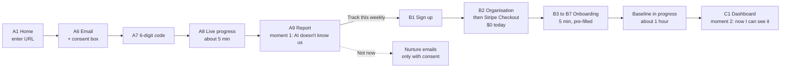

# AEO Corner — UI Design

| | |
|---|---|
| **Document** | UI design: rules, brand basics, component kit, screen inventory, wireframes, key flows and the content of every non-happy state |
| **Date** | 2026-10-02 |
| **Status** | Draft v0.2. The **public site shell and component kit are built** (Phase 1), and so are the **sign-in hand-off, organization creation, team settings and invitation screens** (Phase 2). **Group A wireframes (public site + audit flow) are drafted and await founder sign-off**, which gates Phase 7. Groups B–E are first-pass drafts to be reviewed before their phases. Brand basics are a **proposal**, not yet approved (§2) |
| **Companion docs** | [BUILD_PLAN.md](BUILD_PLAN.md) Phase 1 · [CUSTOMER_JOURNEY.md](CUSTOMER_JOURNEY.md) (the stages these screens serve) · [MVP.md](MVP.md) §5 (features), §6 (methodology), §10 (accessibility target) · [ADR-0003](adr/0003-strict-csp.md) (strict CSP) · [ADR-0004](adr/0004-clerk-hosted-sign-in.md) (hosted sign-in) |

---

## 0. Summary

- **One kit, one rule book.** Every screen is built from the same EJS components, listed in §3 and shown live at `/_styleguide` (development only). A phase that needs a new component adds it to the kit and the styleguide first.
- **The one rule that matters most:** a failed or missing collection is never shown as "not mentioned" and never as zero. It has its own look and its own words: *Couldn't check* (§1, rule 1; §7). The code enforces it (`ui.resultCell()`, stat tiles), and tests prove it.
- **What exists today:** the public site (home with the audit form, methodology, Terms and Privacy drafts, 404/500/maintenance), the app shell layout, the transactional email base, and the component kit. The audit form itself is a stub until Phase 7. Phase 2 added sign-in through Clerk's hosted pages, creating an organization, the Team page (members, roles, invitations), the invitation page and the staff console doorway.
- **What the founder needs to do:** approve or change the brand proposal (§2), review the Group A wireframes (§5.1), supply the Terms and Privacy text (§11), and switch on one PostHog setting (§9).

---

## 1. UI rules

Every phase follows these. They are short on purpose.

| # | Rule | Why | How it is enforced |
|---|---|---|---|
| 1 | **A failed, pending or missing collection is never "not mentioned" and never 0.** It shows as *Couldn't check* (dashed, hatched, with a help icon) and is left out of rates. Only a successful collection can be "Not mentioned". | Counting an outage against the customer destroys trust. It mirrors the rollup rule in [CLAUDE.md](../CLAUDE.md) and [CUSTOMER_JOURNEY.md](CUSTOMER_JOURNEY.md) principle 6 | `ui.resultCell({ status, mentioned })` can only return *mentioned* or *absent* when `status` is `ok`. `ui.stat({ state: 'unknown' })` shows a dash, never a number. Unit tests cover every other status value |
| 2 | **Normal ups and downs are neutral.** A change is coloured green or red only when the significance test passed ([MVP §6.3](MVP.md#63-sampling--statistics)). Otherwise it is grey and says "within normal variation". | One noisy week must not look like a win or a loss | `ui.stat` delta needs `significant: true` to be coloured; the default is grey |
| 3 | **Every number opens its evidence.** A score or rate links to the answers behind it. | [CUSTOMER_JOURNEY.md](CUSTOMER_JOURNEY.md) principle 4 | `ui.stat` takes `href`; a review checklist item for every dashboard screen |
| 4 | **Build from the kit.** A screen that doesn't use it needs a reason written in its phase. New components go in `views/components`, `tailwind/components.css` and `/_styleguide` together. | One look, one set of states, one accessibility fix for all | Review. The styleguide Playwright test fails on console errors |
| 5 | **No inline scripts, handlers or `style=""`.** Behaviour lives in `src/web/public/js/components.js`; Alpine runs as its CSP build; htmx has eval off. | A strict CSP is only real if the code never needs `unsafe-inline` ([ADR-0003](adr/0003-strict-csp.md)) | `ui.attrs()` throws on `on*` attributes; route tests scan every page; Playwright fails on CSP violations |
| 6 | **Public pages are complete in the raw HTML.** No content may depend on JavaScript. | AI crawlers don't run JavaScript. The marketing site must be readable by them ([MVP §7.3](MVP.md#73-components)) | Raw-HTML route tests |
| 7 | **WCAG 2.1 AA.** Never colour alone: status has an icon and words; links are underlined in text; every control is ≥ 44 px tall; focus is always visible. | [MVP §10](MVP.md#10-non-functional-requirements) | axe-core over every page in `tests/e2e/pages.js`, zero serious or critical violations; checks at 375/768/1280 px |
| 8 | **Plain words.** "Buyer questions", not "prompts". "AEO Score". Sentence case. Always write the name **AEO Corner**. Typographic apostrophes (’). | The customer is a marketer, not an engineer ([CUSTOMER_JOURNEY.md](CUSTOMER_JOURNEY.md) terminology note) | Review |
| 9 | **Nothing changes on the customer's site without a preview and an explicit approval.** The pattern is: show the exact change → **Approve** → we apply it → we verify it. | [CUSTOMER_JOURNEY.md](CUSTOMER_JOURNEY.md) principle 5 | Review; Phase 11/12 acceptance tests |
| 10 | **No invented data.** Example content is clearly labelled *Illustrative — not real data*. No fake testimonials, counts or logos. | [MVP §11.4](MVP.md#114-what-we-deliberately-will-not-build) | Review. The home page example carries the label (route test) |

---

## 2. Brand basics

> **Status: proposal.** The wordmark, palette and typeface below were chosen to get Phase 1 built. Changing them later is cheap: colours live in one file (`tailwind/tokens.css`) and the logo in one partial. Approve them, or tell the designer what to change. ([D6](MVP.md#17-decisions-needed-from-the-founder) fixed the *name* and tagline; this is the look.)

| Part | Proposal | Reasoning |
|---|---|---|
| **Name** | AEO Corner (always written this way) | [D6](MVP.md#17-decisions-needed-from-the-founder) ✅ Decided 2026-09-28 |
| **Tagline** | *Corner your market in AI answers.* | D6. Used in the footer and the social-share image |
| **Wordmark** | The words "AEO Corner" in bold Inter, next to a rounded indigo square holding a white corner bracket and a lime dot | The bracket is the "corner"; the dot is the spot where your brand shows up in an answer. Works at 16 px as a favicon |
| **Primary colour** | Indigo `#4f46e5` (buttons, links, focus) | Credible and calm for a B2B tool; white text on it passes AA (6.29:1) |
| **Highlight colour** | Lime `#a3e635`, used only with near-black text and as the "you're in the answer" highlight | A single bright accent that means one thing |
| **Neutrals** | A cool slate scale, `ink-50` to `ink-950` | Readable text and quiet surfaces |
| **Status colours** | Green (success / mentioned), amber (warning / competitor highlight), red (danger), sky (info). *Couldn't check* is **not a colour**: it is a dashed, hatched grey pattern | Missing data must not borrow the meaning of green or red |
| **Typeface** | Inter (variable), self-hosted. System font fallback | One family keeps pages light. Self-hosting means no third-party font host ([ADR-0003](adr/0003-strict-csp.md)) |
| **Shape** | 8–16 px rounded corners, light shadows | Friendly without looking like a toy |
| **Dark mode** | Not in the MVP. The marketing hero and the app sidebar are dark by design | Out of scope for 12 weeks |

**Contrast** (computed 2026-10-02, WCAG ratios; AA needs 4.5 for body text, 3 for large text and UI):

| Pair | Ratio |
|---|---|
| Body text `ink-900` on white | 17.85 |
| Muted text `ink-600` on white / on `ink-50` | 7.58 / 7.24 |
| Lightest text we use, `ink-500` on white | 4.76 |
| Link `brand-700` on white | 7.90 |
| White on primary button `brand-600` | 6.29 |
| `ink-950` on lime `signal-400` | 12.56 |
| Hero body text `ink-200` on `ink-950` | 15.36 |
| Status text on its tint: success 6.81, warning 6.37, danger 7.60, info 7.09 | all ≥ 6.3 |

---

## 3. Design tokens and component kit

**Tokens** are in [`tailwind/tokens.css`](../tailwind/tokens.css). The default Tailwind palette is switched off on purpose, so a screen can only use colours defined there. Email templates repeat a few colours as hex (email clients can't read CSS variables); a unit test fails if the two drift.

**Components** are EJS files in `src/web/views/components/`, called with `ui.<name>({ … })` ([`src/web/ui.js`](../src/web/ui.js)). Each call gets only the props you pass, so a missing prop can't silently pick up a parent template's variable. Text props are escaped by the component; props named `html` or ending in `Html` are trusted, already-rendered markup and must never carry user input.

| Component | Call | What it is for | Notes |
|---|---|---|---|
| Button | `ui.button` | Actions and button-styled links | `primary`, `secondary`, `ghost`, `danger`, `signal`; `sm/md/lg`; disabled; busy (spinner) |
| Form field | `ui.field`, `ui.checkbox`, `ui.radio` | Text, URL, email, textarea, select, checkbox, radio (a group goes in a `<fieldset>` with a `<legend>`) | Label, hint and error are wired to the input (`aria-describedby`, `aria-invalid`); "(optional)" is added automatically |
| Card | `ui.card` | Grouping | Optional title, header actions, footer |
| Table | `ui.table` | Data tables | Required caption; scrolls sideways inside its own box on narrow screens, never the page. Options: `stack` (below 640px each row becomes a small card of label/value lines; use it when cells hold actions, such as role selectors), `flush` (fills a card: no second border), `captionHidden` (when a heading already says it; the caption stays for screen readers) |
| Tabs | `ui.tabs` | Switching panels | Arrow keys, Home/End; first panel visible without JavaScript |
| Badge | `ui.badge` | Small labels | `unknown` tone is the *Couldn't check* look |
| Modal | `ui.modal` | Confirmations | Native `<dialog>`: focus trap and Escape for free |
| Stat tile | `ui.stat` | A headline number | States: ok, **unknown**, loading. Delta is coloured only when significant. Evidence link |
| Result cell | `ui.resultCell` | One engine's answer for one question | *Mentioned*, *Not mentioned*, ***Couldn't check***, *Checking…*, *No AI Overview* |
| Answer excerpt | `ui.excerpt` | A real AI answer with names highlighted | Text is escaped before highlighting. Brand = lime, competitor = amber underline |
| Banner | `ui.banner` | Messages | `info`, `success`, `warning`, `danger`, **`incomplete`** (partial data, hatched). Dismissible option |
| State | `ui.state` | Empty, loading, error | Each says why, and offers the next action |
| Stepper | `ui.stepper` | Progress through a flow | Complete / current / upcoming |
| Meter | `ui.meter` | Plan usage ("38 of 50") | Native `<progress>`; turns amber near the limit |
| Toast | `data-toast-message` or an `HX-Trigger: {"toast":{…}}` header | Brief confirmations | Message set with `textContent`, so it can't inject HTML |
| Icons, logo | `ui.icon`, `ui.logo` | | Inline SVG, decorative unless given a label |
| Audit form | `ui.auditForm` | The URL form (hero and compact) | Posts to `/audit` |

**Layouts:** `public` (header, footer, audit call-to-action band) and `app` (sidebar + top bar, empty until Phase 2). **Emails:** `src/lib/email.js` renders an HTML and a plain-text variant from one data set, inside a shared table-based layout.

---

## 4. Screen inventory

Routes for screens not yet built are proposals. Organization pages carry the organization in the URL (`/app/o/:org/…`, its public ID) rather than in a "current organization" setting, so two browser tabs on different organizations can never act on the wrong one ([DATABASE_SCHEMA §10.1](DATABASE_SCHEMA.md#101-auth-clerk-identity-only)). "Group" is the wireframe sign-off group from [BUILD_PLAN.md](BUILD_PLAN.md) Phase 1; each group is signed off before the phase that builds it.

| ID | Screen | Journey stage | Route (proposed) | Layout | Built in | Group |
|---|---|---|---|---|---|---|
| A1 | **Home** with the audit URL form | 1 Discover | `/` | public | **Phase 1 ✅** | A |
| A2 | **Methodology** | 1, 3 | `/methodology` | public | **Phase 1 ✅** | A |
| A3 | Terms of Service | all | `/terms` | public | Phase 1 ✅ (draft text) | A |
| A4 | Privacy Policy and subprocessors | all | `/privacy` | public | Phase 1 ✅ (draft text) | A |
| A5 | 404, error and maintenance pages | all | n/a | public | **Phase 1 ✅** | A |
| A6 | Audit step 2: work email + marketing-consent checkbox | 2 Free audit | `/audit/email` (the answer to the form) | public | Phase 7 ✅ | A |
| A7 | Audit step 3: 6-digit code | 2 | `/audit/:id/verify` | public | Phase 7 ✅ | A |
| A8 | Audit progress (live) | 2 | `/audit/:id/progress` | public | Phase 7 ✅ | A |
| A9 | **Audit report** (read-only, unguessable link) | 3 Report | `/r/:id` | public | Phase 7 ✅ | A |
| A10 | Audit edge-case messages: cached report, limit reached, site blocks our crawler, site unreachable, non-English | 2 | in A6 / A8 / A9 | public | Phase 7 ✅ except non-English (no message yet) | A |
| A11 | Crawler identity page (the URL in our bot's user agent) | n/a | `/bot` | public | Phase 7 ✅ | A |
| A12 | Emails: verification code ✅, "Your AEO report is ready", nurture (3) | 2, 3 | n/a | email | Phase 1 / 7 | A |
| A13 | **Free tools hub**: one card per live tool, each free, no account | 1 Discover | `/tools` | public | **Milestone 17 ✅ 2026-10-07** (built to the wireframe in §5.1, a proposal until the founder signs it off) | A |
| A14 | **A free tool**: the form, the answer on the same page, what the tool cannot tell you, questions, and a link to the free audit. Six tools: robots.txt checker, structured data validator, sitemap checker, and the robots.txt, schema markup and llms.txt generators | 1 | `/tools/:slug` | public | **Milestone 17 ✅ 2026-10-07** (same wireframe; complete without JavaScript; nothing a visitor enters is stored) | A |
| B1 | Sign up and sign in | 4 Trial | `/sign-in`, `/sign-up` → Clerk's hosted pages ([ADR-0004](adr/0004-clerk-hosted-sign-in.md)) | Clerk | **Phase 2 ✅** | B |
| B1a | Sign-in unavailable (a server with no Clerk keys) | 4 | `/sign-in`, `/app` | public | **Phase 2 ✅** | B |
| B2 | Create organisation (name pre-filled from the audit domain with `?domain=`) | 4 | `/app/new-org` | app | **Phase 2 ✅** | B |
| B2a | Empty overview of an organization ("No projects yet") | 4 | `/app/o/:org` | app | **Phase 2 ✅** (projects: Phase 8) | B |
| B2b | Accept an invitation: signed out, signed in, wrong account, expired, already used, unknown | 4, 9 | `/invite/:token` | public | **Phase 2 ✅** | B |
| B3 | Onboarding 1: confirm your brand | 5 Onboarding | `/app/onboarding/brand` | app | Phase 8 | B |
| B4 | Onboarding 2: competitors | 5 | `…/competitors` | app | Phase 8 | B |
| B5 | Onboarding 3: buyer questions | 5 | `…/questions` | app | Phase 8 | B |
| B6 | Onboarding 4: connect (optional) | 5 | `…/connect` | app | Phase 8 / 12 | B |
| B7 | Onboarding 5: start tracking, then "baseline in progress" | 5, 6 | `…/start` | app | **Milestone 4 ✅ 2026-10-03** (the last step offers "Start tracking"; the project page has an "AI checks" card with the latest check, "Run a check now" and the month's allowance) | B |
| B8 | Brand Kit editor with version history | 5, 7 | `/app/p/:id/brand` | app | Phase 8 | B |
| B9 | Prompt Manager (list, filters, CSV import, duplicates) | 5, 7 | `/app/p/:id/questions` | app | Phase 8 | B |
| C1 | **Dashboard** (score, engines, competitors, trend, top actions) | 6 Baseline | `…/dashboard` | app | **Milestone 5 ✅ 2026-10-03** (figures with their ranges and changes, the trend with its 95% band, the engines, competitors, what changed; "top actions" waits for the Action Center in Milestone 6) | C |
| C2 | Question matrix (questions × engines) | 6 | `…/answers` | app | **Milestone 5 ✅ 2026-10-03** | C |
| C3 | Answer detail with evidence, method label and "That's not us" | 6, 7 | `…/answers/:qid` | app | **Milestone 5 ✅ 2026-10-03** (a page, not a drawer: it works without JavaScript and has an address that can be shared inside the team) | C |
| C4 | Citation and source intelligence | 6 | `…/citations` | app | **Milestone 5 ✅ 2026-10-03** (cited sites and pages, and the sites cited where the brand was not named; the competitors view is `…/compare`); **Milestone 13 ✅ 2026-10-05**: three views (`?tab=overview|opportunities|pages`): the citation share by week and the kinds of site cited; the opportunities by site and by question, with the kind of page each site is cited for; your pages that are cited, and the key pages that never are | C |
| C5 | First-visit guided tour (3 steps) | 6 | overlay | app | Phase 10 | C |
| D1 | **Action Center** (ranked recommendations) | 7 Loop | `…/actions` | app | **Milestone 6 ✅ 2026-10-04** (to do, checking and measuring, results, dismissed) | D |
| D2 | Recommendation detail: evidence, fix path, status timeline | 7 | `…/actions/:id` | app | **Milestone 6 ✅ 2026-10-04** | D |
| D3 | Auto-fix preview and approve | 7 | modal / page | app | **✅ 2026-10-04** (a page at `/actions/:rid/autofix`; Organization and WebSite schema on the home page; see CLAUDE.md "Auto-fix"); **✅ 2026-10-04** undo: a written fix can be taken off the site from the same page; **✅ 2026-10-04** the same page previews page-type schema, titles and descriptions (a before and after table) and robots.txt lines | D |
| D4 | **Proof card** (before/after) and share | 8 Proof | `…/actions/:rid` (the card); `/p/:publicId` (the shared page, public) | app + public | **Milestone 6 ✅ 2026-10-04** (the card); **✅ 2026-10-04** (share: a public read-only link for a proven win, stoppable at any time; no question, answer or competitor is shown) | D |
| D5 | Content Studio: list, brief, editor, quality check, approve / publish | 7 | `…/content`, `…/content/:id` | app | **Milestone 7 ✅ 2026-10-04** | D |
| D6 | WordPress connector setup | 5, 7 | `…/integrations/wordpress` | app | Phase 12 | D |
| D7 | **Entity**: profiles checked, Wikidata, what engines say about the brand's facts, and the text to put on each profile we cannot touch | 7 | `…/entity` | app | **Milestone 12 ✅ 2026-10-04** (built to the wireframe in §5.4, which is a proposal until the founder signs it off; the facts and profile links are edited on the Brand Kit's new Entity tab) | D |
| D8 | **Recovery**: when visibility drops and stays down, a list of cases and one page per case with the numbers, the likely cause and the facts behind it, the repairs and the timeline | 7 Loop | `…/recovery`, `…/recovery/:cid` | app | **Milestone 14 ✅ 2026-10-05** (built to the wireframe in §5.4, which is a proposal until the founder signs it off; read-only: only the system opens, diagnoses and closes a case) | D |
| D9 | **Autopilot**: what was prepared this week for a person to approve (a fix for the site, a draft page), what it may do, the pause and the switches. No approve button here: each item links to the screen that shows the exact code or the draft | 7 Loop | `…/autopilot` | app | **Milestone 15 ✅ 2026-10-05** (built to the wireframe in §5.4, which is a proposal until the founder signs it off; prepares only: a person approves on the screen the item links to) | D |
| E1 | AI traffic (Google connections + chart) | 7 | `…/traffic` | app | **Milestone 8 ✅ 2026-10-04** | E |
| E2 | Weekly digest email, alert emails, trial-ending email (and: retention warning, "reconnect Google") | 7, 9 | n/a | email | **Milestone 8 ✅ 2026-10-04** | E |
| E3 | Plan, billing and usage (Stripe Checkout and Portal hand-offs) | 4, 9 | `/app/o/:org/billing` | app | **Milestone 8 ✅ 2026-10-04** | E |
| E4 | Settings: members and roles, invitations (**built**); notifications (`/app/o/:org/notifications` and the one-click `/unsubscribe/:token`, **Milestone 8 ✅**) | 4, 9 | `/app/o/:org/settings` | app | **Phase 2 ✅** / **M8 ✅** | E |
| E6 | No access: signed in and a member, but the role doesn't allow the page | 9 | inline (403) | app | **Phase 2 ✅** | E |
| E5 | Plan-limit prompts, spend-cap and stale-data banners | 9 | inline | app | **Milestone 8 ✅ 2026-10-04** (plan and payment banners on every page) | E |

---

## 5. Wireframes

Low fidelity, to settle layout and content order, not looks. `▸` means collapsed, `✓` done, `[ ]` input or button.

### 5.1 Group A — public site and audit flow (sign off before Phase 7)

**A1 Home** — built; the live page is the reference.

```
┌────────────────────────────────────────────────────────────────────────────┐
│ [▙] AEO Corner            How it works  Methodology  FAQ   [Free AEO audit] │
╞════════════════════════════════════════════════════════════════════════════╡  dark hero
│ FREE AEO AUDIT                              ┌─ Example report ─ Illustrative ┐
│ Is AI sending your customers                │ AEO Score for Acme Dental      │
│ to your competitors?                        │ 38/100     Readiness 54        │
│ See what ChatGPT, Perplexity, Gemini and    │            Visibility 15       │
│ Google AI Overviews actually say…           │ ChatGPT      [– Not mentioned] │
│ ┌────────────────────────────────┐          │ Perplexity   [✓ Mentioned]     │
│ │ Your website                   │          │ Gemini       [? Couldn't check]│
│ │ [ yourcompany.com            ] │          │ Google AIO   [i No AI Overview]│
│ │ ▸ Compare with a competitor    │          │ "Top picks include …" (excerpt)│
│ │ [ Run my free audit  → ]       │          └────────────────────────────────┘
│ │ Free · ~5 min · no account     │
│ └────────────────────────────────┘
├────────────────────────────────────────────────────────────────────────────┤
│ How it works:  [1 Measure] [2 Diagnose] [3 Fix] [4 Prove]                  │
│ What the free audit shows: Score · Real answers · Who AI names · Top 5 fixes│
│ Engines we check: (ChatGPT) (Perplexity) (Gemini) (Google AI Overviews)    │
│ Honest by design:  [Rates, not guesses] [Couldn't check ≠ zero] [Evidence] │
│ FAQ  ▸ Is the audit really free?  ▸ Which engines? …                       │
├────────────────────────────────────────────────────────────────────────────┤
│ Footer: logo + tagline │ Product links │ Legal links                        │
└────────────────────────────────────────────────────────────────────────────┘
```

**A6 Audit step 2 — work email**

```
 Stepper: ✓ Your site ── ② Confirm email ── ③ Checking AI ── ④ Report
 ┌───────────────────────────────────────────────┐
 │ Where should we send your report?             │
 │ Checking: yourcompany.com                     │
 │ Work email  [ you@yourcompany.com           ] │
 │ [ ] Send me tips on AI visibility (optional;  │
 │     separate from receiving your report)      │
 │ [ Turnstile check ]                           │
 │ [ Send my code → ]                            │
 │ We use your email only to send your report.   │
 │ Privacy policy                                │
 └───────────────────────────────────────────────┘
```

**A7 Audit step 3 — code**

```
 ┌───────────────────────────────────────────────┐
 │ Enter the 6-digit code we emailed to          │
 │ you@yourcompany.com                           │
 │ [ _ ][ _ ][ _ ][ _ ][ _ ][ _ ]                │
 │ [ Start my audit → ]                          │
 │ Didn't get it? Resend in 0:30 · Wrong email?  │
 │ Code expires in 10 minutes.                   │
 └───────────────────────────────────────────────┘
```

**A8 Audit progress** — real steps stream in; answers appear as they arrive.

```
 Stepper: ✓ ── ✓ ── ③ Checking AI ── ④
 ┌───────────────────────────────────────────────┐
 │ Checking yourcompany.com        about 4 min   │
 │ ✓ Read your site (14 pages)                   │
 │ ✓ Checked whether AI crawlers can reach it    │
 │ ◌ Asking ChatGPT 5 buyer questions…           │
 │ ✓ Asked Perplexity                            │
 │ ? We couldn't check Gemini right now          │
 │ ┌ ChatGPT · "best family dentist in Austin" ┐ │
 │ │ "Top picks include Bright Smiles…"        │ │
 │ └───────────────────────────────────────────┘ │
 │ You can close this tab. We'll email the link. │
 └───────────────────────────────────────────────┘
```

**A9 Audit report** — in the persuasion order from [CUSTOMER_JOURNEY.md Stage 3](CUSTOMER_JOURNEY.md#stage-3--audit-report-the-first-aha).

```
 ┌ Headline ────────────────────────────────────────────────────────────┐
 │ ChatGPT mentioned you in 1 of 5 buyer questions. RivalCo was in 4.   │
 └──────────────────────────────────────────────────────────────────────┘
 ┌ AEO Score ┐  ┌ Readiness ┐  ┌ Visibility ┐      yourcompany.com · date
 │   38/100  │  │    54     │  │     15     │      How is this calculated?
 └───────────┘  └───────────┘  └────────────┘      (links to /methodology)
 Engine cards:  [ChatGPT: Not mentioned · RivalCo, Acme]  [Perplexity ✓ …]
                [Gemini: ? Couldn't check]  [Google AIO: No AI Overview]
 Real answers:  engine · question · excerpt with names highlighted (x5)
 Top 5 fixes:   1. Allow AI search bots in robots.txt   [why] [evidence ↗]
                2. Add Organization schema   [we can do this for you]  …
 ┌ [ Track this weekly and fix it — start 14-day trial ]  [ Email to a colleague ]
 Honesty note: "This is a 1-sample snapshot. AI answers vary; tracking asks each
 question 3 times."
```

**A10 Edge-case messages** (shown in place of, or above, the screen they interrupt)

| Situation | Message pattern |
|---|---|
| Same domain within 24 hours | Info banner: "We ran this audit 3 hours ago, so here it is. Run a new one tomorrow to see changes." |
| Limit reached (3 per email, 10 per IP, per day) | Warning banner with when they can try again. Never blame the visitor |
| Site blocks our crawler | A **finding** in the report ("AI crawlers may be blocked too"), not an error |
| Site unreachable or behind a login | Error state: what we tried, what to check, "this didn't count toward your limit" |
| An engine fails | *Couldn't check* cell and a line in the progress feed. Never a 0 |
| Non-English site | Info banner: audit ran in the site's language, or says plainly that it isn't supported yet |

**A13 Free tools hub and A14 a free tool** (Milestone 17; a proposal until the founder signs it off). The page after a run is the same page again with the answer in it, so it works without JavaScript.

```
 A13 /tools                                    A14 /tools/robots-txt-checker
 ┌──────────────────────────────────┐          ┌──────────────────────────────────┐
 │ FREE TOOLS                       │          │ FREE TOOLS  (links back to /tools)│
 │ Free tools for AI search         │          │ robots.txt checker                │
 │ Each is free, no account, and    │          │ one-sentence lead                 │
 │ says what it cannot tell you     │          ├──────────────────────────────────┤
 ├──────────────────────────────────┤          │ ┌ Try it ───────────────────────┐ │
 │ Choose a tool                    │          │ │ [ field(s), grouped if many ] │ │
 │ ┌────────────┐ ┌────────────┐    │          │ │ [ Turnstile, fetching tools ] │ │
 │ │ name (link)│ │ name (link)│    │          │ │ [ Run the check → ]           │ │
 │ │ lead       │ │ lead       │    │          │ │ Free, no account. We do not   │ │
 │ │ [badge]    │ │ [badge]    │    │          │ │ save what you enter.          │ │
 │ └────────────┘ └────────────┘    │          │ └───────────────────────────────┘ │
 │ … six cards, two across          │          │ Answer (after a run):             │
 │ Each tool looks at one file or   │          │  headline · sections of rows      │
 │ page. To see whether engines     │          │  (label · detail · OK/Check/      │
 │ name you: [free AEO audit]       │          │  Problem/Info/Couldn't check)     │
 └──────────────────────────────────┘          │  or, for a generator, the file in │
                                               │  a box with [Copy] [Download]     │
                                               │ What this tool cannot tell you    │
                                               │  … run the [free AEO audit]       │
                                               │ Questions about this tool ▸ …     │
                                               └──────────────────────────────────┘
 A tool that could not look says "Couldn't check" with the reason, never "missing" or "fine".
```

### 5.2 Group B — onboarding, Brand Kit and questions (sign off before Phase 8)

```
 B3 Confirm your brand                         Stepper: ① Brand ② Competitors ③ Questions ④ Connect ⑤ Start
 ┌ Brand name [ Acme Dental ]   Also known as [ Acme, AcmeDental ] (chips)
 │ One-line description [ Family dental practice in Austin, TX … ]
 │ Category [ Dentist ]   Where you operate [ Austin, TX ]
 │ Products and services  (Cleanings ✕) (Invisalign ✕) (+ Add)
 │ Pre-filled from your website — correct anything that's wrong.   [ Looks right → ]

 B4 Competitors (3–10)                          B5 Buyer questions (25–50)
 ┌ RivalCo   rivalco.com        [✕]            ┌ Plan meter: 38 of 50 ─────────────┐
 │ BrightSmile  brightsmile.com [✕]            │ ▾ Finding a dentist (12)           │
 │ [+ Add a competitor]  3 of 10               │   [on] best family dentist in Austin   [edit]
 │ We found these in your audit answers.       │   [on] dentist near me open Saturday   [edit]
 └─────────────────────────────────────────── │ ▸ Comparing options (9)   ▸ Costs (8) …
                                               │ [+ Add a question]   [Import CSV]
 B6 Connect (optional)                          └────────────────────────────────────┘
 ┌ WordPress  Apply fixes with your approval  [Connect]  ┌ Google Analytics + Search Console [Connect]
 │ [ Do this later ]                                                        [ Next → ]

 B7 Start tracking → "Baseline in progress"
 ┌ We're asking 4 AI engines your 38 questions, 3 times each.
 │ Your baseline will be ready in about an hour — we'll email you.
 │ Updating: 25% of answers collected  (progress)
 │ Meanwhile, your site readiness checklist: ✓ ✓ ✗ ✗ …  [4 fixes you can make today]
```

```
 B8 Brand Kit            Tabs: Identity | Offerings | Facts | Voice | Competitors      Version 3 ▾ (history)
 B9 Prompt Manager       [Search] [Topic ▾] [Intent ▾] [Status ▾]            [Import CSV] [+ Add]
 ┌────────────────────────────────────────────────────────────────────────────┐
 │ ☐ Question                         Topic        Intent      Priority  Status │
 │ ☐ best family dentist in Austin    Finding      Discovery   1         On     │
 │ ☐ best family dentist austin tx    Finding      Discovery   2         ⚠ Looks like a duplicate of the row above │
 └────────────────────────────────────────────────────────────────────────────┘
 Limit reached at save: "50 of 50 buyer questions" + [Upgrade]. Nothing is dropped silently.
```

### 5.3 Group C — dashboard and citations (sign off before Phase 10)

```
 C1 Dashboard      Project ▾ · Locale ▾ · Last 4 weeks ▾                       Updated Mon 9:12
 ┌ banner (only if needed): ⧗ Gemini data is incomplete this week — retrying. Missing cells show "Couldn't check".
 ┌ AEO Score ┐ ┌ Mention rate ┐ ┌ Share of voice ┐ ┌ Citation share ┐   each: value · change · range · "See the answers"
 ┌ Trend (line + 95% band; gaps where an engine failed) ┐ ┌ By engine ───────────────┐
 │                                                      │ │ ChatGPT     22%  [result]│
 │                                                      │ │ Gemini      ?  Couldn't check│
 └──────────────────────────────────────────────────────┘ └──────────────────────────┘
 ┌ Competitors (share of voice, win rate) ┐ ┌ Top 3 actions → Action Center ┐
 C5 First visit: 3 callouts — 1 Score and engines · 2 Question matrix · 3 Action Center. "This is your baseline."

 C2 Question matrix          Engine → ChatGPT | Perplexity | Gemini | Google AIO
 ┌ best family dentist in Austin  [Not mentioned] [Mentioned] [? Couldn't check] [No AI Overview]
 click a cell → C3

 C3 Answer detail (drawer)   ChatGPT · run date · sample 2 of 3 · collected via: UI capture
 ┌ Full answer with brand/competitor highlights ┐ Sources cited (domain, your site?) ┐
 │ [ That's not us ]  [ This answer was misread ]  → goes to the extraction review queue │

 C4 Citations   [ Overview | Opportunities | Your pages ]
                Overview       Your citation share by week (chart + table) · cited sites by type · gap panel · most cited sites
                Opportunities  Sites to be present on: site · type · its pages are (list, comparison…) · answers without you · what to do
                               By question: each question's cited sites and their share of that question's answers
                Your pages     Your pages engines cite (by engine) · key pages never cited · most cited pages
                A "get listed" action shows a note to copy (built from the Brand Kit; we never send it)
```

### 5.4 Group D — Action Center, proof and Content Studio (sign off before Phase 11)

```
 D1 Action Center       Filter: Open ▾ In progress ▾ Done ▾ …              Ranked by impact vs effort
 ┌ ① Allow AI search bots in robots.txt          [Auto-fix] Effort: low   Affects 22 questions
 │   Why: robots.txt blocks OAI-SearchBot.  Evidence ↗                                   [ Start ]
 ┌ ② Add Organization schema to your homepage    [Auto-fix] …
 ┌ ③ Allow AI bots in Cloudflare                 [Guidance] …

 D2 Recommendation detail   Status timeline:  Open ─ In progress ─ Done ─ Verified ─ Measuring ─ Proven win
 ┌ Why this matters │ Evidence (failing check / answers) │ Questions affected │ How to fix (3 paths) ┐

 D3 Auto-fix approval    "Add Organization schema to yourcompany.com"
 ┌ Preview of the exact code (diff) │ Where it goes │ [ Approve and apply ] [ Cancel ]
 After: "Fix verified ✓ — live on your homepage" (we re-fetched it as an AI crawler would)

 D4 Proof card           "Since you published 'Family dentist in Austin' on Oct 3, ChatGPT mentions on the
 3 targeted questions went from 1 of 9 to 5 of 9 answers (significant)."   [ Share ]   Details: How sure are we?
 Not significant: "Within normal variation so far. AI answers often take 2–6 weeks to change."

 D5 Content Studio   List (draft · in review · published)  →  Brief  →  Editor (rich text) with side panel:
                     quality score + checklist │ evidence used │ [ Approve ] [ Publish to WordPress / Copy ]
 D6 WordPress setup  Site URL · application password (never shown again) · [ Test connection ] · plugin download
                     (built at `…/integrations/wordpress` in Milestone 7: connect, "Check again", disconnect, plugin zip)

 D7 Entity           3 tiles: Profiles confirmed (1 of 3) │ Wikidata (Found / No item / Can't tell which is yours) │ What engines say (1 to fix)
                     [ Check now ]  [ Edit profile links and facts ] → Brand Kit, Entity tab
                     Your profiles: one row per link: profile + address │ result badge │ what we found
                       Confirmed · Doesn't name you · Page not found · Couldn't check (a sign-in page, a firewall, robots.txt)
                     Wikidata: one card with the result and, if found, the item
                     What AI engines say about you: Fact │ You said │ Engines agree / disagree / not mentioned yet │ their words
                     What to put on each profile: Google Business Profile · LinkedIn · Crunchbase · Wikidata · a trade directory
                       each folds open: the steps, then every field with [ Copy ]; fields we lack are listed, never invented

 D8 Recovery         list: open cases first, then closed. One row per case: what fell │ where it stands (Finding the cause ·
                       Repairs in progress · Recovered · Recovered by itself · Closed, cause unknown) │ probable cause │ opened
                     a case: title + status, one sentence with the counts ("was 60% (280 answers), fell to 36% … is 20% over
                       the last 14 days"), then
                       How the figure moved: before · the fall · now, each with the answers read
                       What probably caused it: a card per cause with its band (Strong evidence · Likely) and the facts it stands on,
                         or "We can't tell what caused this" with the reason
                       Your earlier fixes, checked now: Still in place · No longer on your site · Couldn't check
                       Repairs: pointers into the Actions list (nothing to press here) and the SEO-safe promise
                       What happened, and when: the timeline. No button closes or reopens a case.

 D9 Autopilot        "Fixes and drafts, prepared for you": it prepares, you approve; it never changes your site or publishes by itself
                     status badge (On · Off · Paused · Not in your plan · Switched off) + a sentence, and what the last tick did
                     Ready for you: one card per item: title + kind (Fix for your site · Draft page) + where a draft stands (Writing ·
                       Ready to review…) · one sentence of what it is · "Prepared <date>. Nothing has been sent to your site." ·
                       [ Review the code and approve ] / [ Read the draft and approve ] (links to D3 / D5) · Reject ▸ reason + note
                     What it may do: the limits in numbers; owner/admin: on · fixes · drafts · drafts a week · [ Save ] · [ Pause ]
                     Earlier: what / how it ended (Approved · Rejected · No longer needed) / why / when
                     No approve button on this page. The preview screen (D3) says "Autopilot prepared this on…" and warns if it moved.
```

### 5.5 Group E — traffic, billing and settings (sign off before Phase 13)

```
 E1 AI traffic     [Connect Google Analytics — 2 minutes]  →  chart: visits from AI answers by source · top landing pages
 E3 Billing        Plan: Starter (trial ends in 6 days) │ Usage meters: Buyer questions 38 of 50, Projects 1 of 1
                   [ Manage billing ] → Stripe Customer Portal        [ Upgrade ]
 E4 Settings       Members table: name · email · role (owner/admin/editor/viewer) · [ Save ] [ Remove ]
                   Invite a teammate: email + role (an inline card, not a modal, so it works without JavaScript;
                   the "which projects" picker for limited client seats arrives with projects, Phase 8)
                   Waiting for an answer: email · role · expires · [ Send again ] [ Cancel ]
                   Notifications: digest on/off, alerts on/off
 E5 Banners        "Plan limit reached" · "This week's update is delayed — our team has been notified" ·
                   "Last updated 16 days ago because payment is paused"
```

---

## 6. Key flows

**Audit → report → sign-up → onboarding → first dashboard** (the path that creates the customer; times are targets from [CUSTOMER_JOURNEY.md](CUSTOMER_JOURNEY.md)).



| Step | The visitor sees | Time target | Notes |
|---|---|---|---|
| A1 → A6 | One field, then the email step. No account | seconds | Turnstile runs here. The URL is checked on the spot (`normalizeWebsite`) so typos are caught before any work is queued |
| A7 → A9 | A live feed, then the report | p50 ≤ 5 min, p90 ≤ 10 min | Closing the tab is fine; the report arrives by email |
| A9 → B1 | One primary button | n/a | The audit is claimed by the report link's token, so a different sign-up email still works |
| B2 → B7 | Everything pre-filled; the visitor confirms and corrects | ≤ 5 min to the first run | The first run starts at once; it doesn't wait for the weekly slot |
| B7 → C1 | A progress banner and the readiness checklist, so the screen is never empty | ≤ 2 h | "Your baseline is ready" email, then a 3-step tour (C5) |

---

## 7. What every state looks like

**Data situations**

| Situation | Do show | Never show |
|---|---|---|
| An engine failed or timed out | *Couldn't check* cell or tile (hatched, help icon); gap in trend lines; incomplete-data banner while a retry is pending | "Not mentioned", 0, 0%, or a line dropping to zero |
| Run still collecting | *Checking…*; "Updating: 60% of answers collected"; existing data stays visible | A blank page or a spinner over old data |
| The last check was incomplete | "N of M answers couldn't be checked. They're left out of your numbers: they are not counted as 'not mentioned'" (`src/core/run-status.js`) | A number for the missing answers, or a drop in a trend |
| The last check read nothing | "Couldn't read any answers. No number is guessed" | A zero score |
| Google AI Overview didn't appear for a search | *No AI Overview* (info, not a miss) | "Not mentioned" |
| Only one sample (free audit) | A note: "1-sample snapshot" and a link to the methodology | Confidence ranges that imply more samples |
| Change inside normal noise | Grey arrow and "within normal variation" | Green or red |
| Significant change | Green/red, the numbers (for example "1 of 9 → 5 of 9") and the date | An unexplained percentage |
| Brand name is a common word | Ask the customer to confirm aliases before trusting numbers | Silent guesses |
| No run in 14+ days | Banner with the date of the last update and the reason | Fresh-looking numbers |
| Spend cap reached (internal) | "This week's update is delayed; our team has been notified." | A raw error |

**Screen states** — each has a component in the kit and appears in `/_styleguide`.

| State | Pattern | Content rule |
|---|---|---|
| **Empty** | `ui.state kind=empty` | Say *why* it is empty and give the next action, with the time it takes: "Connect Google Analytics to see AI traffic. 2 minutes." |
| **Loading** | `ui.state kind=loading` or skeleton tiles | Say what is loading and how far along it is. Keep old data visible while refreshing |
| **Error (page)** | `error.ejs`, `ui.state kind=error` | Say it is our side, that the data is safe, and what to do next. Show a reference number (the request id). Never show a stack trace, SQL or an exception message |
| **Error (field)** | `ui.field error=` | Say what to change, in the visitor's words: "That doesn't look like a website address. Try something like yourcompany.com." |
| **Partial data** | `ui.banner tone=incomplete` | Name the missing engine, say it is retrying, and say that missing cells are left out of rates |
| **Limit reached** | `ui.meter` + warning banner | Show it at the moment of saving ("50 of 50 buyer questions"), with the upgrade option. Nothing is silently dropped |
| **Maintenance** | `maintenance.ejs`, HTTP 503 + `Retry-After` | "Back soon", and that work in progress is not affected |
| **Sign-in unavailable** | `auth-unavailable.ejs`, HTTP 503 | Say sign-in isn't available on this server right now and the public pages still work. On a development server only, say which keys are missing |
| **No access** | `forbidden.ejs`, HTTP 403 inside the app shell | Name the role and say who can change it ("An owner or admin can change your role"). Never reveal what is on the page |
| **Not a member / unknown organization** | the normal 404 | Identical to a page that doesn't exist, so the response never confirms an organization is real |
| **Invitation problems** | `invite.ejs` | Expired: say invitations last 7 days and who to ask. Used or withdrawn: say so and what to do next. Wrong account: say which account is signed in, show the invited address only masked (`s•••@example.com`), and offer to sign out |
| **Notices after an action** | banner from a short code in `?notice=` | The text is ours, never taken from the URL: "Role updated.", "An organization needs at least one owner, so that change wasn't made." |
| **Success** | toast, or a success banner for something that needs follow-up | Say what happened and what happens next: "Saved. Your change applies on the next run." |

---

## 8. Voice and terminology

| Use | Not | Why |
|---|---|---|
| AEO Corner | Aeo Corner, AEOCorner, "the platform" | D6 |
| buyer questions | prompts | Customers don't think in prompts |
| AEO Score, Readiness, Visibility | AI Visibility Score for the audit (that's the tracked metric) | The audit's score has two named parts ([MVP §6.6](MVP.md#66-aeo-readiness-rubric-v0)) |
| Couldn't check | Error, N/A, failed, 0 | Rule 1 |
| mentioned, recommended, cited | ranked, scored (for single answers) | Plain language |
| fix verified / proven | fixed, worked (before the evidence is in) | Two levels of proof ([CUSTOMER_JOURNEY.md](CUSTOMER_JOURNEY.md) principle 7) |
| "AI answers vary" | "AI is unreliable" | Honest without sounding alarmist |

Sentence case for headings and buttons. Short sentences. Say what happens next. Numbers carry their unit ("3 of 9 answers", not "33%") when the count is small.

---

## 9. Analytics and consent

**✅ Decided 2026-10-02** (a Phase 1 task in [BUILD_PLAN.md](BUILD_PLAN.md); the founder can overturn it): **the public site runs PostHog cookieless, with no consent banner.**

| Question | Answer |
|---|---|
| What is it? | PostHog with `cookieless_mode: 'always'` and `person_profiles: 'never'`: no cookies, no local storage, no identifying anyone. PostHog's servers count unique visitors with a privacy-preserving hash |
| Why not a banner? | A banner makes every first-time visitor click before they see the page, which costs audit starts, and the metric we need most is *visitor → audit started*. Cookieless counts are enough for that. Verified against PostHog's documentation on 2026-10-02 |
| What we give up | Per-person journeys across days, session replay, and identified funnels on the public site. We can still count page views, referrers, UTM sources and the audit form's start and finish |
| Do Not Track | Honoured in addition: `analytics.js` does not load if the browser sends Do Not Track or Global Privacy Control |
| Setup needed | In the PostHog project settings turn on **Cookieless server hash mode** (Web analytics). Set `POSTHOG_API_KEY` (and `POSTHOG_HOST` for the EU region). With no key, nothing loads |
| Privacy policy | States that the public site sets no cookies and lists PostHog as a subprocessor |
| Signed-in area | **No analytics inside the signed-in area, the invitation pages or the staff console** (decided in Phase 2). Analytics is opt-in per page and only the public pages opt in, because PostHog records page URLs and these URLs hold organization IDs or a secret invitation token. Clerk's sign-in cookies are strictly necessary. If in-app product analytics are wanted later, they need their own decision (events without URLs, and whether they sit behind consent) |

---

## 10. Accessibility, responsive and testing

| Check | Tool | Gate |
|---|---|---|
| WCAG 2.1 A/AA over every page in `tests/e2e/pages.js`, plus the audit form in its error state, the open modal and the open mobile menu | axe-core via Playwright | Zero serious or critical violations |
| No horizontal overflow at 375, 768 and 1280 px; the audit form usable at 375 px (controls inside the viewport, ≥ 44 px tall) | Playwright | Must pass |
| No requests to hosts other than our own (PostHog and Turnstile are allowed but not configured in the sweep) | Playwright | Must pass |
| `/_styleguide` renders every component with no console errors or CSP violations; tabs, modal, dismissible banner and toast work | Playwright | Must pass |
| Public pages complete in the raw HTML; unique title, description and canonical URL; 404 and 500 render without leaking details; `noindex` outside production | supertest | Must pass |
| Email: HTML and plain-text variants render with no template tokens left | `node:test` | Must pass |

Keyboard: every control is reachable and visible when focused; the skip link goes to `#main`; tabs use arrow keys; the modal is a native `<dialog>`. The sweeps use axe's automated rules, which catch only part of what a person would find. A manual pass with a screen reader on the audit flow is still needed before launch (Phase 15).

---

## 11. Open items for the founder

| # | Item | Needed by | What to do |
|---|---|---|---|
| 1 | **Approve the brand proposal** (§2): wordmark, colours, Inter | Before Phase 7 goes public | Approve, or list changes. Colours are one file |
| 2 | **Review Group A wireframes** (§5.1) and the live home page | Before Phase 7 | Sign off, or mark up changes. Then B–E in turn |
| 3 | **Terms of Service and Privacy Policy text** | Before Phase 7 collects real emails | The pages carry a working draft with `[bracketed]` gaps (legal entity, contact address, governing law, liability cap, transfer mechanism). Have a lawyer review it, then replace the text and remove the draft banner |
| 4 | **Cloudflare Turnstile keys** (site + secret) | Phase 7 | Create the widget; set `TURNSTILE_SITE_KEY` / `TURNSTILE_SECRET_KEY`. Not yet exercised end to end |
| 5 | **PostHog project + cookieless server hash mode** | Before launch | See §9 |
| 6 | **Domain** `aeocorner.com` | Before staging | Needed for canonical URLs, the crawler identity page and email |
